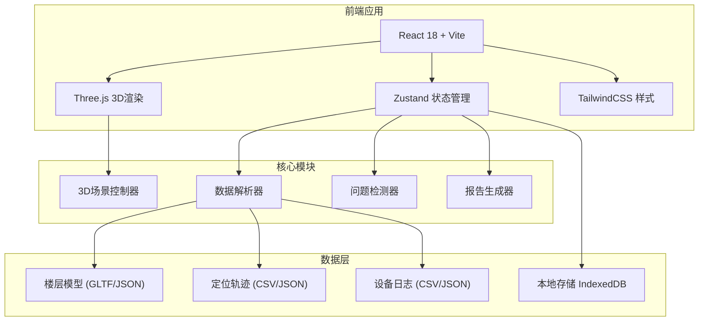
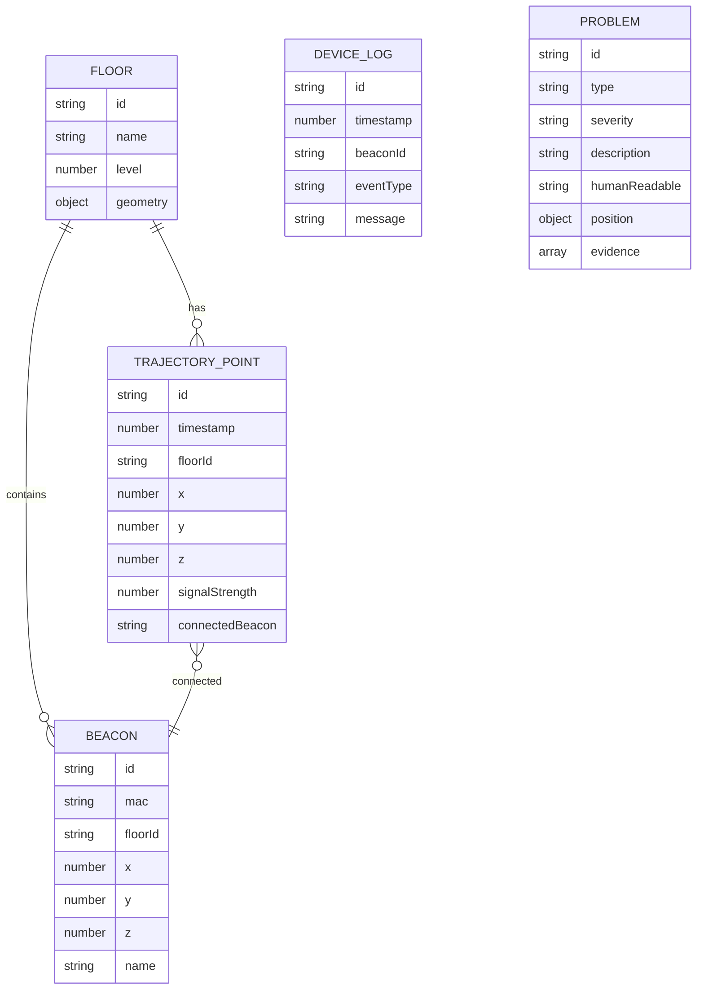

## 1. 架构设计



## 2. 技术选型

| 类别 | 技术栈 | 版本 | 说明 |
|------|--------|------|------|
| 前端框架 | React | 18.x | 函数组件 + Hooks |
| 构建工具 | Vite | 5.x | 快速开发构建 |
| 3D引擎 | Three.js | 0.160.x | WebGL 3D渲染 |
| React-Three | @react-three/fiber | 8.x | React 封装 Three.js |
| React-Three | @react-three/drei | 9.x | 常用3D组件库 |
| 后处理 | @react-three/postprocessing | 2.x | Bloom 等效果 |
| 状态管理 | Zustand | 4.x | 轻量级状态管理 |
| 样式 | TailwindCSS | 3.x | 原子化CSS |
| 图表 | Recharts | 2.x | 热力图/统计图表 |
| PDF导出 | jspdf | 2.x + html2canvas | 报告生成 |
| 截图 | html2canvas | 1.x | 3D视图截图 |
| 语言 | TypeScript | 5.x | 类型安全 |

## 3. 目录结构

```
src/
├── components/
│   ├── Scene3D/              # 3D场景组件
│   │   ├── Floor.tsx         # 楼层模型
│   │   ├── Beacon.tsx        # 信标设备
│   │   ├── Trajectory.tsx    # 轨迹线
│   │   ├── Heatmap.tsx       # 热力图平面
│   │   └── Controls.tsx      # 相机控制
│   ├── Sidebar/              # 侧边栏
│   │   ├── LeftPanel.tsx     # 左面板：热力+筛选
│   │   └── RightPanel.tsx    # 右面板：回放+问题
│   ├── Toolbar/              # 顶部工具栏
│   ├── DataImport/           # 数据导入弹窗
│   ├── Report/               # 报告预览组件
│   └── common/               # 通用UI组件
├── store/
│   ├── useSceneStore.ts      # 3D场景状态
│   ├── useDataStore.ts       # 数据管理状态
│   └── useFilterStore.ts     # 筛选同步状态
├── hooks/
│   ├── useProblemDetection.ts # 问题检测
│   └── useReportGenerator.ts  # 报告生成
├── utils/
│   ├── parsers/              # 数据解析器
│   ├── exporters/            # 导出工具
│   └── helpers.ts            # 辅助函数
├── types/
│   └── index.ts              # TypeScript 类型定义
├── mock/                     # 示例数据
├── App.tsx
└── main.tsx
```

## 4. 状态管理设计

### 4.1 场景状态 (useSceneStore)
```typescript
interface SceneState {
  floorId: string | null;
  selectedObject: Object3D | null;
  cameraPosition: Vector3;
  isPlaying: boolean;
  playbackTime: number;
  playbackSpeed: number;
  setFloor: (id: string) => void;
  selectObject: (obj: Object3D | null) => void;
}
```

### 4.2 数据状态 (useDataStore)
```typescript
interface DataState {
  floors: FloorData[];
  beacons: BeaconData[];
  trajectories: TrajectoryPoint[];
  logs: DeviceLog[];
  problems: Problem[];
  rawFiles: {
    floorModels: FileRecord[];
    trajectoryFiles: FileRecord[];
    logFiles: FileRecord[];
  };
  importData: (type: string, data: any) => void;
  detectProblems: () => void;
}
```

### 4.3 筛选状态 (useFilterStore) - 同步核心
```typescript
interface FilterState {
  timeRange: { start: Date; end: Date };
  selectedFloors: string[];
  signalStrength: { min: number; max: number };
  showHeatmap: boolean;
  showTrajectory: boolean;
  showBeacons: boolean;
  setTimeRange: (range) => void;
  toggleFloor: (floorId) => void;
}
```

## 5. 核心数据模型



## 6. 问题检测规则

### 6.1 楼层串跳检测
- 规则：短时间内（< 5秒）定位点楼层发生变化
- 阈值：连续3个点跨越楼层
- 人话解释："定位设备在5秒内从1楼跳到了3楼，这在物理上是不可能的，说明信标信号干扰严重"

### 6.2 信标重号检测
- 规则：同一MAC地址出现在多个楼层或位置
- 人话解释："编号为 A-102 的信标在1楼和2楼都检测到了，这会导致定位系统无法判断真实位置"

### 6.3 轨迹漂移检测
- 规则：连续点之间移动速度超过物理可能（> 5m/s）
- 人话解释："轨迹在这个点突然跳了10米，相当于每秒跑10米，比世界纪录还快，说明定位信号有干扰"

## 7. 报告生成流程

1. 收集所有检测到的问题
2. 对每个问题生成3D视角截图
3. 生成人话解释文本
4. 使用 jsPDF + html2canvas 生成PDF
5. 包含：问题汇总表、详细问题卡片、3D截图、改进建议

## 8. 性能优化策略

- 3D模型：使用简化几何体，轨迹点按需渲染
- 状态更新：使用 Zustand selectors 避免不必要重渲染
- 数据处理：Web Worker 进行问题检测计算
- 截图优化：使用 OffscreenCanvas 进行后台渲染

