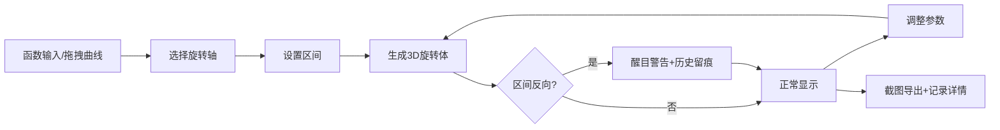

## 1. 产品概述
数学旋转体展台是一个交互式教学工具，帮助学生直观理解旋转体体积概念。用户可以拖动函数曲线、选择旋转轴，实时查看3D旋转体形状，并同步更新参数数据和历史记录。

- **核心目标**：解决学生难以理解旋转轴方向和区间反向导致的概念混淆问题
- **目标用户**：高中/大学数学学生、教师
- **产品价值**：通过可视化交互降低抽象概念的理解门槛

## 2. 核心功能

### 2.1 用户角色
| 角色 | 注册方式 | 核心权限 |
|------|----------|----------|
| 访客用户 | 无需注册 | 使用所有可视化功能、导出截图、查看历史记录 |

### 2.2 功能模块
1. **3D旋转体可视化区**：实时渲染旋转体模型、坐标轴标识、切片演示
2. **函数曲线编辑器**：参数输入、曲线预览、拖拽调整、区间设置
3. **控制面板**：旋转轴选择、参数滑块、播放控制、重置功能
4. **历史记录面板**：操作轨迹、备注编辑、筛选功能
5. **数据详情区**：体积计算、参数对应关系、截图导出

### 2.3 页面详情
| 页面名称 | 模块名称 | 功能描述 |
|----------|----------|----------|
| 主工作台 | 3D场景区 | Three.js渲染旋转体，支持旋转缩放，异常状态醒目提示 |
| 主工作台 | 曲线编辑器 | 函数输入、区间设置、拖拽控制点、实时预览 |
| 主工作台 | 参数控制区 | 旋转轴切换、精度滑块、播放动画、重置对比 |
| 主工作台 | 历史记录 | 操作时间轴、筛选、备注、缺字段标记 |
| 主工作台 | 详情面板 | 体积数值、参数对应表、截图导出 |

## 3. 核心流程
用户通过函数输入或拖拽创建曲线→选择旋转轴（X/Y）→设置区间范围→系统实时生成3D旋转体→调整参数观察变化→截图导出并记录历史

## 4. 用户界面设计

### 4.1 设计风格
- **主色调**：深蓝科技感 (#1a1a2e) 搭配 青蓝高亮 (#00d4ff)
- **警告色**：亮橙红 (#ff4757) 用于区间反向和轴线混淆提示
- **按钮风格**：微立体圆角按钮，悬停时有微妙发光效果
- **字体**：Fira Code（代码/数字） + Noto Sans SC（中文）
- **布局风格**：左侧控制面板 + 中央3D场景 + 右侧详情面板的三栏布局
- **图标风格**：线性简洁图标，数学符号结合几何元素

### 4.2 页面设计概述
| 页面名称 | 模块名称 | UI元素 |
|----------|----------|--------|
| 主工作台 | 3D场景区 | 半透明网格地面、渐变背景、坐标轴箭头、悬浮信息卡 |
| 主工作台 | 曲线编辑器 | 坐标网格、可拖拽控制点、函数表达式输入框 |
| 主工作台 | 参数控制区 | 滑块组件、切换开关、播放进度条、重置按钮组 |
| 主工作台 | 历史记录 | 时间轴卡片、状态标签（正常/警告/缺字段）、备注输入 |
| 主工作台 | 详情面板 | 参数对照表、体积计算结果、截图预览、导出按钮 |

### 4.3 响应式
- **桌面端**：三栏布局完整展示
- **平板端**：左右面板可折叠收起
- **移动端**：上下堆叠布局，优先保证3D场景可见性

### 4.4 3D场景指导
- **环境**：深色渐变背景 + 柔和环境光，营造科技感
- **光照设置**：主光源+补光组合，突出旋转体曲面细节
- **相机设置**：初始45度俯视角，支持轨道控制
- **交互**：鼠标拖拽旋转、滚轮缩放、双击重置视角
- **动画**：旋转轴高亮脉冲、切片生成动画、参数变化平滑过渡
- **后期处理**：轻微泛光效果，增强科技感
