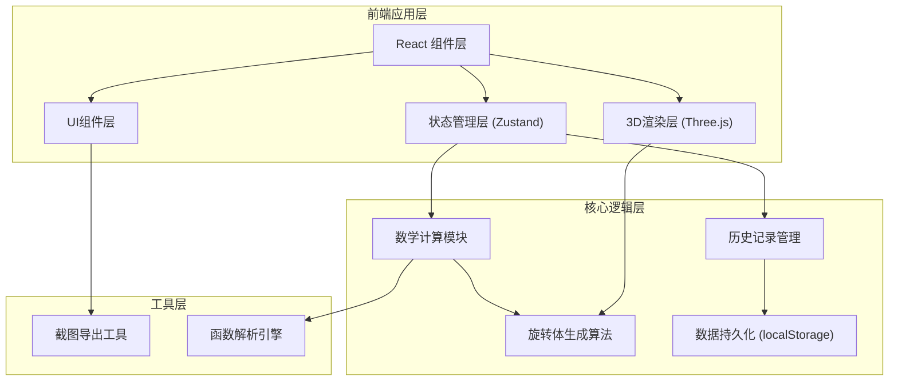

## 1. 架构设计


## 2. 技术描述
- **前端框架**: React@18 + TypeScript
- **构建工具**: Vite@5
- **样式方案**: TailwindCSS@3
- **3D渲染**: Three.js + @react-three/fiber + @react-three/drei
- **状态管理**: Zustand
- **数学计算**: mathjs
- **图表绘制**: @nivo/line
- **图标**: lucide-react

## 3. 路由定义
| 路由 | 用途 |
|------|------|
| / | 主工作台（唯一页面） |

## 4. 数据模型

### 4.1 核心数据类型
```typescript
// 函数配置
interface FunctionConfig {
  id: string;
  expression: string;      // 函数表达式，如 "x^2"
  variable: 'x' | 'y';     // 自变量
  domain: {
    start: number;         // 区间起点
    end: number;           // 区间终点
    isReversed: boolean;   // 是否区间反向
  };
  color: string;
}

// 旋转轴配置
interface RotationAxis {
  axis: 'x' | 'y';         // 旋转轴
  offset: number;          // 轴偏移量
}

// 旋转体参数
interface SolidOfRevolution {
  functionId: string;
  rotationAxis: RotationAxis;
  slices: number;          // 切片数量
  precision: number;       // 精度
  volume: number;          // 计算出的体积
}

// 历史记录
interface HistoryRecord {
  id: string;
  timestamp: number;
  type: 'create' | 'update' | 'export' | 'warning';
  functionConfig: FunctionConfig;
  rotationAxis: RotationAxis;
  volume: number;
  screenshot?: string;     // base64截图
  remark: string;
  tags: string[];
  status: 'normal' | 'warning' | 'missing_field' | 'late_edit';
  issues: {
    reversedInterval: boolean;
    axisConfusion: boolean;
    insufficientSlices: boolean;
  };
}

// 应用状态
interface AppState {
  currentFunction: FunctionConfig;
  rotationAxis: RotationAxis;
  solidParams: { slices: number; precision: number };
  history: HistoryRecord[];
  selectedHistoryId: string | null;
  isPlaying: boolean;
  playbackSpeed: number;
  filters: {
    types: string[];
    dateRange: [number, number] | null;
  };
}
```

### 4.2 初始样例数据
```typescript
const initialHistory: HistoryRecord[] = [
  {
    id: '1',
    timestamp: Date.now() - 86400000 * 3,
    type: 'warning',
    functionConfig: {
      id: 'f1',
      expression: 'x^2',
      variable: 'x',
      domain: { start: 2, end: 0, isReversed: true },
      color: '#00d4ff'
    },
    rotationAxis: { axis: 'x', offset: 0 },
    volume: 0,
    remark: '区间反向，已自动修正但保留警告',
    tags: ['缺字段', '晚补'],
    status: 'warning',
    issues: { reversedInterval: true, axisConfusion: false, insufficientSlices: false }
  },
  {
    id: '2',
    timestamp: Date.now() - 86400000 * 2,
    type: 'create',
    functionConfig: {
      id: 'f2',
      expression: 'sin(x)',
      variable: 'x',
      domain: { start: 0, end: 3.14, isReversed: false },
      color: '#ff6b6b'
    },
    rotationAxis: { axis: 'x', offset: 0 },
    volume: 4.9348,
    remark: '备注改过：调整了区间上限',
    tags: ['备注修改'],
    status: 'normal',
    issues: { reversedInterval: false, axisConfusion: false, insufficientSlices: false }
  },
  {
    id: '3',
    timestamp: Date.now() - 86400000,
    type: 'warning',
    functionConfig: {
      id: 'f3',
      expression: 'sqrt(x)',
      variable: 'x',
      domain: { start: 0, end: 4, isReversed: false },
      color: '#4ecdc4'
    },
    rotationAxis: { axis: 'y', offset: 0 },
    volume: 25.1327,
    remark: '切片过少警告，建议增加精度',
    tags: ['缺字段'],
    status: 'missing_field',
    issues: { reversedInterval: false, axisConfusion: false, insufficientSlices: true }
  }
];
```

## 5. 核心模块设计

### 5.1 3D旋转体生成模块
- 使用 LatheGeometry 或自定义 BufferGeometry 生成旋转体
- 支持动态切片数量调整
- 实现区间反向检测和可视化警告

### 5.2 数学计算模块
- 基于圆盘法/壳层法计算旋转体体积
- 函数表达式解析与求值
- 区间合法性校验

### 5.3 历史记录模块
- localStorage 持久化
- 筛选与搜索功能
- 状态标签管理

### 5.4 截图导出模块
- Three.js 场景截图
- 参数信息叠加
- 对应关系记录
