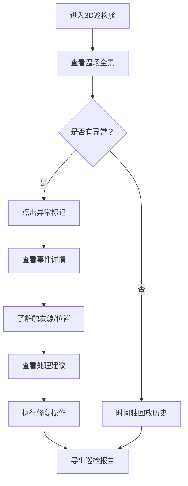

## 1. 产品概述
冷链冷库温场巡检舱是一个面向冷链工程师的3D交互式工作台，用于可视化监控冷库温度分布、设备状态和货品信息。通过整合货架模型、温度探头、货品批次和风机状态，帮助工程师快速定位异常问题，减少排查时间，提高冷链运营效率。

- **核心目标**：将分散的线索（货架改动、货品批次、风机状态）归到统一事件中，实现异常问题的快速溯源和决策支持
- **目标用户**：冷链工程师、冷库运维人员、质量管控人员

## 2. 核心功能

### 2.1 用户角色
| 角色 | 注册方式 | 核心权限 |
|------|----------|----------|
| 冷链工程师 | 企业账号登录 | 3D巡检、异常处理、报告导出、配置管理 |
| 运维人员 | 企业账号登录 | 设备监控、状态查看、基础操作 |

### 2.2 功能模块
1. **3D温场巡检舱**：交互式3D场景、货架模型可视化、温场热力分布、时间轴播放
2. **事件中心**：异常事件归集、问题溯源、处理建议
3. **详情面板**：货架模型详情、探头数据、货品信息、报告导出
4. **时间轴控制**：历史回放、时间戳标注、快照截图

### 2.3 页面详情
| 页面名称 | 模块名称 | 功能描述 |
|----------|----------|----------|
| 主巡检舱 | 3D场景视图 | 可旋转/缩放/平移的冷库3D模型，支持货架、探头、风机的交互选中 |
| 主巡检舱 | 温场可视化 | 温度热力图叠加，带数值标注，不依赖颜色单独识别 |
| 主巡检舱 | 异常高亮 | 探头离线、货品遮挡、风机停转等异常状态醒目标注 |
| 主巡检舱 | 时间轴控制 | 播放/暂停、进度拖拽、关键时间点标记 |
| 事件面板 | 事件列表 | 按时间排序的异常事件，关联相关线索 |
| 事件面板 | 事件溯源 | 显示触发源、卡顿位置、下一步操作建议 |
| 详情面板 | 货架信息 | 货架ID、位置、改动记录、关联探头 |
| 详情面板 | 探头详情 | 探头状态、历史数据、校准信息、对应关系 |
| 详情面板 | 货品批次 | 批次信息、存放位置、温度敏感等级 |
| 详情面板 | 报告导出 | 生成包含截图和数据的巡检报告 |

## 3. 核心流程

用户进入3D巡检舱，查看整体温场分布。系统自动归集相关线索，当发生异常时（探头离线/货品遮挡/风机停转），工程师点击异常标记查看事件详情，了解触发源和位置，按照系统建议进行处理，最后导出巡检报告留档。

## 4. 界面设计

### 4.1 设计风格
- **主色调**：深蓝冷色调 (#0A1628) 配合科技感青色 (#00D4FF) 强调，体现冷链的低温专业感
- **辅助色**：红色 (#FF4757) 表示异常，黄色 (#FFA502) 表示警告，绿色 (#2ED573) 表示正常
- **按钮风格**：微立体圆角矩形，悬停时有光效反馈
- **字体**：JetBrains Mono（数字显示）+ Noto Sans SC（中文显示），等宽字体确保数据对齐
- **布局风格**：三栏式布局，左侧事件列表 + 中央3D主视图 + 右侧详情面板
- **图标风格**：线性简约图标，配合状态色彩区分

### 4.2 页面设计概览
| 页面名称 | 模块名称 | UI元素 |
|----------|----------|--------|
| 主巡检舱 | 3D场景视图 | 深色背景、网格地面、半透明货架、发光探头标记、悬浮数值标签 |
| 主巡检舱 | 时间轴控制 | 底部通栏、进度条带刻度、播放控制按钮、关键事件标记点 |
| 事件面板 | 事件卡片 | 带状态色边框、时间戳、事件类型、关联线索数 |
| 详情面板 | 信息分组 | 折叠式分组、键值对布局、对应关系表格、导出按钮 |

### 4.3 响应式
- 桌面端优先设计（1920×1080），支持窗口缩放
- 3D场景自适应容器大小
- 面板可折叠收起，最大化3D视图空间

### 4.4 3D场景指引
- **环境**：深色科技感空间，蓝色环境光，冷库内部氛围
- **光照**：主光源从上方照射，补光突出货架和探头，产生柔和阴影
- **相机**：透视相机，支持轨道控制（旋转/缩放/平移），默认45度俯视角
- **交互**：点击货架/探头/风机选中，高亮显示并显示详情，悬停显示信息卡
- **动画**：温场变化平滑过渡，异常状态呼吸闪烁，时间轴播放时模型联动
- **后期**：轻微辉光效果，增强科技感，色调映射确保色彩准确
