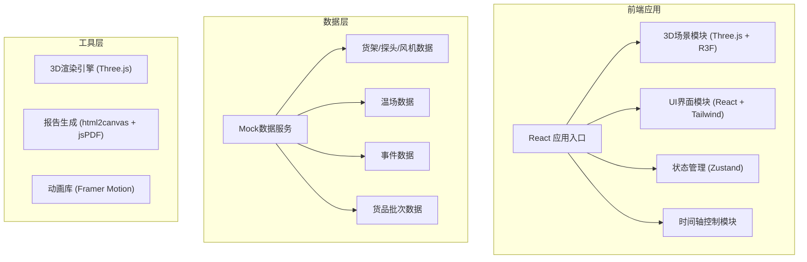

## 1. 架构设计



## 2. 技术栈说明
- **前端框架**: React@18 + TypeScript + Vite
- **3D引擎**: Three.js + @react-three/fiber + @react-three/drei
- **样式方案**: TailwindCSS@3
- **状态管理**: Zustand
- **动画效果**: Framer Motion
- **报告导出**: html2canvas + jsPDF
- **数据**: Mock数据（内置模拟数据）

## 3. 目录结构
```
src/
├── components/
│   ├── Scene3D/           # 3D场景组件
│   │   ├── ColdStore.tsx  # 冷库主场景
│   │   ├── Shelf.tsx      # 货架模型
│   │   ├── Probe.tsx      # 温度探头
│   │   ├── Fan.tsx        # 风机模型
│   │   ├── HeatMap.tsx    # 温场热力图
│   │   └── InfoLabel.tsx  # 信息标签
│   ├── Panels/
│   │   ├── EventPanel.tsx # 事件面板
│   │   ├── DetailPanel.tsx# 详情面板
│   │   └── Timeline.tsx   # 时间轴控制
│   └── common/            # 通用组件
├── store/
│   └── useStore.ts        # 状态管理
├── data/
│   └── mockData.ts        # Mock数据
├── types/
│   └── index.ts           # 类型定义
├── utils/
│   └── exportReport.ts    # 报告导出工具
├── App.tsx
└── main.tsx
```

## 4. 数据模型定义

### 4.1 核心数据类型

```typescript
// 货架模型
interface Shelf {
  id: string;
  name: string;
  position: [number, number, number];
  dimensions: { width: number; height: number; depth: number };
  lastModified: string;
  probeIds: string[];
}

// 温度探头
interface Probe {
  id: string;
  name: string;
  shelfId: string;
  position: [number, number, number];
  status: 'online' | 'offline' | 'warning';
  currentTemp: number;
  history: { timestamp: string; temp: number }[];
  lastCalibration: string;
}

// 风机
interface Fan {
  id: string;
  name: string;
  position: [number, number, number];
  status: 'running' | 'stopped' | 'error';
  speed: number;
}

// 货品批次
interface ProductBatch {
  id: string;
  name: string;
  shelfId: string;
  position: [number, number, number];
  temperatureSensitivity: 'high' | 'medium' | 'low';
  storageTime: string;
}

// 异常事件
interface Event {
  id: string;
  type: 'probe_offline' | 'product_block' | 'fan_stop';
  timestamp: string;
  severity: 'critical' | 'warning' | 'info';
  sourceId: string;
  sourceType: 'probe' | 'product' | 'fan';
  description: string;
  location: string;
  suggestion: string;
  relatedClues: { type: string; id: string; name: string }[];
}

// 温场数据
interface TemperatureData {
  timestamp: string;
  grid: { x: number; y: number; z: number; temp: number }[];
}
```

## 5. 交互与性能优化
- **按需渲染**: 仅在数据变化或用户交互时更新3D场景
- **LOD优化**: 远距离模型降低细节层次
- **事件节流**: 鼠标移动和缩放操作使用防抖节流
- **数据分页**: 历史数据按需加载，避免一次性加载过多
