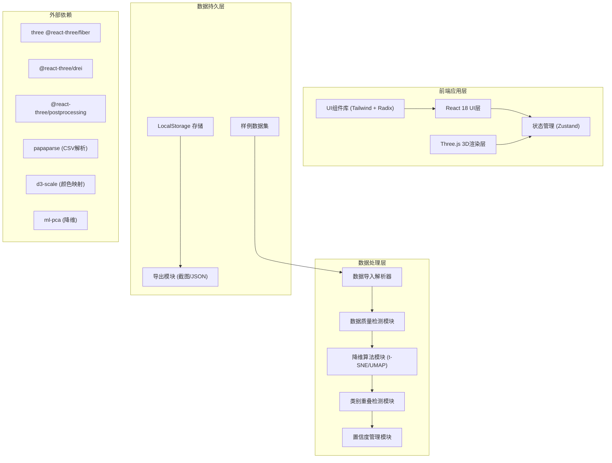
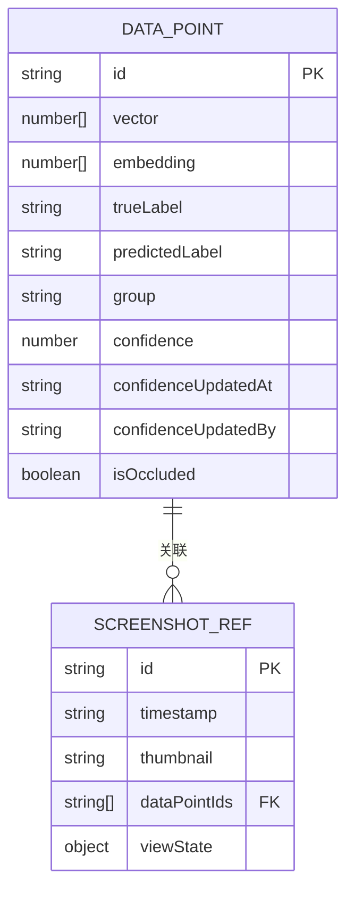

## 1. Architecture Design



## 2. Technology Description
- **前端框架**: React@18 + TypeScript + Vite@5
- **样式方案**: TailwindCSS@3 + CSS变量主题系统
- **3D渲染**: three + @react-three/fiber + @react-three/drei + @react-three/postprocessing
- **状态管理**: Zustand (轻量级，支持时间旅行调试)
- **数据处理**: papaparse (CSV解析) + ml-pca + 自定义t-SNE实现 + d3-scale
- **UI组件**: Radix UI (无样式组件库) + lucide-react (图标)
- **后端**: 无，纯前端应用，所有数据本地处理
- **数据库**: LocalStorage + IndexedDB (可选，用于大数据量缓存)
- **样例数据**: 内置Mock数据，包含类别重叠、异常点遮挡、降维不稳三种场景

## 3. Route Definitions
| Route | Purpose |
|-------|---------|
| / | 主应用页面，包含3D星图、筛选面板、详情面板 |
| /examples/:type | 直接加载指定样例数据 (overlap/occlusion/instability) |

## 4. API Definitions (无后端)
所有数据处理均在前端完成，定义以下TypeScript类型：

```typescript
// 样本数据点
interface DataPoint {
  id: string;
  vector: number[];           // 原始高维向量
  embedding: [number, number, number];  // 3D嵌入坐标
  trueLabel: string;          // 真实标签
  predictedLabel?: string;    // 预测标签（可选）
  group: string;              // 分组字段
  confidence: number;         // 置信度 0-1
  confidenceUpdatedAt?: string;  // 置信度补录时间
  confidenceUpdatedBy?: string;  // 补录操作人
  isOccluded?: boolean;       // 是否被遮挡
  occlusionReason?: string;   // 遮挡原因
  screenshots: ScreenshotRef[];  // 关联的导出截图
}

// 截图引用
interface ScreenshotRef {
  id: string;
  timestamp: string;
  thumbnail: string;  // base64缩略图
  dataPoints: string[];  // 截图时选中的点ID
  viewState: CameraState;  // 截图时的相机状态
}

// 相机状态
interface CameraState {
  position: [number, number, number];
  target: [number, number, number];
}

// 数据质量报告
interface DataQualityReport {
  hasMissingVectors: boolean;
  missingVectorCount: number;
  hasMissingLabels: boolean;
  missingLabelCount: number;
  hasUnevenGroups: boolean;
  groupDistribution: Record<string, number>;
  overlapScore: number;  // 0-1 重叠程度
  stabilityScore: number;  // 0-1 降维稳定性
}

// 筛选状态
interface FilterState {
  selectedLabels: string[];
  confidenceRange: [number, number];
  selectedGroups: string[];
  showOverlapOnly: boolean;
  showOccluded: boolean;
}

// 应用状态
interface AppState {
  dataPoints: DataPoint[];
  selectedPointIds: string[];
  filters: FilterState;
  qualityReport: DataQualityReport | null;
  showOverlapHulls: boolean;
  datasetName: string;
}
```

## 5. 数据模型

### 5.1 Data Model ER Diagram


### 5.2 数据结构说明
- **DataPoint**: 核心数据实体，存储每个样本的完整信息，从原始向量到3D嵌入坐标
- **ScreenshotRef**: 记录每次导出截图的元数据，包含当时选中的点和相机视角，用于追溯
- **FilterState**: 多维筛选条件，与3D视图实时联动
- **DataQualityReport**: 数据质量检测结果，用于在界面上显示警示

### 5.3 本地存储结构
```
localStorage:
  └── ai-starmap-state/
      ├── current-dataset.json       # 当前数据集
      ├── screenshots/               # 截图缩略图存储 (IndexedDB)
      └── history/                   # 置信度变更历史
```
