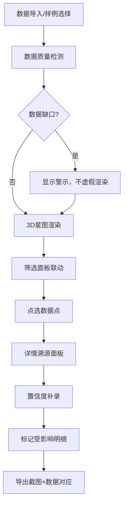

## 1. 产品概述
AI特征误判星图是面向算法工程师的评审与讲解工具，通过3D可视化直观呈现高维特征空间中的类别重叠、异常点遮挡、降维不稳等问题，解决在样本向量、真实标签、分组字段间反复切换的痛点，支持数据溯源与置信度补录标记。
- 核心价值：将抽象的特征空间问题具象化，让评审过程有据可依、有迹可循
- 目标用户：算法工程师、模型评审人员、技术负责人

## 2. 核心 Features

### 2.1 用户角色
| 角色 | 注册方式 | 核心权限 |
|------|----------|----------|
| 算法工程师 | 无需注册，本地使用 | 数据导入、可视化交互、导出截图、置信度补录 |
| 评审人员 | 无需注册，本地使用 | 查看星图、筛选联动、追溯数据来源 |

### 2.2 Feature Module
1. **3D星图主界面**：特征空间嵌入可视化，支持旋转、缩放、点选交互
2. **数据导入模块**：支持CSV/JSON格式导入样本向量、真实标签、分组字段
3. **筛选联动面板**：按类别、置信度、分组等多维筛选，实时联动3D视图
4. **类别重叠检测**：自动识别并高亮显示重叠区域，计算重叠度指标
5. **数据质量警示**：检测数据缺口，在3D图旁明确标注问题而非虚假渲染
6. **置信度补录标记**：补录置信度后，可视化标记受影响的数据点及明细
7. **详情溯源面板**：展示点选样本的向量、真实标签、分组信息、截图对应关系
8. **样例数据集**：预置类别重叠、异常点遮挡、降维不稳三种典型场景样例

### 2.3 Page Details
| 页面名称 | 模块名称 | Feature 描述 |
|---------|----------|--------------|
| 主页面 | 3D星图区域 | Three.js渲染特征嵌入点云，颜色编码类别，大小表示置信度，标签显示分组 |
| 主页面 | 左侧筛选面板 | 类别筛选器、置信度区间滑块、分组字段筛选、数据质量状态指示 |
| 主页面 | 右侧详情面板 | 选中点的向量数值、真实标签、分组信息、历史截图关联、置信度变更记录 |
| 主页面 | 顶部工具栏 | 数据导入、样例加载、导出截图、视图重置、重叠检测开关 |
| 主页面 | 底部状态栏 | 数据统计信息、重叠度指标、降维稳定性评分、数据缺口警示 |
| 数据导入弹窗 | 文件上传区 | 拖拽上传CSV/JSON，自动识别向量、标签、分组字段映射 |
| 置信度补录弹窗 | 批量编辑 | 支持框选数据点批量补录置信度，记录补录时间与操作人 |

## 3. 核心流程
用户导入或选择样例数据 → 系统自动检测数据质量并标注问题 → 3D星图渲染特征空间，颜色区分类别 → 用户通过筛选面板联动筛选 → 点击数据点查看详情，追溯来源 → 发现误判区域后框选补录置信度 → 系统自动标记受影响明细 → 导出截图与对应数据记录留痕

## 4. User Interface Design

### 4.1 Design Style
- **主色调**：深空蓝(#0A0E27)为背景，配合荧光色系区分类别（青蓝#00D4FF、洋红#FF00AA、翠绿#00FF88、琥珀#FFAA00）
- **警示色**：数据缺口用橙红(#FF4444)边框闪烁提示
- **补录标记**：用金色(#FFD700)光晕圈出置信度补录的点
- **字体**：标题用Space Grotesk，正文用JetBrains Mono等宽字体便于展示数值
- **整体风格**：科技感星图风格，深色背景配合发光点云，模拟宇宙星图的深邃感

### 4.2 Page Design Overview
| 页面名称 | 模块名称 | UI Elements |
|---------|----------|-------------|
| 主页面 | 3D星图区域 | 背景星空粒子效果、发光点云、重叠区域半透明凸包、鼠标悬停显示标签、点选后详情飞入动画 |
| 主页面 | 左侧筛选面板 | 毛玻璃效果卡片、类别色卡复选框、双滑块置信度区间、分组下拉筛选、数据质量状态徽章 |
| 主页面 | 右侧详情面板 | 向量数值表格、真实标签高亮、分组信息卡片、截图缩略图时间线、置信度变更记录 |
| 主页面 | 顶部工具栏 | 图标按钮组、样例下拉菜单、导出按钮带下拉选项 |
| 主页面 | 底部状态栏 | 关键指标卡片、进度条式重叠度展示、降维稳定性评分仪表盘 |

### 4.3 Responsiveness
- 桌面端优先，三栏布局（左20% + 中60% + 右20%）
- 平板端可折叠左右面板，通过抽屉式呼出
- 支持全屏模式，隐藏所有面板专注星图展示

### 4.4 3D Scene Guidance
- **环境**：深空背景，远处微弱星空粒子，营造宇宙空间感
- **光照**：环境光 + 点光源跟随相机，点云材质自发光，重叠区域有额外体积光
- **相机**：PerspectiveCamera，支持轨道控制，初始视角45度俯角
- **交互**：左键旋转、右键平移、滚轮缩放、点选高亮、框选批量操作
- **动画**：点云入场粒子动画、重叠检测结果渐显、补录点脉冲光晕、详情面板滑入
- **后处理**：Bloom泛光效果增强发光感、轻微景深突出选中区域、FXAA抗锯齿
- **性能**：点云使用BufferGeometry，限制最大点数10000，支持LOD策略
