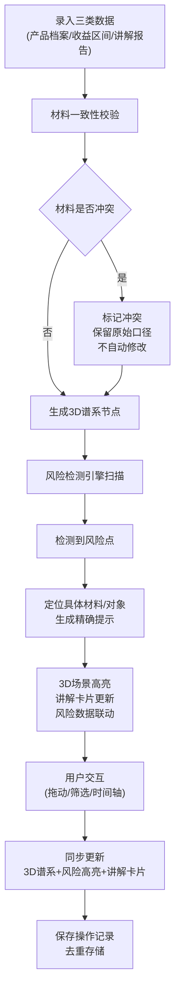

## 1. 产品概述

金融产品谱系宇宙是一个3D可视化风险核查平台，将复杂的金融产品体系映射为可交互的三维空间，帮助业务人员、风控人员和合规人员直观发现收益夸大、风险错层、期限缺失等问题。

- 核心目标：解决3D谱系之后收益夸大说不清的问题，让产品风险关系可视化、可追溯、可验证
- 目标用户：金融机构业务人员、风控审核员、合规审查人员、产品经理
- 核心价值：通过三维空间+时间轴的双重维度，实现风险点的精确定位与材料级追溯

## 2. 核心功能

### 2.1 用户角色

| 角色 | 注册方式 | 核心权限 |
|------|----------|----------|
| 业务录入员 | 系统账号登录 | 录入产品档案、收益区间、讲解报告 |
| 风控审核员 | 系统账号登录 | 查看3D谱系、风险检测、导出报告 |
| 合规管理员 | 系统账号登录 | 管理历史记录、配置风险规则、查看全部数据 |

### 2.2 功能模块

1. **3D谱系主场景**：产品节点三维布局、风险高亮、连接线关系、空间旋转缩放
2. **数据输入面板**：产品档案录入、收益区间配置、讲解报告上传
3. **风险检测引擎**：风险错层检测、期限缺失检测、收益夸大检测
4. **交互控制面板**：产品筛选器、时间轴播放器、视图切换
5. **历史记录管理**：操作回溯、版本对比、防重复结论

### 2.3 页面详情

| 页面名称 | 模块名称 | 功能描述 |
|----------|----------|----------|
| 主工作台 | 3D谱系场景 | 产品节点三维展示、拖拽交互、风险高亮动画、连接线关系可视化 |
| 主工作台 | 左侧输入面板 | 产品档案表单、收益区间配置器、讲解报告文本区、材料冲突标记 |
| 主工作台 | 右侧讲解卡片 | 选中产品详情、风险提示（精确到材料/对象）、收益对比图表 |
| 主工作台 | 底部控制栏 | 产品筛选器（类型/风险等级/期限）、时间轴（播放/暂停/跳转）、视图预设 |
| 历史记录页 | 历史列表 | 操作时间线、版本快照、重复结论检测、一键恢复 |

## 3. 核心流程

## 4. 用户界面设计

### 4.1 设计风格
- **设计方向**：金融科技风格，深色系专业仪表盘，数据可视化优先
- **主色调**：深空蓝 #0A1628 背景，科技青 #00D4FF 高亮，警示红 #FF4757 风险标识，信任绿 #2ED573 安全标识
- **字体**：标题使用 Space Grotesk，正文使用 Inter Mono（等宽字体确保数据对齐）
- **布局**：三栏布局 + 底部控制栏，中央3D场景占主导地位
- **动效**：节点脉冲动画、风险扫描线、连接线流光、页面过渡采用淡入+滑动组合

### 4.2 页面设计概述

| 页面名称 | 模块名称 | UI元素 |
|----------|----------|--------|
| 主工作台 | 3D谱系场景 | 发光产品节点（按风险等级着色）、半透明连接线、光晕效果、坐标轴参考线、鼠标悬停信息框 |
| 主工作台 | 左侧输入面板 | 卡片式表单、材料冲突黄色边框标记、收益区间滑块、报告文本编辑器（带行号） |
| 主工作台 | 右侧讲解卡片 | 玻璃拟态风格、风险项红色标记带材料来源链接、收益对比柱状图、期限时间线 |
| 主工作台 | 底部控制栏 | 胶囊式筛选标签、时间轴进度条（带刻度标记）、播放控制按钮组、视图切换下拉 |
| 历史记录页 | 历史列表 | 时间线布局、重复记录红色边框、版本对比分屏视图、恢复按钮 |

### 4.3 响应式
- 桌面端优先（1920×1080及以上），三栏布局完整展示
- 平板端折叠为左右可滑动面板，3D场景保持全屏
- 移动端简化为列表+详情模式，3D场景转为缩略图+关键指标卡片

### 4.4 3D场景指引
- **环境**：深空背景配合星点粒子效果，营造"宇宙"氛围，无HDRI避免反射干扰
- **光照**：环境光+方向光主照明，节点自发光材质，风险节点使用点光源投射红色光晕
- **相机**：透视相机，初始距离包含全部节点，支持轨道控制器（缩放/旋转/平移）
- **构图**：产品按类型分布在不同高度层，高风险产品置于前景突出位置，连接线形成蜘蛛网结构
- **交互**：节点悬停放大+显示标签，点击选中后相机平滑聚焦，支持框选多个节点
- **后处理**：Bloom泛光效果增强科技感，风险节点使用Glitch故障效果闪烁提示
- **性能**：节点数量控制在50-200个，使用InstancedMesh优化，目标帧率60fps
