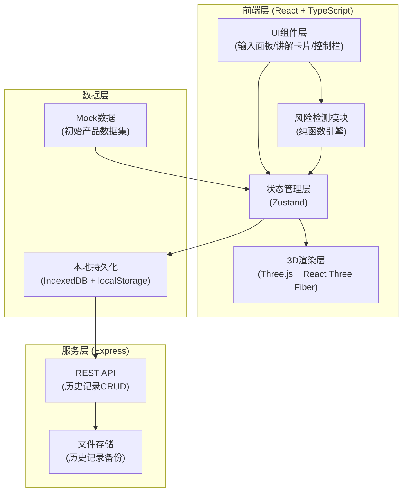
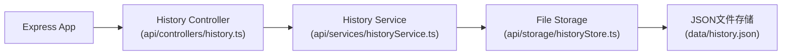
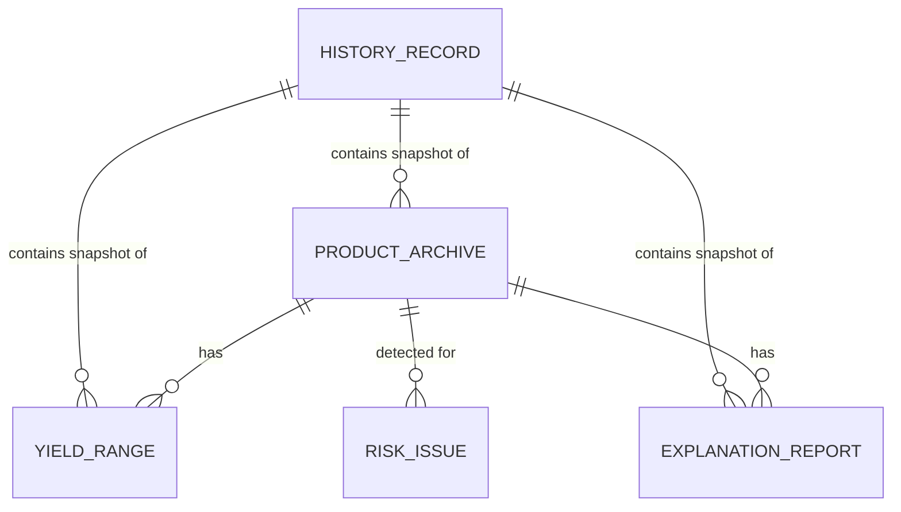

## 1. 架构设计



## 2. 技术描述

- **前端框架**：React@18 + TypeScript + Vite
- **3D渲染**：three@0.160 + @react-three/fiber@8 + @react-three/drei@9 + @react-three/postprocessing@2
- **状态管理**：zustand@4
- **样式方案**：tailwindcss@3
- **路由管理**：react-router-dom@6
- **图表库**：recharts@2（收益对比图表）
- **图标库**：lucide-react
- **后端服务**：Express@4 + TypeScript
- **本地持久化**：IndexedDB（idb@7库封装）+ localStorage（配置项）
- **数据校验**：zod@3（输入数据schema校验）

## 3. 路由定义

| 路由 | 页面/组件 | 用途 |
|------|----------|------|
| `/` | `pages/Workbench.tsx` | 主工作台 - 3D谱系+输入面板+讲解卡片+控制栏 |
| `/history` | `pages/History.tsx` | 历史记录管理页 |
| `/settings` | `pages/Settings.tsx` | 系统设置页（风险规则配置） |

## 4. API 定义

### 4.1 TypeScript 类型定义

```typescript
// 产品档案
interface ProductArchive {
  id: string;
  name: string;
  type: 'fund' | 'insurance' | 'bond' | 'derivative' | 'structured';
  riskLevel: 1 | 2 | 3 | 4 | 5;
  issuer: string;
  code: string;
  createTime: number;
  sourceMaterial: string;
}

// 收益区间
interface YieldRange {
  productId: string;
  expectedMin: number;
  expectedMax: number;
  historicalMin: number;
  historicalMax: number;
  benchmark: number;
  sourceMaterial: string;
}

// 讲解报告
interface ExplanationReport {
  productId: string;
  content: string;
  reporter: string;
  reportTime: number;
  sourceMaterial: string;
}

// 风险检测结果
interface RiskIssue {
  id: string;
  productId: string;
  type: 'risk_misalignment' | 'maturity_missing' | 'yield_exaggeration';
  severity: 'warning' | 'critical';
  description: string;
  sourceMaterials: string[];
  targetObject: string;
  detectedTime: number;
}

// 操作历史记录
interface HistoryRecord {
  id: string;
  timestamp: number;
  action: string;
  productIds: string[];
  snapshot: {
    products: ProductArchive[];
    yields: YieldRange[];
    reports: ExplanationReport[];
  };
  checksum: string;
}

// 3D节点数据
interface ProductNode3D {
  productId: string;
  position: [number, number, number];
  color: string;
  scale: number;
  riskHighlight: boolean;
}
```

### 4.2 API 接口

| 方法 | 路径 | 请求体 | 响应 | 用途 |
|------|------|--------|------|------|
| GET | `/api/history` | - | `HistoryRecord[]` | 获取历史记录列表 |
| POST | `/api/history` | `HistoryRecord` | `{ id: string }` | 保存历史记录 |
| GET | `/api/history/:id` | - | `HistoryRecord` | 获取单条历史记录 |
| DELETE | `/api/history/:id` | - | `{ success: boolean }` | 删除历史记录 |
| POST | `/api/history/verify` | `{ checksum: string }` | `{ exists: boolean }` | 检查重复记录 |

## 5. 服务端架构



## 6. 数据模型

### 6.1 实体关系图



### 6.2 核心数据结构说明

**产品档案 (ProductArchive)**
- 主键：`id` (UUID)
- 唯一约束：`code` (产品代码)
- 索引：`type`, `riskLevel`, `createTime`

**收益区间 (YieldRange)**
- 外键：`productId` → `ProductArchive.id`
- 校验：`expectedMin ≤ expectedMax`, `historicalMin ≤ historicalMax`

**讲解报告 (ExplanationReport)**
- 外键：`productId` → `ProductArchive.id`
- 全文索引：`content`

**风险问题 (RiskIssue)**
- 类型枚举：`risk_misalignment`（风险错层）、`maturity_missing`（期限缺失）、`yield_exaggeration`（收益夸大）
- `sourceMaterials` 存储具体材料来源，`targetObject` 定位具体问题对象

**历史记录 (HistoryRecord)**
- `checksum` 字段用于防重复，基于 snapshot 内容生成 SHA-256 哈希
- 存储完整快照，支持一键恢复

## 7. 关键技术决策

### 7.1 3D 渲染方案
- 使用 `@react-three/fiber` 声明式管理 Three.js 场景
- 产品节点使用 `InstancedMesh` 批量渲染提升性能
- 后处理使用 `@react-three/postprocessing` 的 `EffectComposer` + `Bloom`
- 风险节点使用自定义 ShaderMaterial 实现脉冲发光效果

### 7.2 风险检测引擎
- 纯函数设计，输入数据输出风险问题，无副作用
- 三类风险检测规则：
  1. **风险错层**：产品档案风险等级与收益区间不匹配（高风险低收益/低风险高收益）
  2. **期限缺失**：产品档案或讲解报告中缺少到期日、存续期等期限信息
  3. **收益夸大**：讲解报告中收益率 > 收益区间上限 * 1.1 倍，或与历史数据偏差过大

### 7.3 持久化方案
- 前端使用 IndexedDB 存储完整数据，localStorage 存储 UI 状态
- 后端使用 JSON 文件存储历史记录备份，支持跨会话恢复
- 防重复机制：保存前计算 checksum，与已有记录比对，重复则拒绝保存

### 7.4 状态管理分层
```
zustand store
├── products: ProductArchive[]
├── yields: YieldRange[]
├── reports: ExplanationReport[]
├── risks: RiskIssue[]
├── selectedProductId: string | null
├── filters: { type, riskLevel, maturity }
├── timeline: { current, playing, speed }
├── nodes3D: ProductNode3D[]
└── history: HistoryRecord[]
```
