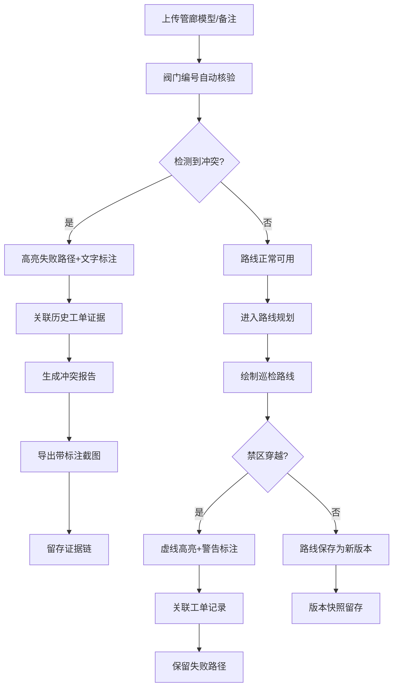

## 1. 产品概述

核电管廊巡检路由3D工作台是为核电运维工程师设计的专业级3D交互平台，解决管廊模型变更、巡检路线多版本、阀门重号、路线穿禁区等核心问题，提供可追溯的证据链管理和清晰的可视化标注。

- 核心问题：模型备注修改、路线版本迭代导致口径混乱；人工核验易凭印象出错；工单过期被新版本覆盖
- 目标用户：核电运维工程师、巡检规划人员、安全审核人员
- 核心价值：提供可交互3D工作台而非单纯模型展示；冲突自动检测；证据链完整留存；标注清晰可追溯

## 2. 核心功能

### 2.1 用户角色

| 角色 | 注册方式 | 核心权限 |
|------|----------|----------|
| 运维工程师 | 企业账号登录 | 路线规划、阀门核验、冲突检测、工单查看 |
| 安全审核员 | 企业账号登录 | 禁区审核、冲突确认、证据链审计 |
| 系统管理员 | 企业账号登录 | 模型上传、版本管理、权限配置 |

### 2.2 功能模块

1. **3D工作台主页**：管廊模型全景展示、路线叠加、阀门标注、冲突高亮
2. **路线规划模块**：多版本路线管理、路线绘制、禁区穿越检测
3. **阀门管理模块**：阀门编号核验、重号检测、备注历史追溯
4. **工单证据模块**：工单记录关联、版本快照、证据链详情
5. **冲突检测中心**：阀门重号冲突、路线穿禁区、模型与编号不一致
6. **标注与截图**：3D场景标注、截图导出、标注历史

### 2.3 页面详情

| 页面名称 | 模块名称 | 功能描述 |
|----------|----------|----------|
| 3D工作台主页 | 3D场景渲染 | 可旋转缩放的管廊3D模型，支持剖切、分层显示 |
| 3D工作台主页 | 路线叠加显示 | 多版本巡检路线同时显示，不同版本用不同线型+文字标签区分 |
| 3D工作台主页 | 阀门标注层 | 每个阀门显示编号+状态标签，重号阀门用红色边框+闪烁标注 |
| 3D工作台主页 | 冲突高亮 | 穿禁区路段用虚线+警告图标+文字标注"禁区穿越" |
| 路线规划页 | 版本管理 | 路线版本列表，支持版本对比、回滚，每个版本关联工单号 |
| 路线规划页 | 路线绘制 | 点击管廊节点绘制路线，实时检测禁区穿越 |
| 路线规划页 | 失败路径展示 | 阀门重号导致的失败路径用红色高亮，显示失败原因 |
| 阀门管理页 | 编号核验 | 自动比对模型备注与阀门编号，不一致项列表展示 |
| 阀门管理页 | 重号检测 | 扫描所有阀门编号，重号项高亮并关联相关工单 |
| 工单证据页 | 证据链详情 | 工单记录、模型快照、路线版本、时间戳完整呈现 |
| 冲突检测中心 | 冲突仪表盘 | 三类冲突统计：阀门重号、路线穿禁区、模型编号不一致 |
| 标注工具 | 3D标注 | 在3D场景任意位置添加文字标注、箭头、测量线 |
| 标注工具 | 截图导出 | 一键导出带标注的高清截图，自动叠加时间戳和版本号 |

## 3. 核心流程

### 3.1 巡检路线核验流程

运维工程师上传新管廊模型备注 → 系统自动比对阀门编号 → 检测到重号/不一致 → 高亮失败路径 → 关联历史工单证据 → 生成核验报告 → 导出带标注截图

### 3.2 路线规划冲突检测流程

创建新版本巡检路线 → 绘制路径 → 实时检测禁区穿越 → 发现冲突后高亮标注 → 关联相关工单记录 → 保留失败路径证据 → 确认或修改路线

### 3.3 证据链追溯流程

查看历史路线版本 → 点击版本节点 → 展示关联工单详情 → 查看模型变更备注 → 对比前后版本差异 → 导出完整证据链

## 4. 用户界面设计

### 4.1 设计风格

**工业核电风 - 严肃专业、高对比度、功能优先**

- **主色调**：深海军蓝 `#0A1628`（背景）、科技蓝 `#1E40AF`（主操作）、警戒红 `#DC2626`（冲突）、安全绿 `#059669`（正常）
- **辅助色**：琥珀黄 `#D97706`（警告）、钢灰 `#475569`（中性）
- **按钮风格**：直角矩形、2px边框、悬停时有发光效果、禁用态灰色
- **字体**：
  - 标题：`JetBrains Mono`（等宽科技感，强调数据精确性）
  - 正文：`Noto Sans SC`（清晰易读，支持中文）
  - 标注：`Share Tech Mono`（ monospace 风格，工业感）
- **布局风格**：
  - 左侧工具面板（固定宽度280px）
  - 中央3D场景（自适应）
  - 右侧详情/证据面板（可折叠，宽度360px）
  - 底部状态栏（显示版本号、时间戳、当前视角）
- **图标风格**：线性图标 `Lucide`，统一2px线宽，工业感强

### 4.2 页面设计概述

| 页面名称 | 模块名称 | UI Elements |
|----------|----------|-------------|
| 3D工作台主页 | 3D场景 | 深灰背景、网格地面、金属质感管廊、动态环境光、鼠标悬停高亮 |
| 3D工作台主页 | 阀门标注 | 白色背景标签、黑色文字、2px边框、重号时红色边框+脉冲动画 |
| 3D工作台主页 | 路线显示 | 实线（正常）、虚线（穿禁区）、不同版本添加文字标签如"V2.3-20260528" |
| 3D工作台主页 | 冲突标注 | 红色警告图标+文字"重号"/"禁区"，悬浮显示详情 |
| 冲突检测中心 | 仪表盘 | 三个大数字卡片，分别显示三类冲突数量，点击跳转详情 |
| 冲突检测中心 | 冲突列表 | 表格展示，每行包含：冲突类型、位置、涉及工单、时间、状态 |
| 工单证据页 | 证据链 | 时间轴布局，左侧时间戳，右侧事件卡片，卡片包含缩略图和工单详情 |
| 路线规划页 | 版本对比 | 左右分栏对比两个版本路线，差异处用高亮标注 |
| 标注工具 | 工具栏 | 左侧垂直工具栏，图标+文字提示，选中态高亮 |

### 4.3 响应式

- 桌面优先设计，最小支持1280px宽度
- 1920px及以上：面板固定宽度，3D场景充分利用空间
- 平板模式：右侧面板可折叠为图标栏
- 不支持移动端（专业工作台场景）

### 4.4 3D场景指导

**环境与氛围**
- 背景：深灰蓝渐变 `#0A1628` 到 `#1E293B`，模拟工业控制室环境
- 光照：三光源设置 - 主光（冷白色45°角）、补光（蓝色环境光）、轮廓光（边缘高亮）
- 氛围：轻微体积光效果，管道金属材质带粗糙度，真实工业感

**相机与控制**
- 默认视角：45°俯视，可360°旋转、缩放、平移
- 第一人称巡检模式：可沿路线漫游
- 剖切功能：支持X/Y/Z轴剖切，查看内部结构
- 测量工具：两点距离测量，显示在3D场景中

**交互与动画**
- 阀门选中：外发光+轻微上浮
- 冲突点：脉冲动画（红色光环扩散）
- 路线绘制：从起点到终点的动画绘制效果
- 版本切换：淡入淡出过渡，0.3秒

**标注规范（关键！）**
- 每个标注必须包含：文字说明 + 引线 + 图标
- 禁止仅靠颜色区分：颜色是辅助，文字是主信息
- 标注层级：最上层显示，不被模型遮挡
- 标注样式：
  - 正常阀门：`[编号] V-1001 ✓`
  - 重号阀门：`[重号] V-1001 ⚠`（红色边框）
  - 禁区路段：`[禁区] 禁止通行 ⊗`（虚线+红色）
  - 失败路径：`[失败] 阀门重号 → 路径无效 ✕`

**性能预算**
- 3D模型面数：≤ 50万面
- 标注数量：≤ 200个（超出时分页/分层显示）
- 帧率：稳定60fps
- 截图导出：支持2K/4K分辨率

### 4.5 证据留存设计

**工单关联机制**
- 每个路线版本、模型变更、冲突检测结果都必须关联工单号
- 工单详情包含：工单号、创建时间、处理人、问题描述、处理结果、附件截图

**版本快照**
- 每次保存路线版本时自动生成3D场景快照
- 快照包含：当前视角、所有标注、版本号、时间戳
- 历史版本不可删除，只能标记为"已废弃"并保留

**失败路径保留**
- 检测到冲突的路径不自动删除，标记为"失败路径"
- 失败路径用红色半透明显示，可查看失败原因和关联工单
- 提供"隐藏失败路径"开关，默认显示

---

**设计原则强调**：
> 核电无小事。所有关键信息必须有文字标注，不能仅靠颜色；所有操作必须留痕，证据链必须完整；冲突必须高亮可见，不能依赖工程师"记得"。
