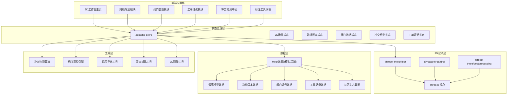

## 1. 架构设计



## 2. 技术描述

### 2.1 前端技术栈

| 技术 | 版本 | 用途 |
|------|------|------|
| React | ^18.2.0 | UI框架 |
| TypeScript | ^5.4.0 | 类型安全 |
| Vite | ^5.2.0 | 构建工具 |
| Tailwind CSS | ^3.4.0 | 样式框架 |
| three | ^0.162.0 | 3D渲染核心 |
| @react-three/fiber | ^8.15.0 | React Three.js 绑定 |
| @react-three/drei | ^9.99.0 | Three.js 辅助组件 |
| @react-three/postprocessing | ^2.16.0 | 后期处理效果 |
| zustand | ^4.5.0 | 状态管理 |
| lucide-react | ^0.363.0 | 图标库 |
| html2canvas | ^1.4.1 | 截图导出 |

### 2.2 技术选型说明

- **React 18**：使用并发特性，提升3D场景交互流畅度
- **TypeScript**：核电领域对数据准确性要求高，类型系统可减少错误
- **@react-three/fiber**：声明式3D开发，与React生态无缝集成
- **Zustand**：轻量级状态管理，避免Redux的繁琐，适合3D场景高频状态更新
- **Tailwind CSS**：快速构建工业风格UI，统一设计系统

### 2.3 初始化方式

使用 Vite + React + TypeScript 模板初始化：
```bash
npm create vite@latest nuclear-corridor-workbench -- --template react-ts
```

## 3. 目录结构

```
src/
├── components/              # 组件目录
│   ├── layout/             # 布局组件
│   │   ├── Header.tsx      # 顶部导航栏
│   │   ├── Sidebar.tsx     # 左侧工具面板
│   │   ├── RightPanel.tsx  # 右侧详情面板
│   │   └── StatusBar.tsx   # 底部状态栏
│   ├── three/              # 3D场景组件
│   │   ├── Scene3D.tsx     # 3D场景容器
│   │   ├── Corridor.tsx    # 管廊模型
│   │   ├── RoutePath.tsx   # 巡检路线
│   │   ├── Valve.tsx       # 阀门组件
│   │   ├── Label3D.tsx     # 3D标注组件
│   │   ├── ForbiddenZone.tsx # 禁区显示
│   │   └── Lights.tsx      # 灯光设置
│   ├── workbench/          # 工作台模块
│   │   ├── Toolbar.tsx     # 工具栏
│   │   ├── ViewControls.tsx # 视角控制
│   │   └── SectionTool.tsx # 剖切工具
│   ├── route/              # 路线规划模块
│   │   ├── RouteList.tsx   # 路线版本列表
│   │   ├── RouteCompare.tsx # 版本对比
│   │   ├── RouteEditor.tsx # 路线编辑器
│   │   └── FailedPath.tsx  # 失败路径展示
│   ├── valve/              # 阀门管理模块
│   │   ├── ValveList.tsx   # 阀门列表
│   │   ├── ValveDetail.tsx # 阀门详情
│   │   └── DuplicateAlert.tsx # 重号告警
│   ├── conflict/           # 冲突检测模块
│   │   ├── ConflictDashboard.tsx # 冲突仪表盘
│   │   ├── ConflictList.tsx # 冲突列表
│   │   └── ConflictDetail.tsx # 冲突详情
│   ├── workorder/          # 工单证据模块
│   │   ├── EvidenceChain.tsx # 证据链时间轴
│   │   ├── WorkOrderCard.tsx # 工单卡片
│   │   └── SnapshotGallery.tsx # 快照画廊
│   └── annotation/         # 标注模块
│       ├── AnnotationToolbar.tsx # 标注工具栏
│       ├── TextAnnotation.tsx # 文字标注
│       ├── ArrowAnnotation.tsx # 箭头标注
│       └── MeasureTool.tsx # 测量工具
├── store/                  # 状态管理
│   ├── useSceneStore.ts    # 3D场景状态
│   ├── useRouteStore.ts    # 路线状态
│   ├── useValveStore.ts    # 阀门状态
│   ├── useConflictStore.ts # 冲突状态
│   └── useWorkOrderStore.ts # 工单状态
├── types/                  # TypeScript 类型定义
│   ├── corridor.ts         # 管廊相关类型
│   ├── route.ts            # 路线相关类型
│   ├── valve.ts            # 阀门相关类型
│   ├── conflict.ts         # 冲突相关类型
│   └── workorder.ts        # 工单相关类型
├── data/                   # Mock数据
│   ├── corridor.ts         # 管廊模型数据
│   ├── routes.ts           # 路线版本数据
│   ├── valves.ts           # 阀门数据（含重号案例）
│   ├── workorders.ts       # 工单数据
│   └── forbiddenZones.ts   # 禁区数据
├── utils/                  # 工具函数
│   ├── conflictDetection.ts # 冲突检测算法
│   ├── annotation.ts       # 标注工具函数
│   ├── screenshot.ts       # 截图导出
│   ├── versionCompare.ts   # 版本对比
│   └── measurement.ts      # 3D测量
├── hooks/                  # 自定义Hooks
│   ├── use3DInteraction.ts # 3D交互Hook
│   ├── useRouteDrawing.ts  # 路线绘制Hook
│   └── useConflictCheck.ts # 冲突检测Hook
├── App.tsx                 # 应用入口
├── main.tsx                # React入口
└── index.css               # 全局样式
```

## 4. 路由定义

| 路由 | 页面/组件 | 用途 |
|------|----------|------|
| `/` | 3D工作台主页 | 管廊模型全景展示、路线叠加、阀门标注 |
| `/workbench` | 3D工作台主页 | 同上（别名） |
| `/route` | 路线规划页 | 路线版本管理、绘制、对比 |
| `/valve` | 阀门管理页 | 阀门核验、重号检测 |
| `/conflict` | 冲突检测中心 | 冲突仪表盘、冲突列表 |
| `/evidence` | 工单证据页 | 证据链追溯、工单详情 |

## 5. 核心数据模型

### 5.1 类型定义

```typescript
// ============ 管廊相关类型 ============
interface CorridorNode {
  id: string;
  position: [number, number, number];
  type: 'pipe' | 'junction' | 'valve' | 'elbow';
  label?: string;
}

interface CorridorConnection {
  id: string;
  from: string;
  to: string;
  path: [number, number, number][];
}

interface CorridorModel {
  id: string;
  version: string;
  name: string;
  nodes: CorridorNode[];
  connections: CorridorConnection[];
  remark: string;
  createdAt: string;
  updatedAt: string;
  workOrderId?: string;
}

// ============ 路线相关类型 ============
interface RoutePoint {
  nodeId: string;
  position: [number, number, number];
  arrivalTime?: string;
  stayDuration?: number;
}

interface InspectionRoute {
  id: string;
  version: string;
  name: string;
  points: RoutePoint[];
  status: 'draft' | 'active' | 'deprecated' | 'failed';
  failedReason?: string;
  creator: string;
  createdAt: string;
  workOrderId?: string;
  snapshotUrl?: string;
  remark: string;
}

interface RouteVersion {
  version: string;
  route: InspectionRoute;
  timestamp: string;
  operator: string;
  changeLog: string;
}

// ============ 阀门相关类型 ============
interface Valve {
  id: string;
  tagNumber: string;
  nodeId: string;
  position: [number, number, number];
  modelRemark: string;
  status: 'normal' | 'duplicate' | 'mismatch' | 'maintenance';
  type: 'gate' | 'ball' | 'butterfly' | 'check';
  lastInspectionDate?: string;
  workOrderIds: string[];
}

interface DuplicateValveGroup {
  tagNumber: string;
  valves: Valve[];
  detectedAt: string;
  workOrderId?: string;
  resolved: boolean;
}

// ============ 冲突相关类型 ============
type ConflictType = 'valve_duplicate' | 'route_forbidden' | 'model_mismatch';
type ConflictStatus = 'open' | 'investigating' | 'resolved' | 'accepted';

interface Conflict {
  id: string;
  type: ConflictType;
  title: string;
  description: string;
  position?: [number, number, number];
  relatedRouteId?: string;
  relatedValveIds?: string[];
  status: ConflictStatus;
  detectedAt: string;
  workOrderId?: string;
  evidence: EvidenceItem[];
}

interface EvidenceItem {
  id: string;
  type: 'screenshot' | 'workorder' | 'model_snapshot' | 'annotation';
  url: string;
  timestamp: string;
  description: string;
}

// ============ 工单相关类型 ============
interface WorkOrder {
  id: string;
  title: string;
  description: string;
  type: 'valve_correction' | 'route_update' | 'conflict_investigation' | 'model_update';
  status: 'open' | 'in_progress' | 'closed';
  creator: string;
  assignee?: string;
  createdAt: string;
  updatedAt: string;
  closedAt?: string;
  relatedRouteIds: string[];
  relatedValveIds: string[];
  relatedConflictIds: string[];
  attachments: EvidenceItem[];
  comments: WorkOrderComment[];
}

interface WorkOrderComment {
  id: string;
  author: string;
  content: string;
  timestamp: string;
  attachments?: EvidenceItem[];
}

// ============ 禁区相关类型 ============
interface ForbiddenZone {
  id: string;
  name: string;
  description: string;
  boundary: [number, number, number][]; // 多边形边界点
  color: string;
  level: 'critical' | 'warning' | 'caution';
  effectiveFrom: string;
  effectiveTo?: string;
  workOrderId?: string;
}

// ============ 标注相关类型 ============
type AnnotationType = 'text' | 'arrow' | 'measure' | 'circle' | 'rectangle';

interface Annotation {
  id: string;
  type: AnnotationType;
  position: [number, number, number];
  content: string;
  color: string;
  author: string;
  createdAt: string;
  relatedRouteId?: string;
  relatedValveId?: string;
  relatedConflictId?: string;
}
```

### 5.2 Mock 数据结构说明

**关键测试数据设计（必须包含）：**

1. **阀门重号测试案例**：
   - 至少2个阀门使用相同编号 `V-1001`
   - 分别位于管廊不同位置
   - 关联历史工单记录编号重复问题

2. **路线穿禁区测试案例**：
   - 设计一条巡检路线穿过禁区
   - 系统检测后标记为失败路径
   - 保留该失败路径不自动删除

3. **模型与编号不一致案例**：
   - 管廊模型备注中的阀门编号与实际阀门编号不一致
   - 例如：模型备注写 `V-2001`，实际阀门编号为 `V-2002`

4. **多版本路线数据**：
   - 至少3个版本的巡检路线
   - 每个版本有不同的路径和工单号
   - 包含一个"已废弃"版本和一个"失败"版本

## 6. 核心算法

### 6.1 冲突检测算法

```typescript
// 阀门重号检测
function detectDuplicateValves(valves: Valve[]): DuplicateValveGroup[] {
  const tagMap = new Map<string, Valve[]>();
  valves.forEach(valve => {
    if (!tagMap.has(valve.tagNumber)) {
      tagMap.set(valve.tagNumber, []);
    }
    tagMap.get(valve.tagNumber)!.push(valve);
  });
  
  return Array.from(tagMap.entries())
    .filter(([_, group]) => group.length > 1)
    .map(([tagNumber, valves]) => ({
      tagNumber,
      valves,
      detectedAt: new Date().toISOString(),
      resolved: false,
    }));
}

// 路线禁区穿越检测
function detectForbiddenZoneCrossing(
  route: InspectionRoute,
  forbiddenZones: ForbiddenZone[]
): { zoneId: string; crossingPoints: RoutePoint[] }[] {
  const violations: { zoneId: string; crossingPoints: RoutePoint[] }[] = [];
  
  forbiddenZones.forEach(zone => {
    const crossingPoints = route.points.filter(point => 
      isPointInPolygon(point.position, zone.boundary)
    );
    
    if (crossingPoints.length > 0) {
      violations.push({
        zoneId: zone.id,
        crossingPoints,
      });
    }
  });
  
  return violations;
}

// 模型备注与阀门编号一致性检测
function detectModelMismatch(
  corridor: CorridorModel,
  valves: Valve[]
): { valveId: string; modelRemark: string; actualTag: string }[] {
  const mismatches: { valveId: string; modelRemark: string; actualTag: string }[] = [];
  
  corridor.nodes.forEach(node => {
    if (node.type === 'valve' && node.label) {
      const valve = valves.find(v => v.nodeId === node.id);
      if (valve && node.label !== valve.tagNumber) {
        mismatches.push({
          valveId: valve.id,
          modelRemark: node.label,
          actualTag: valve.tagNumber,
        });
      }
    }
  });
  
  return mismatches;
}
```

### 6.2 3D标注渲染

```typescript
// 标注组件核心逻辑 - 使用HTML overlay确保不被3D模型遮挡
function Label3D({ position, content, color, type }: Label3DProps) {
  const { camera, size } = useThree();
  const [screenPos, setScreenPos] = useState({ x: 0, y: 0, visible: false });
  
  useFrame(() => {
    // 将3D坐标投影到2D屏幕
    const vector = new Vector3(...position).project(camera);
    const x = (vector.x * 0.5 + 0.5) * size.width;
    const y = (-vector.y * 0.5 + 0.5) * size.height;
    
    // 判断是否在相机视锥体前
    setScreenPos({ x, y, visible: vector.z < 1 });
  });
  
  if (!screenPos.visible) return null;
  
  return (
    <div
      className="absolute pointer-events-none z-50"
      style={{
        left: screenPos.x,
        top: screenPos.y,
        transform: 'translate(-50%, -100%)',
      }}
    >
      {/* 引线 */}
      <svg className="absolute left-1/2 top-full" width="2" height="20" style={{ transform: 'translateX(-50%)' }}>
        <line x1="1" y1="0" x2="1" y2="20" stroke={color} strokeWidth="2" />
      </svg>
      {/* 标签内容 */}
      <div className={`px-2 py-1 text-xs font-mono rounded border-2 whitespace-nowrap ${getTypeClass(type)}`}
           style={{ borderColor: color, color }}>
        {content}
      </div>
    </div>
  );
}
```

## 7. 截图导出机制

```typescript
async function exportScreenshot(
  canvas: HTMLCanvasElement,
  annotations: Annotation[],
  metadata: { routeVersion: string; timestamp: string; valveCount: number }
): Promise<string> {
  // 1. 获取3D画布截图
  const baseImage = canvas.toDataURL('image/png');
  
  // 2. 创建离屏Canvas叠加标注和元数据
  const offscreen = document.createElement('canvas');
  offscreen.width = canvas.width;
  offscreen.height = canvas.height;
  const ctx = offscreen.getContext('2d')!;
  
  // 3. 绘制基础图像
  const img = new Image();
  await new Promise(resolve => {
    img.onload = resolve;
    img.src = baseImage;
  });
  ctx.drawImage(img, 0, 0);
  
  // 4. 绘制元数据边框（核电风格）
  ctx.strokeStyle = '#1E40AF';
  ctx.lineWidth = 4;
  ctx.strokeRect(10, 10, offscreen.width - 20, offscreen.height - 20);
  
  // 5. 绘制底部信息栏
  ctx.fillStyle = 'rgba(10, 22, 40, 0.9)';
  ctx.fillRect(10, offscreen.height - 60, offscreen.width - 20, 50);
  
  ctx.fillStyle = '#E2E8F0';
  ctx.font = '14px JetBrains Mono';
  ctx.fillText(`版本: ${metadata.routeVersion}`, 30, offscreen.height - 28);
  ctx.fillText(`时间: ${metadata.timestamp}`, 250, offscreen.height - 28);
  ctx.fillText(`阀门数: ${metadata.valveCount}`, 550, offscreen.height - 28);
  
  // 6. 绘制标注
  annotations.forEach(ann => {
    // 绘制标注逻辑...
  });
  
  return offscreen.toDataURL('image/png');
}
```

## 8. 性能优化策略

1. **3D场景优化**：
   - 使用 InstancedMesh 渲染大量重复管道和阀门
   - 开启视锥体剔除（frustumCulled: true）
   - 细节层次（LOD）控制远距离对象精度

2. **标注优化**：
   - 标注使用HTML Overlay而非3D平面，避免深度冲突
   - 超出视口的标注自动隐藏
   - 标注数量过多时支持分层显示

3. **状态更新优化**：
   - Zustand 状态分片，避免不必要的重渲染
   - useFrame 中只更新必要的状态
   - 高频交互使用 requestAnimationFrame 批量处理

4. **数据加载优化**：
   - 路线版本数据懒加载
   - 大模型数据分片加载
   - Web Worker 处理冲突检测算法

## 9. 安全与合规考虑

1. **数据不可篡改**：
   - 历史版本快照使用哈希校验
   - 工单记录创建后不可编辑，只能追加评论
   - 所有操作记录审计日志

2. **证据链完整性**：
   - 每个状态变更必须关联工单号
   - 时间戳使用服务器时间（Mock中使用ISO标准时间）
   - 截图自动叠加数字水印（版本号+时间戳）

3. **权限控制**：
   - 不同角色有不同的操作权限
   - 关键操作（如删除路线）需要二次确认
   - 所有修改操作记录操作人

---

**架构设计原则**：
> 核电领域的特殊性要求系统必须是"防错"的，而不是"容错"的。所有可能导致错误的路径都应该被检测、高亮、并留下不可磨灭的证据。
