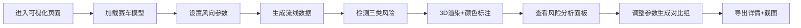

## 1. 产品概述

赛道赛车空气流线可视化评审工具，专为车辆工程教学和评审场景设计。通过 3D 可视化直观展示赛车周围空气流动状态，清晰标注角度越界、采样过密、尾流反向等风险点，支持风向参数对比和数据导出，便于复核和教学讲解。

## 2. 核心功能

### 2.1 用户角色

| 角色 | 使用场景 | 核心需求 |
|------|----------|----------|
| 车辆工程教师 | 课堂讲解、作业评审 | 清晰的风险标注、可导出截图用于教学 |
| 学生/研究员 | 方案复核、参数调试 | 风向参数对比、详细数据记录 |

### 2.2 功能模块

1. **3D 流线可视化页**：赛车模型展示、空气流线渲染、风险点实时标注
2. **风险分析面板**：角度越界、采样过密、尾流反向分开说明
3. **参数控制面板**：风向参数调节、前后对比视图
4. **导出详情页**：赛车模型、风向参数、截图对应关系记录

### 2.3 页面详情

| 页面名称 | 模块名称 | 功能描述 |
|-----------|-------------|---------------------|
| 3D 可视化主页 | 场景渲染区 | Three.js 渲染赛车和流线，颜色编码流速和方向 |
| 3D 可视化主页 | 风险标注层 | 角度越界用红色、采样过密用黄色、尾流反向用蓝色标注 |
| 风险分析面板 | 分类说明 | 三类风险分开列出，各带位置标签和数值说明 |
| 参数控制面板 | 风向调节 | 风速、角度、方向可调，支持前后快照对比 |
| 导出详情页 | 数据记录 | 模型ID、参数组、截图时间戳一一对应，可复核 |

## 3. 核心流程

## 4. 用户界面设计

### 4.1 设计风格

- **主色调**：深空灰 (#1a1a2e) 背景，科技感强
- **强调色**：
  - 角度越界：警示红 (#ff4757)
  - 采样过密：警告黄 (#ffa502)
  - 尾流反向：信息蓝 (#3742fa)
  - 正常流线：渐变青蓝 (#00d2d3 → #54a0ff)
- **字体**：JetBrains Mono（等宽字体，适合工程数据展示）+ Inter
- **布局**：左 3D 主视图（70%），右控制面板 + 风险分析（30%）
- **风格**：工业科技风，深色主题，高对比度，便于投影展示

### 4.2 页面设计概述

| 页面名称 | 模块名称 | UI 元素 |
|-----------|-------------|-------------|
| 3D 可视化主页 | 主视图区 | 深色背景、发光流线、悬浮风险标签、数据缺口提示框 |
| 3D 可视化主页 | 图例说明 | 固定左下角，颜色-风险类型对应表 |
| 风险分析面板 | 风险卡片 | 三类风险各成卡片，含数量、位置列表、严重程度 |
| 参数控制面板 | 滑块组 | 风速、偏航角、俯仰角，带数值输入框 |
| 参数控制面板 | 对比视图 | 上下分栏，前后参数并排展示 |
| 导出详情页 | 记录表格 | 模型名称、参数组、截图缩略图、时间戳 |

### 4.3 响应式

- 桌面端优先设计（1920×1080 及以上）
- 右侧面板可折叠，小屏自动隐藏
- 触控设备支持手势旋转 3D 视图

### 4.4 3D 场景指导

- **环境**：纯深色背景 + 微弱环境光，突出流线效果
- **光照**：三盏方向光 + 环境光，赛车金属质感，流线发光材质
- **相机**：初始等距视角，支持轨道控制，可保存预设视角
- **动画**：流线粒子流动动画，风险点脉冲闪烁
- **后处理**：Bloom 发光效果，增强科技感
- **性能**：流线使用实例化渲染，保证 60fps
