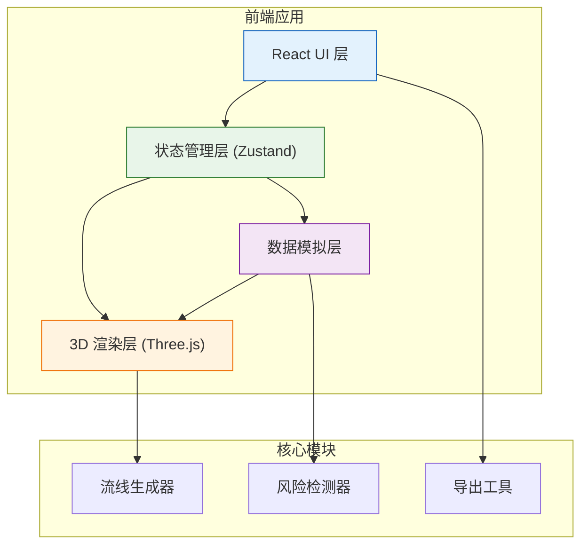

## 1. 架构设计



## 2. 技术描述

- **前端框架**: React@18 + TypeScript
- **构建工具**: Vite
- **样式方案**: TailwindCSS@3
- **状态管理**: Zustand
- **3D 渲染**: Three.js + @react-three/fiber + @react-three/drei
- **后处理**: @react-three/postprocessing
- **图标**: lucide-react
- **导出**: html2canvas + js-yaml (详情导出)

## 3. 路由定义

| 路由 | 页面 | 用途 |
|-------|------|---------|
| / | 主可视化页 | 3D 流线展示 + 控制面板 + 风险分析 |
| /compare | 对比页 | 前后参数并排对比视图 |
| /export | 导出详情 | 导出记录列表和详情查看 |

## 4. 数据模型

### 4.1 核心类型定义

```typescript
// 风向参数
interface WindParams {
  speed: number;      // 风速 m/s
  yawAngle: number;   // 偏航角 -90~90°
  pitchAngle: number; // 俯仰角 -45~45°
  density: number;    // 空气密度
}

// 流线数据点
interface StreamPoint {
  x: number;
  y: number;
  z: number;
  velocity: number;
  direction: [number, number, number];
}

// 单条流线
interface StreamLine {
  id: string;
  points: StreamPoint[];
  color: string;
  startPosition: [number, number, number];
}

// 风险类型
type RiskType = 'angle_violation' | 'oversampling' | 'reverse_flow';

// 风险点
interface RiskPoint {
  id: string;
  type: RiskType;
  position: [number, number, number];
  severity: 'low' | 'medium' | 'high';
  value: number;       // 具体数值
  description: string; // 说明文字
}

// 导出记录
interface ExportRecord {
  id: string;
  timestamp: number;
  modelName: string;
  windParams: WindParams;
  screenshotUrl: string;
  riskSummary: {
    angleViolations: number;
    oversampling: number;
    reverseFlows: number;
  };
  hasDataGap: boolean;
  dataGapNote?: string;
}
```

### 4.2 状态结构

```typescript
interface AppState {
  // 当前参数
  currentWindParams: WindParams;
  // 对比参数（用于前后对比）
  compareWindParams: WindParams | null;
  // 流线数据
  streamLines: StreamLine[];
  // 风险点
  riskPoints: RiskPoint[];
  // 数据缺口
  dataGaps: string[];
  // 导出记录
  exportRecords: ExportRecord[];
  // UI 状态
  showRiskLabels: boolean;
  showLegend: boolean;
  viewMode: 'single' | 'compare';
}
```

## 5. 模块划分

### 5.1 组件结构

```
src/
├── components/
│   ├── Scene3D/           # 3D 场景组件
│   │   ├── CarModel.tsx   # 赛车模型
│   │   ├── StreamLines.tsx # 流线渲染
│   │   ├── RiskMarkers.tsx # 风险标注
│   │   └── index.tsx
│   ├── ControlPanel/      # 控制面板
│   │   ├── WindParams.tsx # 风向参数调节
│   │   ├── ViewControls.tsx
│   │   └── index.tsx
│   ├── RiskAnalysis/      # 风险分析面板
│   │   ├── AngleViolation.tsx
│   │   ├── Oversampling.tsx
│   │   ├── ReverseFlow.tsx
│   │   └── index.tsx
│   ├── Legend.tsx         # 图例
│   ├── DataGapNotice.tsx  # 数据缺口提示
│   └── ExportModal.tsx    # 导出弹窗
├── pages/
│   ├── Home.tsx
│   ├── Compare.tsx
│   └── Export.tsx
├── store/
│   └── useAppStore.ts     # Zustand 状态
├── utils/
│   ├── streamGenerator.ts # 流线生成算法
│   ├── riskDetector.ts    # 风险检测逻辑
│   └── exportUtils.ts     # 导出工具
└── types/
    └── index.ts           # 类型定义
```

### 5.2 核心算法

1. **流线生成**：基于简化的势流模型 + 随机扰动生成可视化流线
2. **角度越界检测**：计算流线方向与来流方向夹角，超过阈值（如 150°）标记
3. **采样过密检测**：计算相邻流线距离，小于阈值标记为过密
4. **尾流反向检测**：检测尾部区域流线与来流方向反向的点

## 6. 性能优化

- 流线使用 InstancedMesh 或 LineSegments 批量渲染
- 风险检测使用空间分区加速
- 截图导出使用 WebGL 直接读取像素，避免重绘
