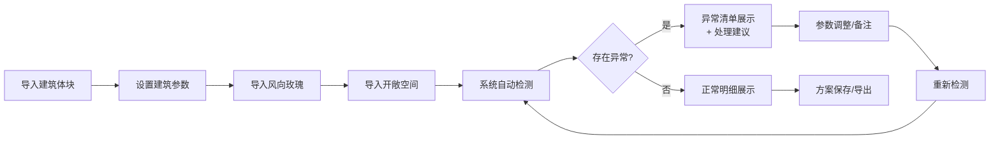

## 1. 产品概述

城市风廊建筑体块分析工具是一款面向规划设计院的3D可视化分析平台，解决风廊遮挡关系难以用静态总图说明的问题，将风廊来源、判断逻辑和结果可视化关联。

### 核心价值
- 动态展示建筑体块与城市风廊的空间关系
- 参数驱动的双向联动：3D场景与侧边数据同步更新
- 增量式数据导入：建筑体块、风向玫瑰、开敞空间可分步导入，互不覆盖
- 异常清单机制：体块重叠、风向缺口、退界线错误独立展示，提供处理建议

## 2. 核心功能

### 2.1 用户角色
| 角色 | 注册方式 | 核心权限 |
|------|----------|----------|
| 规划设计师 | 本地应用 | 导入数据、参数调整、异常分析、方案保存 |

### 2.2 功能模块
1. **3D场景视图**：建筑体块渲染、风廊高亮、视角控制
2. **数据控制面板**：建筑参数、风向参数、开敞空间参数
3. **异常清单面板**：体块重叠、风向缺口、退界线错误的检测与建议
4. **时间轴播放器**：不同时段风向变化的动画演示
5. **备注与筛选**：交互后状态保存与筛选

### 2.3 页面详情
| 页面名称 | 模块名称 | 功能描述 |
|----------|----------|----------|
| 主工作区 | 3D场景 | Three.js渲染建筑体块、风廊通道，支持旋转、缩放、平移 |
| 右侧面板 | 参数控制 | 建筑高度、密度、风向角度、风速等参数调节滑块 |
| 底部面板 | 异常清单 | 待确认项、异常项分类展示，点击定位3D场景 |
| 左侧面板 | 图层管理 | 建筑体块、风向玫瑰、开敞空间分层控制 |
| 顶部栏 | 时间轴 | 时段切换与播放，风向随时间变化动画 |

## 3. 核心流程

## 4. 用户界面设计

### 4.1 设计风格
- **主色调**：深空蓝 (#0A1628) - 专业、科技感
- **辅助色**：风廊青 (#00D4AA)、异常红 (#FF5252)、警告黄 (#FFC107)
- **按钮风格**：圆角胶囊按钮，hover时有发光效果
- **字体**：标题用 Space Grotesk，正文用 Inter（等宽数字用 JetBrains Mono）
- **布局风格**：暗色工作台式布局，3D场景为核心，三面板环绕
- **图标风格**：线性细线图标，异常状态用填充高亮

### 4.2 页面设计概述
| 页面名称 | 模块名称 | UI 元素 |
|----------|----------|---------|
| 主工作区 | 3D场景 | 暗色背景、建筑体块半透明蓝、风廊发光青、异常红色闪烁 |
| 右侧面板 | 参数控制 | 分组卡片、滑块控件、数值输入框、实时数值显示 |
| 底部面板 | 异常清单 | 标签页切换（待确认/异常/正常）、列表项含原因与建议 |
| 左侧面板 | 图层管理 | 开关按钮、可见性控制、透明度滑块 |
| 顶部栏 | 时间轴 | 播放/暂停按钮、进度条、时段标签 |

### 4.3 响应式
- 桌面端优先设计（1920×1080）
- 支持窗口缩放，面板自适应
- 异常清单可折叠最大化

### 4.4 3D场景指引
- **环境**：深色渐变背景 + 微弱环境光，营造夜间分析氛围
- **光照**：主方向光 + 半球光，建筑底部投射柔和阴影
- **相机**：透视相机，初始45°俯视角，支持OrbitControls
- **焦点元素**：风廊用发光线条和半透明体积突出显示
- **交互**：点击建筑高亮，滚轮缩放，右键平移，左键旋转
- **后处理**：Bloom效果用于风廊发光，轻微Vignette增强沉浸感
