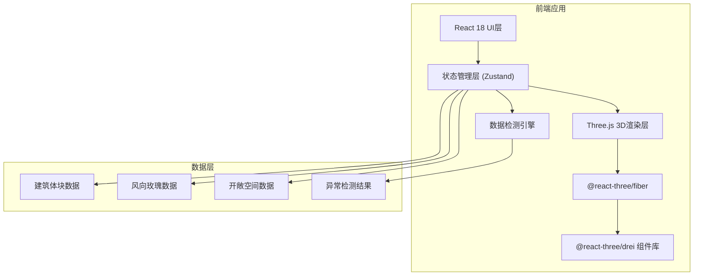

## 1. 架构设计



## 2. 技术描述

- **前端框架**：React@18 + TypeScript + Vite
- **3D渲染**：three@0.160 + @react-three/fiber@8 + @react-three/drei@9
- **状态管理**：zustand@4（轻量级，支持时间旅行调试）
- **样式方案**：tailwindcss@3 + tailwind-animate
- **UI组件**：自定义组件 + Radix UI（弹窗、滑块等基础组件）
- **图标**：lucide-react
- **后端**：无后端，纯前端应用，数据存储在localStorage

## 3. 目录结构

```
src/
├── components/
│   ├── Scene3D/          # 3D场景相关组件
│   │   ├── Building.tsx
│   │   ├── WindCorridor.tsx
│   │   └── SceneControls.tsx
│   ├── Panel/            # 面板组件
│   │   ├── LeftPanel.tsx
│   │   ├── RightPanel.tsx
│   │   └── BottomPanel.tsx
│   └── UI/               # 通用UI组件
├── store/                # Zustand状态管理
│   ├── useBuildingStore.ts
│   ├── useWindStore.ts
│   └── useAnomalyStore.ts
├── engine/               # 检测引擎
│   ├── overlapDetector.ts
│   ├── windGapDetector.ts
│   └── setbackDetector.ts
├── types/                # TypeScript类型定义
├── utils/                # 工具函数
└── App.tsx
```

## 4. 核心数据模型

```typescript
// 建筑体块
interface BuildingBlock {
  id: string;
  name: string;
  position: { x: number; y: number; z: number };
  dimensions: { width: number; depth: number; height: number };
  color: string;
  opacity: number;
  setbackDistance: number;  // 退界距离
  remarks: string;
  status: 'normal' | 'pending' | 'anomaly';
}

// 风向数据
interface WindDirection {
  angle: number;       // 风向角度 (0-360)
  speed: number;       // 风速
  frequency: number;   // 频率
  timePeriod: string;  // 时段
}

// 开敞空间
interface OpenSpace {
  id: string;
  name: string;
  position: { x: number; y: number; z: number };
  area: number;
  type: 'park' | 'plaza' | 'river';
}

// 异常项
interface AnomalyItem {
  id: string;
  type: 'overlap' | 'wind_gap' | 'setback_error';
  severity: 'warning' | 'error';
  relatedEntities: string[];  // 关联的建筑/空间ID
  reason: string;
  suggestion: string;
  position?: { x: number; y: number; z: number };
  resolved: boolean;
}
```

## 5. 状态管理设计

```typescript
// 主状态切片
interface AppState {
  buildings: BuildingBlock[];
  windData: WindDirection[];
  openSpaces: OpenSpace[];
  anomalies: AnomalyItem[];
  selectedEntity: string | null;
  timePeriod: string;
  isPlaying: boolean;
  layers: {
    buildings: boolean;
    windCorridors: boolean;
    openSpaces: boolean;
  };
}
```

## 6. 异常检测算法

### 6.1 体块重叠检测
- 使用AABB（轴对齐包围盒）碰撞检测
- 计算重叠体积和重叠面积
- 生成异常项，包含重叠原因和调整建议

### 6.2 风向缺口检测
- 根据风向角度计算风廊路径
- 检测风廊路径上的建筑遮挡
- 计算遮挡率，超过阈值标记异常

### 6.3 退界线错误检测
- 读取建筑退界距离参数
- 与规定退界线比较
- 标记不满足退界要求的建筑

## 7. 性能优化策略

- 建筑体块使用InstancedMesh批量渲染
- 异常检测使用Web Worker后台计算
- 状态更新采用批量处理，避免频繁重渲染
- 3D场景使用Frustum Culling剔除不可见物体
