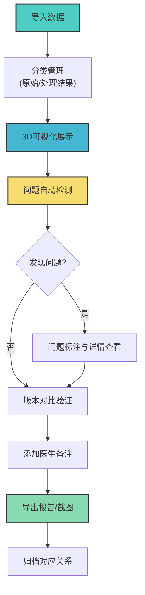

## 1. 产品概述

医学剂量云图3D交互工作台，专为放疗物理师设计，解决器官错位、版本混用等导致剂量评估混乱的问题。提供器官模型与剂量云图的交互式3D展示、版本管理、问题检测及专业报告导出功能。

- 核心目标：帮助放疗物理师高效管理多来源的器官模型、剂量网格和医生备注，清晰区分原始材料与处理结果
- 价值定位：减少因版本混淆和器官错位导致的剂量评估错误，提升放疗计划审核效率与准确性

## 2. 核心功能

### 2.1 用户角色

| 角色 | 注册方式 | 核心权限 |
|------|----------|----------|
| 放疗物理师 | 无需注册，本地应用 | 导入数据、3D查看、问题检测、导出报告、截图保存 |
| 医生 | 无需注册，本地应用 | 查看结果、添加备注 |

### 2.2 功能模块

1. **3D工作台主界面**：交互式3D视图、多版本对比、剂量云图叠加、标注工具
2. **数据导入管理**：器官模型导入、剂量网格导入、医生备注导入、原始/处理结果分类
3. **问题检测中心**：器官错位检测、剂量超限检测、版本混用检测、检测报告生成
4. **导出与归档**：报告导出（PDF/HTML）、截图导出、剂量网格数据导出、版本对比记录
5. **详情复核面板**：器官-剂量-截图对应关系、操作历史、备注时间线

### 2.3 页面详情

| 页面名称 | 模块名称 | 功能描述 |
|----------|----------|----------|
| 3D工作台 | 主视图区 | 可旋转/缩放/平移的3D场景，支持多器官模型叠加剂量云图 |
| 3D工作台 | 左侧工具栏 | 器官显隐控制、剂量阈值调节、视角预设、测量工具 |
| 3D工作台 | 版本对比面板 | 并排/叠加对比两个版本，标注差异区域 |
| 数据管理 | 导入面板 | 拖拽导入器官模型(.obj/.stl)、剂量网格(.dcm/.nrrd)、备注文件 |
| 数据管理 | 文件列表 | 分类展示原始材料和处理结果，显示来源、时间、版本号 |
| 问题检测 | 检测仪表盘 | 显示检测状态、问题数量分类统计、异常项快速跳转 |
| 问题检测 | 详情列表 | 器官错位程度、剂量超限位置/数值、版本混用冲突点 |
| 报告导出 | 导出配置 | 选择导出内容、格式、分辨率、是否包含截图和原始数据 |
| 详情复核 | 关系图谱 | 可视化展示器官模型、剂量网格、截图、备注的对应关系 |
| 详情复核 | 操作日志 | 记录所有导入、修改、检测、导出操作，支持时间轴回溯 |

## 3. 核心流程

**用户操作流程：**
1. 放疗物理师导入多来源的器官模型、剂量网格和备注文件
2. 系统自动分类为原始材料和处理结果，记录版本信息
3. 在3D工作台中查看器官模型与剂量云图，可调节视角和显示参数
4. 系统自动检测器官错位、剂量超限、版本混用问题并高亮标注
5. 物理师可进行版本对比，添加标注和备注
6. 导出包含检测结果、截图、剂量数据的完整报告
7. 系统自动记录器官-剂量-截图-备注的对应关系，便于后续复核

## 4. 用户界面设计

### 4.1 设计风格
- **主色调**：深蓝色(#1a365d)作为主色，传达专业医学氛围；青绿色(#319795)作为强调色，用于交互元素
- **辅助色**：橙色(#ed8936)标注警告，红色(#e53e3e)标注危险/超限，绿色(#38a169)标注正常
- **按钮风格**：圆角8px，轻微阴影，hover时有上浮效果
- **字体**：标题使用Noto Sans SC Bold，正文使用Noto Sans SC Regular，确保中文清晰可读
- **布局风格**：三栏式布局（左工具区 + 中3D视图 + 右详情面板），卡片式模块划分
- **图标风格**：线性图标，统一2px描边，医学专业风格

### 4.2 页面设计概述

| 页面名称 | 模块名称 | UI元素 |
|----------|----------|--------|
| 3D工作台 | 主视图区 | 深色背景3D场景、半透明剂量云图、器官描边高亮、坐标轴线、标注标签 |
| 3D工作台 | 左侧工具栏 | 折叠式工具面板、器官列表带颜色标识、滑块调节器、快捷视角按钮 |
| 数据管理 | 导入面板 | 大尺寸拖拽区域、文件预览缩略图、版本号输入框、分类标签选择器 |
| 问题检测 | 检测仪表盘 | 环形统计图表、问题计数卡片、颜色编码状态指示、快速筛选标签 |
| 报告导出 | 导出配置 | 复选框组、格式单选、进度条、预览按钮 |
| 详情复核 | 关系图谱 | 节点连线图、可缩放画布、点击查看详情、时间轴滑动条 |

### 4.3 响应式
- Desktop-first设计，主要面向1920x1080及以上分辨率
- 支持窗口缩放自适应，最小支持宽度1280px
- 3D视图区域优先保证显示空间，侧边栏可折叠
- 触控屏支持双指缩放旋转

### 4.4 3D场景指导
- **环境与氛围**：深色渐变背景(#0a192f到#112240)，营造专业医学影像氛围
- **光照设置**：主光源(冷白色) + 环境光 + 边缘光，突出器官轮廓；剂量云图使用自发光材质
- **相机设置**：透视相机，默认45度俯视角，支持轨道控制，设置近/远裁剪平面
- **构图与焦点**：3D场景居中展示，剂量云图使用半透明体积渲染，关键器官使用高亮描边
- **交互与动画**：模型加载动画、检测结果弹出动画、视角切换平滑过渡、鼠标悬停显示器官信息
- **后处理效果**：轻微Bloom效果增强剂量云图视觉效果，FXAA抗锯齿
- **资源与性能**：使用简化的器官模型面片，剂量云图使用纹理切片，目标帧率60fps
