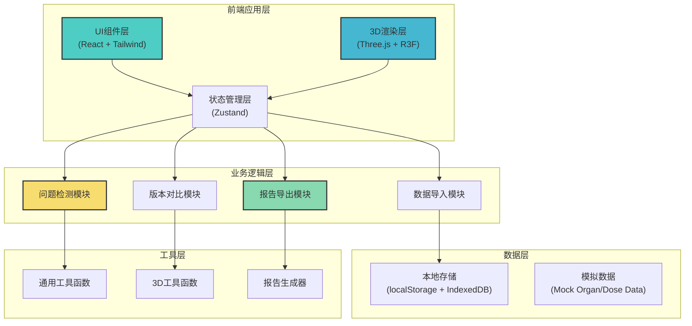
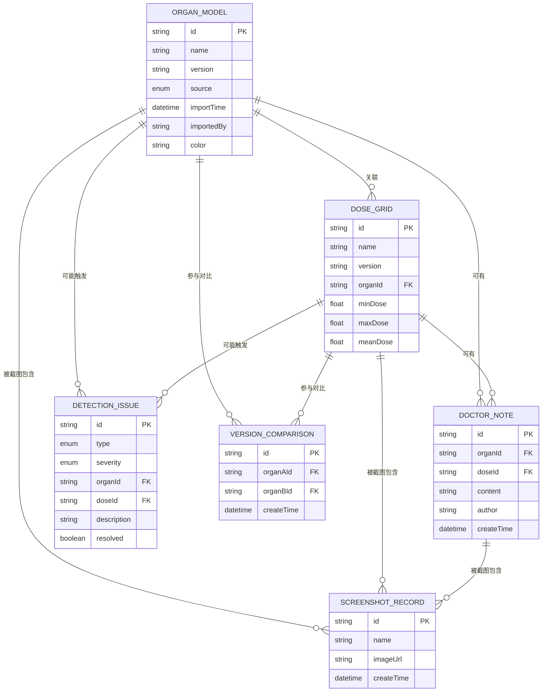

## 1. 架构设计



## 2. 技术描述

- **前端框架**: React@18 + TypeScript
- **构建工具**: Vite@5
- **样式方案**: TailwindCSS@3 + PostCSS
- **3D渲染**: Three@0.160 + @react-three/fiber@8 + @react-three/drei@9
- **3D后处理**: @react-three/postprocessing@2
- **状态管理**: Zustand@4
- **图表可视化**: recharts@2
- **PDF导出**: jspdf@2 + html2canvas@1
- **截图功能**: html2canvas@1 + dom-to-image-more@3
- **数据存储**: localStorage + IndexedDB (dexie@3)
- **图标库**: lucide-react@0.294
- **动画库**: framer-motion@10
- **后端**: 无 - 纯前端本地应用
- **数据库**: 无 - 使用本地存储 + Mock数据演示

## 3. 路由定义

| 路由 | 页面名称 | 用途 |
|------|----------|------|
| / | 3D工作台首页 | 主3D视图、器官和剂量展示、实时交互 |
| /data | 数据管理 | 导入文件、版本管理、原始/处理结果分类 |
| /detection | 问题检测 | 检测仪表盘、问题列表、详情查看 |
| /export | 报告导出 | 导出配置、预览、报告生成 |
| /review | 详情复核 | 关系图谱、操作日志、对应关系查看 |

## 4. 核心类型定义

```typescript
// 器官模型类型
interface OrganModel {
  id: string;
  name: string;
  version: string;
  source: 'original' | 'processed';
  importTime: Date;
  importedBy: string;
  fileType: 'obj' | 'stl' | 'dcm';
  filePath: string;
  color: string;
  visible: boolean;
  opacity: number;
  position: [number, number, number];
  rotation: [number, number, number];
  geometryData?: any;
}

// 剂量网格类型
interface DoseGrid {
  id: string;
  name: string;
  version: string;
  organId: string;
  source: 'original' | 'processed';
  importTime: Date;
  importedBy: string;
  fileType: 'dcm' | 'nrrd';
  minDose: number;
  maxDose: number;
  meanDose: number;
  threshold: number;
  visible: boolean;
  volumeData?: any;
}

// 医生备注
interface DoctorNote {
  id: string;
  organId?: string;
  doseId?: string;
  content: string;
  author: string;
  createTime: Date;
  updateTime: Date;
  tags: string[];
}

// 检测问题
interface DetectionIssue {
  id: string;
  type: 'misalignment' | 'overdose' | 'version_conflict';
  severity: 'low' | 'medium' | 'high';
  organId?: string;
  doseId?: string;
  versionA?: string;
  versionB?: string;
  description: string;
  position?: [number, number, number];
  value?: number;
  threshold?: number;
  detectedTime: Date;
  resolved: boolean;
}

// 截图记录
interface ScreenshotRecord {
  id: string;
  name: string;
  organIds: string[];
  doseIds: string[];
  noteIds: string[];
  imageUrl: string;
  thumbnailUrl: string;
  createTime: Date;
  cameraState: {
    position: [number, number, number];
    target: [number, number, number];
  };
}

// 版本对比
interface VersionComparison {
  id: string;
  organA: OrganModel;
  organB: OrganModel;
  doseA?: DoseGrid;
  doseB?: DoseGrid;
  differences: {
    positionDiff: [number, number, number];
    rotationDiff: [number, number, number];
    doseDiff: number;
  };
  createTime: Date;
}

// 应用状态
interface AppState {
  organs: OrganModel[];
  doses: DoseGrid[];
  notes: DoctorNote[];
  issues: DetectionIssue[];
  screenshots: ScreenshotRecord[];
  comparisons: VersionComparison[];
  selectedOrganId: string | null;
  selectedDoseId: string | null;
  activeTab: 'workspace' | 'data' | 'detection' | 'export' | 'review';
}
```

## 5. 数据模型

### 5.1 数据模型ER图



### 5.2 Mock数据示例

```typescript
// 示例器官模型数据
const mockOrgans: OrganModel[] = [
  {
    id: 'organ-001',
    name: '前列腺',
    version: 'v1.0',
    source: 'original',
    importTime: new Date('2024-01-15T09:30:00'),
    importedBy: '张医生',
    fileType: 'obj',
    filePath: '/models/prostate_v1.obj',
    color: '#4299e1',
    visible: true,
    opacity: 0.8,
    position: [0, 0, 0],
    rotation: [0, 0, 0],
  },
  {
    id: 'organ-002',
    name: '膀胱',
    version: 'v1.0',
    source: 'original',
    importTime: new Date('2024-01-15T09:32:00'),
    importedBy: '张医生',
    fileType: 'obj',
    filePath: '/models/bladder_v1.obj',
    color: '#ed8936',
    visible: true,
    opacity: 0.7,
    position: [0, 20, 0],
    rotation: [0, 0, 0],
  },
  {
    id: 'organ-003',
    name: '直肠',
    version: 'v1.1',
    source: 'processed',
    importTime: new Date('2024-01-15T14:20:00'),
    importedBy: '李物理师',
    fileType: 'stl',
    filePath: '/models/rectum_v1.1.stl',
    color: '#48bb78',
    visible: true,
    opacity: 0.7,
    position: [15, 0, 0],
    rotation: [0, 0, 0],
  },
];

// 示例剂量网格数据
const mockDoses: DoseGrid[] = [
  {
    id: 'dose-001',
    name: '计划A剂量分布',
    version: 'v1.0',
    organId: 'organ-001',
    source: 'original',
    importTime: new Date('2024-01-15T10:00:00'),
    importedBy: '张医生',
    fileType: 'dcm',
    minDose: 0.5,
    maxDose: 78.0,
    meanDose: 45.2,
    threshold: 70.0,
    visible: true,
  },
];
```

## 6. 项目目录结构

```
src/
├── components/
│   ├── ui/                    # 通用UI组件
│   │   ├── Button.tsx
│   │   ├── Card.tsx
│   │   ├── Slider.tsx
│   │   └── Tabs.tsx
│   ├── workspace/             # 3D工作台组件
│   │   ├── Viewer3D.tsx       # 3D视图容器
│   │   ├── OrganList.tsx      # 器官列表
│   │   ├── DoseControls.tsx   # 剂量控制
│   │   └── ViewPresets.tsx    # 视角预设
│   ├── data/                  # 数据管理组件
│   │   ├── ImportPanel.tsx    # 导入面板
│   │   ├── FileList.tsx       # 文件列表
│   │   └── VersionTag.tsx     # 版本标签
│   ├── detection/             # 问题检测组件
│   │   ├── Dashboard.tsx      # 检测仪表盘
│   │   ├── IssueList.tsx      # 问题列表
│   │   └── IssueDetail.tsx    # 问题详情
│   ├── export/                # 导出组件
│   │   ├── ExportConfig.tsx   # 导出配置
│   │   ├── ReportPreview.tsx  # 报告预览
│   │   └── ProgressBar.tsx    # 进度条
│   └── review/                # 复核组件
│       ├── RelationGraph.tsx  # 关系图谱
│       ├── Timeline.tsx       # 时间线
│       └── LogList.tsx        # 日志列表
├── store/                     # 状态管理
│   ├── useAppStore.ts
│   └── useViewerStore.ts
├── hooks/                     # 自定义Hooks
│   ├── useOrganLoader.ts
│   ├── useDoseVolume.ts
│   ├── useDetection.ts
│   └── useExport.ts
├── utils/                     # 工具函数
│   ├── three-helpers.ts
│   ├── dose-calculator.ts
│   ├── detection-algorithms.ts
│   ├── report-generator.ts
│   └── file-utils.ts
├── types/                     # TypeScript类型
│   └── index.ts
├── data/                      # Mock数据
│   ├── mock-organs.ts
│   ├── mock-doses.ts
│   └── mock-detection.ts
├── pages/                     # 页面组件
│   ├── Workspace.tsx
│   ├── DataManagement.tsx
│   ├── Detection.tsx
│   ├── Export.tsx
│   └── Review.tsx
├── App.tsx
├── main.tsx
└── index.css
```
