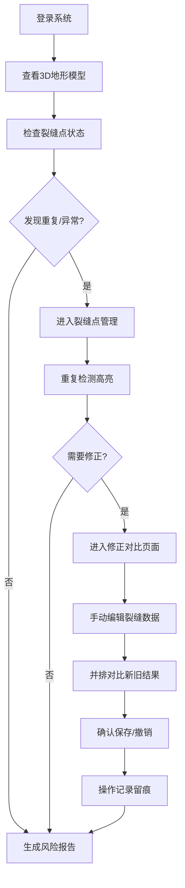

## 1. 产品概述

山地滑坡剖面台是一款面向地质灾害工程师的专业可视化工具，用于监测和分析山地滑坡裂缝数据，解决月底或评审前裂缝重复混入正常结果的问题。通过3D地形可视化、裂缝点智能检测、历史数据留痕和并排对比功能，帮助工程师高效识别裂缝重复情况，确保灾害评估的准确性。

## 2. 核心功能

### 2.1 用户角色

| 角色 | 登录方式 | 核心权限 |
|------|----------|----------|
| 地质灾害工程师 | 系统登录 | 查看3D地形、管理裂缝点、生成风险报告、手动修正数据、对比新旧结果 |

### 2.2 功能模块

1. **3D地形模型页面**：地形可视化、裂缝点标注、数据缺口提示
2. **裂缝点管理页面**：裂缝列表、重复检测、字段完整性检查、历史记录
3. **风险报告页面**：报告生成、数据统计、异常标记、导出功能
4. **修正对比页面**：手动修正入口、新旧结果并排对比、变更留痕

### 2.3 页面详情

| 页面名称 | 模块名称 | 功能描述 |
|----------|----------|----------|
| 3D地形模型 | 地形渲染 | 基于样例数据渲染山地3D模型，支持旋转、缩放、平移交互 |
| 3D地形模型 | 裂缝点标注 | 在地形上标注裂缝位置，用不同颜色区分正常/重复/异常状态 |
| 3D地形模型 | 数据缺口提示 | 当雨量缺测、坐标错误等影响3D渲染时，侧边醒目提示，不强制渲染正常效果 |
| 裂缝点管理 | 裂缝列表 | 展示所有裂缝记录，包含缺字段、晚补、备注修改等样例数据 |
| 裂缝点管理 | 重复检测 | 自动检测并高亮显示重复裂缝，优先级高于雨量缺测或坐标错误 |
| 裂缝点管理 | 历史追踪 | 记录每次修改操作，保留修改时间、修改人、修改内容 |
| 风险报告 | 报告生成 | 基于裂缝数据生成风险评估报告，突出重复和异常情况 |
| 风险报告 | 数据统计 | 统计裂缝总数、重复数、缺字段数、晚补记录数等关键指标 |
| 修正对比 | 手动修正 | 提供裂缝点编辑表单，支持修改坐标、状态、备注等字段 |
| 修正对比 | 并排对比 | 左右分栏展示修正前后的裂缝数据和3D视图 |

## 3. 核心流程

地质灾害工程师进入系统后，首先查看3D地形模型了解整体情况。通过裂缝点管理页面检查重复裂缝和数据完整性，生成风险报告用于评审。发现问题后进入修正对比页面进行手动编辑，对比确认后保存修改，所有操作自动留痕。

## 4. 界面设计

### 4.1 设计风格

- **主色调**：深 slate 蓝 (#0F172A) 作为主背景，体现专业感和地质工程属性
- **辅助色**：
  - 正常状态：深绿 (#059669)
  - 重复状态：亮红 (#DC2626) - 高优先级突出显示
  - 缺字段/晚补：琥珀橙 (#D97706)
  - 数据缺口：紫罗兰 (#7C3AED) - 侧边提示
- **按钮样式**：轻微圆角 (6px)，2px边框，hover时边框发光效果
- **字体**：
  - 标题：Noto Sans SC Bold - 清晰有力的中文显示
  - 正文：JetBrains Mono - 数据表格等宽显示，便于对齐
- **布局风格**：工业仪表盘风格，卡片式模块化布局，大量数据面板
- **图标风格**：线条风格图标，使用 Lucide React 图标库

### 4.2 页面设计概览

| 页面名称 | 模块名称 | UI元素 |
|----------|----------|--------|
| 3D地形模型 | 主视图 | 居中3D画布、左上角状态面板、右上角工具栏、底部时间轴、右侧数据缺口提示条 |
| 3D地形模型 | 裂缝标注 | 彩色圆点标注、悬停显示详情、点击选中高亮 |
| 裂缝点管理 | 数据表格 | 斑马纹表格、行悬停效果、状态列彩色标签、重复行红色背景闪烁 |
| 裂缝点管理 | 历史记录 | 侧边抽屉面板、时间轴样式展示修改记录、差异对比高亮 |
| 风险报告 | 统计面板 | 大数字卡片、趋势图表、环形图展示各类裂缝占比 |
| 风险报告 | 报告内容 | Markdown风格排版、关键数据加粗标红、可打印布局 |
| 修正对比 | 分栏布局 | 50%左右分栏、中间可拖拽分隔线、两侧独立滚动 |
| 修正对比 | 编辑表单 | 深色表单、输入框边框高亮、验证错误即时提示 |

### 4.3 响应式

- **桌面端优先**：针对大屏幕优化，支持多面板同时展示
- **平板适配**：堆叠式布局，保留核心功能
- **触屏优化**：增大点击区域，支持手势缩放3D模型

### 4.4 3D场景指引

- **环境**：暗色调HDRI环境，模拟黄昏/阴天氛围，突出裂缝标记
- **光照**：三光源设置 - 主方向光 + 环境光 + 裂缝点自发光
- **相机设置**：初始45度俯视角，支持轨道控制，限制最小/最大缩放距离
- **构图**：地形居中，裂缝点作为视觉焦点
- **交互动画**：
  - 重复裂缝点脉冲动画（呼吸效果）
  - 选中裂缝点弹跳效果
  - 数据加载时地形渐显动画
- **后处理**：轻微泛光效果（Bloom），色彩微调增强对比度
- **资源与性能**：使用程序化地形生成，总面数控制在5万以内，保持60fps
