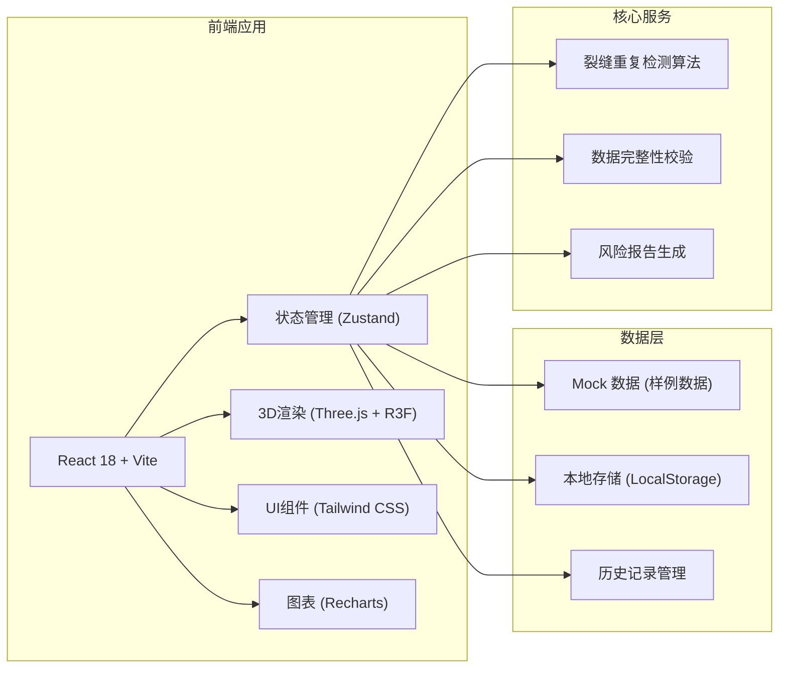
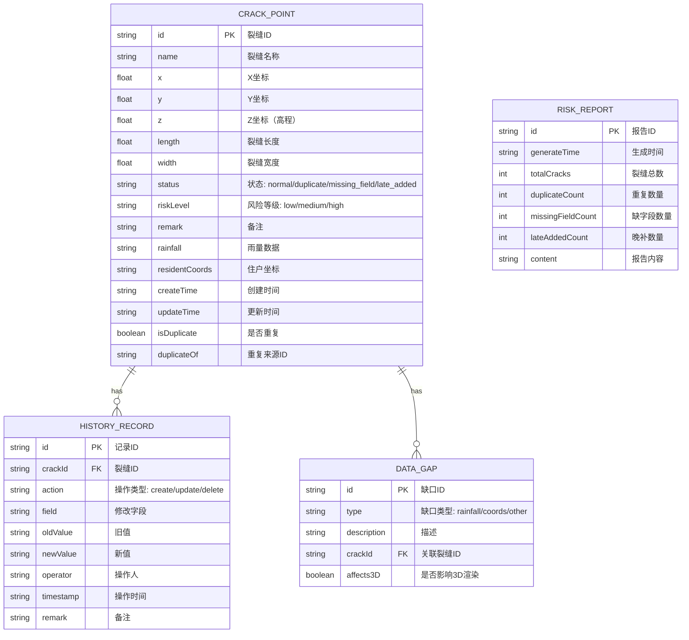

## 1. 架构设计



## 2. 技术选型

- **前端框架**：React@18 + TypeScript + Vite@5
- **3D引擎**：three@0.160 + @react-three/fiber@8 + @react-three/drei@9
- **状态管理**：zustand@4 - 轻量级状态管理
- **样式方案**：tailwindcss@3 + postcss + autoprefixer
- **图标库**：lucide-react@0.312
- **图表库**：recharts@2 - 数据可视化
- **日期处理**：date-fns@3
- **数据存储**：LocalStorage（持久化修改记录）+ Mock数据（样例数据）

## 3. 路由定义

| 路由 | 页面 | 说明 |
|------|------|------|
| / | 3D地形模型 | 首页面板，展示3D地形和裂缝点 |
| /cracks | 裂缝点管理 | 裂缝列表、重复检测、历史记录 |
| /report | 风险报告 | 数据统计、报告生成、导出 |
| /compare | 修正对比 | 手动修正、新旧结果并排对比 |

## 4. 数据模型

### 4.1 数据模型定义



### 4.2 TypeScript 类型定义

```typescript
// 裂缝点类型
interface CrackPoint {
  id: string;
  name: string;
  x: number;
  y: number;
  z: number;
  length: number;
  width: number;
  status: 'normal' | 'duplicate' | 'missing_field' | 'late_added';
  riskLevel: 'low' | 'medium' | 'high';
  remark: string;
  rainfall?: string;
  residentCoords?: string;
  createTime: string;
  updateTime: string;
  isDuplicate: boolean;
  duplicateOf?: string;
}

// 历史记录类型
interface HistoryRecord {
  id: string;
  crackId: string;
  action: 'create' | 'update' | 'delete';
  field?: string;
  oldValue?: string;
  newValue?: string;
  operator: string;
  timestamp: string;
  remark?: string;
}

// 数据缺口类型
interface DataGap {
  id: string;
  type: 'rainfall' | 'coords' | 'other';
  description: string;
  crackId?: string;
  affects3D: boolean;
}

// 风险报告类型
interface RiskReport {
  id: string;
  generateTime: string;
  totalCracks: number;
  duplicateCount: number;
  missingFieldCount: number;
  lateAddedCount: number;
  content: string;
}

// 应用状态类型
interface AppState {
  cracks: CrackPoint[];
  selectedCrack: CrackPoint | null;
  history: HistoryRecord[];
  dataGaps: DataGap[];
  reports: RiskReport[];
  originalCracks: CrackPoint[]; // 用于对比的原始数据
}
```

### 4.3 Mock 数据结构

将包含以下样例数据：
- 15条裂缝记录，其中：
  - 3条重复裂缝（标记为 duplicate）
  - 3条缺字段记录（rainfall 或 residentCoords 缺失）
  - 2条晚补记录（createTime 晚于其他记录）
  - 4条备注被修改过的记录（包含历史记录）
  - 3条正常记录
- 8条历史修改记录
- 5条数据缺口记录（其中3条影响3D渲染）

## 5. 核心算法

### 5.1 裂缝重复检测算法

基于坐标距离和特征相似度检测重复裂缝：
```typescript
function detectDuplicates(cracks: CrackPoint[]): CrackPoint[] {
  const distanceThreshold = 5; // 5米内视为可能重复
  const similarityThreshold = 0.8; // 特征相似度阈值
  
  return cracks.map((crack, i) => {
    const duplicates = cracks.filter((other, j) => {
      if (i === j) return false;
      const distance = calculateDistance(crack, other);
      const similarity = calculateFeatureSimilarity(crack, other);
      return distance < distanceThreshold && similarity > similarityThreshold;
    });
    
    return {
      ...crack,
      isDuplicate: duplicates.length > 0,
      status: duplicates.length > 0 ? 'duplicate' : crack.status
    };
  });
}
```

### 5.2 数据缺口检测

自动检测缺失字段并标记对3D渲染的影响：
```typescript
function detectDataGaps(cracks: CrackPoint[]): DataGap[] {
  const gaps: DataGap[] = [];
  
  cracks.forEach(crack => {
    if (!crack.rainfall) {
      gaps.push({
        id: `gap_rain_${crack.id}`,
        type: 'rainfall',
        description: `裂缝 ${crack.name} 缺少雨量数据`,
        crackId: crack.id,
        affects3D: false
      });
    }
    if (!crack.residentCoords) {
      gaps.push({
        id: `gap_coords_${crack.id}`,
        type: 'coords',
        description: `裂缝 ${crack.name} 住户坐标有误或缺席`,
        crackId: crack.id,
        affects3D: false
      });
    }
    // 坐标异常影响3D渲染
    if (crack.z < 0 || crack.z > 5000) {
      gaps.push({
        id: `gap_z_${crack.id}`,
        type: 'other',
        description: `裂缝 ${crack.name} 高程数据异常，可能影响3D显示`,
        crackId: crack.id,
        affects3D: true
      });
    }
  });
  
  return gaps;
}
```

## 6. 项目目录结构

```
src/
├── components/
│   ├── layout/           # 布局组件
│   │   ├── Header.tsx
│   │   ├── Sidebar.tsx
│   │   └── StatusBar.tsx
│   ├── terrain3d/        # 3D地形组件
│   │   ├── TerrainCanvas.tsx
│   │   ├── CrackMarker.tsx
│   │   ├── TerrainMesh.tsx
│   │   └── DataGapNotice.tsx
│   ├── cracks/           # 裂缝管理组件
│   │   ├── CrackTable.tsx
│   │   ├── CrackDetail.tsx
│   │   ├── DuplicateBadge.tsx
│   │   └── HistoryPanel.tsx
│   ├── report/           # 报告组件
│   │   ├── StatsCards.tsx
│   │   ├── RiskChart.tsx
│   │   └── ReportPreview.tsx
│   └── compare/          # 对比组件
│       ├── SplitView.tsx
│       ├── CrackEditor.tsx
│       └── CompareView.tsx
├── store/
│   └── useAppStore.ts    # Zustand 状态管理
├── data/
│   └── mockData.ts       # Mock样例数据
├── utils/
│   ├── duplicateDetection.ts
│   ├── dataGapDetection.ts
│   ├── reportGenerator.ts
│   └── historyManager.ts
├── types/
│   └── index.ts          # TypeScript类型定义
├── pages/
│   ├── TerrainPage.tsx
│   ├── CracksPage.tsx
│   ├── ReportPage.tsx
│   └── ComparePage.tsx
├── App.tsx
├── main.tsx
└── index.css
```
