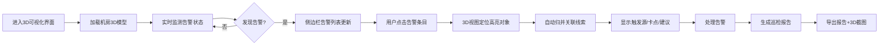

# 数据中心冷热通道3D可视化系统 PRD

## 1. 产品概述
数据中心冷热通道Web3D可视化系统，专为机房运维人员设计，解决多维度信息割裂问题。通过3D交互视图整合机柜模型、空调风口、巡检报告等数据，实现告警联动、智能归并、一键截图导出，提升运维效率。

- 解决机房运维中多资料切换繁琐、信息遗漏的问题
- 目标用户：数据中心运维工程师、机房管理员

## 2. 核心功能

### 2.1 用户角色
| 角色 | 注册方式 | 核心权限 |
|------|----------|----------|
| 运维工程师 | 内部账号 | 3D浏览、筛选、告警查看、截图导出 |
| 机房管理员 | 内部账号 | 全部功能 + 巡检报告生成 |

### 2.2 功能模块
1. **3D主视图**：冷热通道全景、机柜/风口/桥架模型、旋转缩放、点击交互
2. **侧边栏面板**：温场高亮、告警列表、筛选条件、状态同步
3. **告警联动中心**：多线索归并、触发源追踪、卡点诊断、补救建议
4. **巡检报告系统**：3D截图嵌入、告警链路分析、完整导出

### 2.3 页面详情
| 页面名称 | 模块名称 | 功能描述 |
|----------|----------|----------|
| 3D可视化主界面 | 3D场景渲染 | Three.js渲染冷热通道，支持鼠标旋转/缩放/平移 |
| 3D可视化主界面 | 对象交互 | 点击机柜/风口/桥架显示详情面板，高亮选中对象 |
| 3D可视化主界面 | 截图功能 | 一键截取当前3D视图，可下载保存 |
| 侧边栏 | 温场高亮 | 以色温图形式展示各区域温度分布，支持切换显示 |
| 侧边栏 | 告警列表 | 实时显示探头离线、风口遮挡、机柜重号等告警 |
| 侧边栏 | 筛选同步 | 两边筛选条件实时同步，3D视图同步高亮匹配对象 |
| 告警详情面板 | 线索归并 | 自动关联机柜、风口、桥架到同一告警事件 |
| 告警详情面板 | 触发溯源 | 显示哪份材料触发、卡点位置、下一步操作建议 |
| 巡检报告页 | 报告生成 | 整合3D截图、告警链路分析，生成完整巡检报告 |

## 3. 核心流程

### 3.1 告警处理流程
运维人员发现告警 → 点击告警条目 → 3D视图自动定位并高亮 → 侧边栏显示关联线索 → 查看触发源和卡点 → 获取补救建议 → 处理完成 → 生成巡检报告

### 3.2 流程图

## 4. 用户界面设计

### 4.1 设计风格
- 主色调：深蓝(#0A1628) + 科技蓝(#00D4FF)，营造工业科技感
- 辅助色：告警红(#FF4757)、警告橙(#FFA502)、正常绿(#2ED573)
- 按钮风格：圆角8px，玻璃拟态效果，悬浮发光动画
- 字体：JetBrains Mono（等宽，适合数据展示）+ Noto Sans SC
- 布局：左侧固定3D主视图(75%)，右侧可折叠侧边栏(25%)
- 图标风格：线性图标，科技感线条设计

### 4.2 页面设计概览
| 页面名称 | 模块名称 | UI元素 |
|----------|----------|--------|
| 3D主界面 | 3D视窗 | 深色背景、网格地板、机柜发光效果、色温渐变、光晕效果 |
| 3D主界面 | 顶部工具栏 | 截图按钮、视角重置、全屏切换、帮助按钮 |
| 侧边栏 | 温场面板 | 色温图例、开关按钮、温度范围滑块 |
| 侧边栏 | 告警面板 | 告警卡片、状态徽章、时间戳、关联计数 |
| 侧边栏 | 筛选面板 | 多选标签、搜索框、重置按钮 |
| 详情弹窗 | 信息面板 | 标签页切换、属性表格、关联关系图谱、操作按钮 |
| 巡检报告 | 报告预览 | 分章节布局、3D截图占位、告警时间线、导出按钮 |

### 4.3 响应式
- 桌面端优先，支持1920×1080及以上分辨率
- 侧边栏支持拖拽调整宽度
- 移动端适配：侧边栏转为底部滑面板，3D视图全屏显示

### 4.4 3D场景指南
- 环境：深色空间，顶部网格天花板，地板带发光网格线
- 灯光：主光源模拟机房照明，机柜内部发光，告警对象红色脉冲光
- 相机：透视相机，初始视角45度俯角，支持轨道控制
- 交互：悬停高亮外发光，点击选中放大动画，告警对象持续脉冲
- 后处理：轻微泛光效果，增强科技感，边缘抗锯齿
- 性能：机柜使用实例化渲染，控制面数在5万以内
