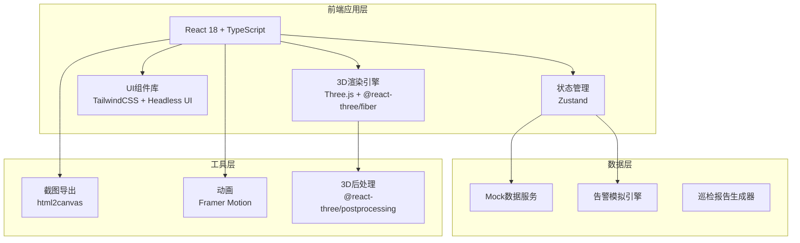
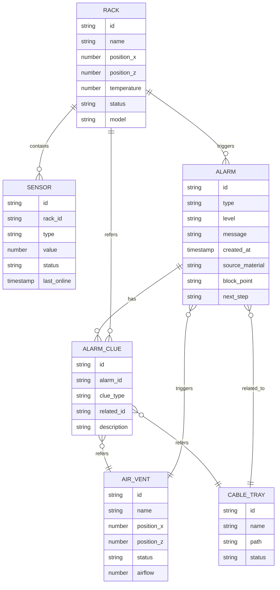

# 数据中心冷热通道3D可视化系统 技术架构

## 1. 架构设计



## 2. 技术描述

- **前端框架**: React@18 + TypeScript + Vite@5
- **3D引擎**: Three.js + @react-three/fiber + @react-three/drei
- **样式方案**: TailwindCSS@3 + CSS变量主题系统
- **状态管理**: Zustand（轻量级，适合3D交互状态同步）
- **动画库**: Framer Motion（UI动画）+ Three.js动画系统
- **截图导出**: html2canvas
- **后端**: 无，使用Mock数据模拟真实场景
- **包管理器**: pnpm

## 3. 路由定义

| 路由 | 页面名称 | 功能说明 |
|------|----------|----------|
| / | 3D可视化主界面 | 包含3D场景、侧边栏、工具栏 |
| /report | 巡检报告页面 | 预览和导出巡检报告 |

## 4. 核心模块结构

```
src/
├── components/
│   ├── 3d/
│   │   ├── Scene.tsx          # 3D主场景
│   │   ├── Rack.tsx           # 机柜模型
│   │   ├── AirVent.tsx        # 空调风口
│   │   ├── CableTray.tsx      # 线缆桥架
│   │   ├── Sensor.tsx         # 温度探头
│   │   └── TemperatureField.tsx # 温场可视化
│   ├── sidebar/
│   │   ├── AlarmList.tsx      # 告警列表
│   │   ├── FilterPanel.tsx    # 筛选面板
│   │   └── TempHeatmap.tsx    # 温场高亮
│   ├── common/
│   │   ├── Toolbar.tsx        # 顶部工具栏
│   │   ├── DetailModal.tsx    # 详情弹窗
│   │   └── ScreenshotBtn.tsx  # 截图按钮
│   └── report/
│       └── ReportPage.tsx     # 巡检报告页面
├── store/
│   ├── useSceneStore.ts       # 3D场景状态
│   ├── useAlarmStore.ts       # 告警状态
│   └── useFilterStore.ts      # 筛选状态（同步用）
├── data/
│   ├── mockRacks.ts           # 机柜Mock数据
│   ├── mockAlarms.ts          # 告警Mock数据
│   └── mockSensors.ts         # 探头Mock数据
├── types/
│   └── index.ts               # 类型定义
└── App.tsx
```

## 5. 数据模型

### 5.1 数据模型定义



### 5.2 告警类型定义

| 告警类型 | 触发条件 | 关联线索 |
|----------|----------|----------|
| 探头离线 | 传感器最后在线时间 > 5分钟 | 所属机柜、附近风口、关联桥架 |
| 风口遮挡 | 气流值 < 阈值 | 附近机柜、上方桥架 |
| 机柜重号 | 机柜名称重复 | 重号机柜列表、巡检报告记录 |

## 6. 状态同步机制

使用 Zustand 单一数据源实现筛选同步：

```typescript
// 筛选状态 - 两侧共享
interface FilterState {
  selectedTypes: ('rack' | 'vent' | 'tray' | 'sensor')[]
  alarmLevels: ('critical' | 'warning' | 'info')[]
  temperatureRange: [number, number]
  searchKeyword: string
}

// 3D场景订阅筛选变化 → 高亮匹配对象
// 侧边栏订阅筛选变化 → 过滤告警/设备列表
```

## 7. 3D性能优化

- 机柜使用 InstancedMesh 批量渲染
- 视锥体剔除（Frustum Culling）
- LOD（Level of Detail）按需加载
- 后处理效果按需开启
- 交互使用 Raycaster 批量检测
