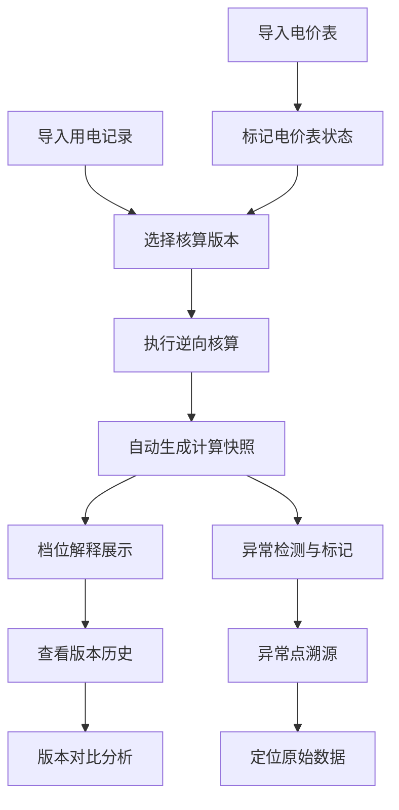

## 1. 产品概述

分段电价逆向核算系统，专为能源数据分析师设计，解决分段电费从"总金额"反推"各档位用量"的核算难题。系统内置完整的版本追踪机制和数据溯源链路，无需依赖聊天截图确认版本，异常点可一键追溯至原始数据来源。

- 核心目标：让逆向核算的口径清晰可查，计算过程全程留痕
- 目标用户：能源数据分析师、电费核算人员
- 产品价值：替代人工在总电费、峰谷用量、客户备注之间反复复制核对的繁琐工作

## 2. 核心功能

### 2.1 用户角色
| 角色 | 注册方式 | 核心权限 |
|------|----------|----------|
| 能源分析师 | 本地使用，无需注册 | 数据导入、逆向核算、版本对比、数据溯源 |

### 2.2 功能模块
1. **数据导入页**：电价表导入、用电记录导入、版本备注
2. **核算工作台**：逆向求解计算、档位解释、异常标记
3. **版本追踪页**：历史版本列表、版本对比、变更说明
4. **数据溯源页**：计算链路追溯、原始数据查看、异常点定位

### 2.3 页面详情
| 页面名称 | 模块名称 | 功能描述 |
|---------|----------|---------|
| 数据导入页 | 电价表管理 | 支持多版本电价表上传，标记生效/过期状态，显示有效期 |
| 数据导入页 | 用电记录导入 | 导入总电费、峰谷用量、客户备注等原始数据 |
| 核算工作台 | 逆向求解引擎 | 根据总电费和电价表，逆向计算各档位实际用电量 |
| 核算工作台 | 档位解释面板 | 逐档展示计算过程：档位区间、适用电价、分摊电量、电费金额 |
| 核算工作台 | 异常检测 | 自动标记边界档位、负用量、电价表过期等异常情况 |
| 版本追踪页 | 版本快照 | 每次核算自动生成版本快照，记录计算参数和结果 |
| 版本追踪页 | 版本对比 | 并排对比两个版本的计算结果差异，高亮变动项 |
| 数据溯源页 | 计算链路 | 从最终结果反向追溯：结果 → 档位计算 → 原始数据 |
| 数据溯源页 | 异常溯源 | 点击异常标记直接跳转至对应原始数据和计算步骤 |

## 3. 核心流程

**主流程说明**：
1. 用户先导入电价表并设置有效期，系统自动识别过期电价表
2. 导入用电记录（包含总电费、峰谷用量、客户备注等字段）
3. 选择对应电价表版本执行逆向核算
4. 系统自动计算各档位用量，生成完整计算链路和版本快照
5. 异常情况（负用量、边界档位、电价表过期）自动高亮标记
6. 点击任意结果可追溯至计算步骤和原始数据
7. 历史版本可随时对比，差异项自动高亮

## 4. 用户界面设计

### 4.1 设计风格
- **主色调**：深青色（#0F3B5F）- 专业严谨
- **辅助色**：琥珀色（#F59E0B）- 异常标记；翠绿色（#10B981）- 正常状态；橙红色（#EF4444）- 错误警告
- **中性色**：石板灰系列（slate）- 文字和背景
- **字体**：专业等宽字体（JetBrains Mono）用于数值展示，思源黑体用于正文
- **布局**：左右分栏，左侧数据/版本列表，右侧详情面板
- **交互**：悬停显示计算细节，点击展开溯源链路
- **图标**：使用 Lucide 线性图标，保持简洁专业

### 4.2 页面设计概述
| 页面名称 | 模块名称 | UI 元素 |
|---------|----------|---------|
| 数据导入页 | 电价表管理 | 卡片式电价表列表，显示有效期状态标签，过期项红框高亮 |
| 核算工作台 | 档位解释 | 阶梯式可视化展示各档位，每项可点击展开计算公式 |
| 核算工作台 | 异常标记 | 异常数据左侧显示琥珀色竖条，悬停显示异常说明 |
| 版本追踪页 | 版本列表 | 时间线式版本记录，每项显示变更摘要，支持复选对比 |
| 版本追踪页 | 版本对比 | 并排双栏布局，差异单元格背景色高亮 |
| 数据溯源页 | 计算链路 | 面包屑式追溯路径，每步可点击查看详情 |

### 4.3 响应式
- 桌面端优先设计（1280px 以上）
- 平板端：左右分栏改为上下堆叠
- 移动端：简化为列表+抽屉式详情
- 核心数值表格支持水平滚动

### 4.4 样例数据设计
系统内置 4 条典型样例记录，覆盖正常和异常场景：

| 样例编号 | 场景类型 | 说明 | 预期表现 |
|---------|----------|------|---------|
| 样例1 | 正常记录 | 用电量落在中间档位，电价表在有效期内 | 顺利完成逆向核算，各档位解释清晰 |
| 样例2 | 电价表过期 | 用电日期超出电价表有效期 | 橙色警告标记，仍可计算但明确标注风险 |
| 样例3 | 边界档位 | 用电量恰好等于档位临界点 | 明确标注归属档位，展示判定逻辑 |
| 样例4 | 用量为负 | 原始数据中某时段用量为负值 | 红色异常标记，可追溯至原始导入数据 |
