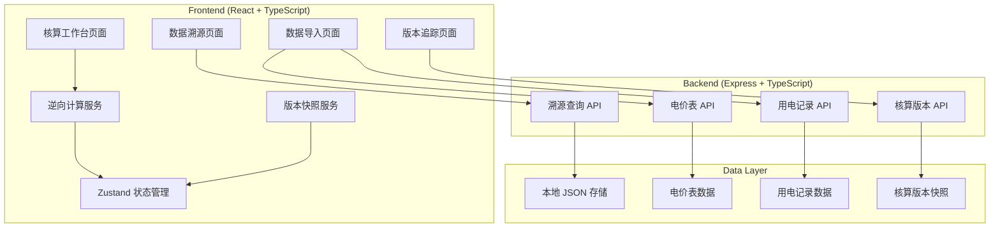
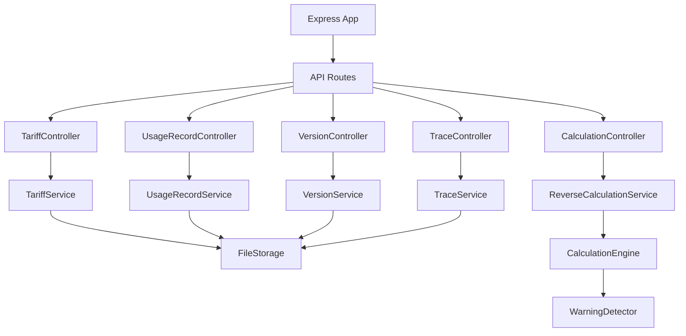
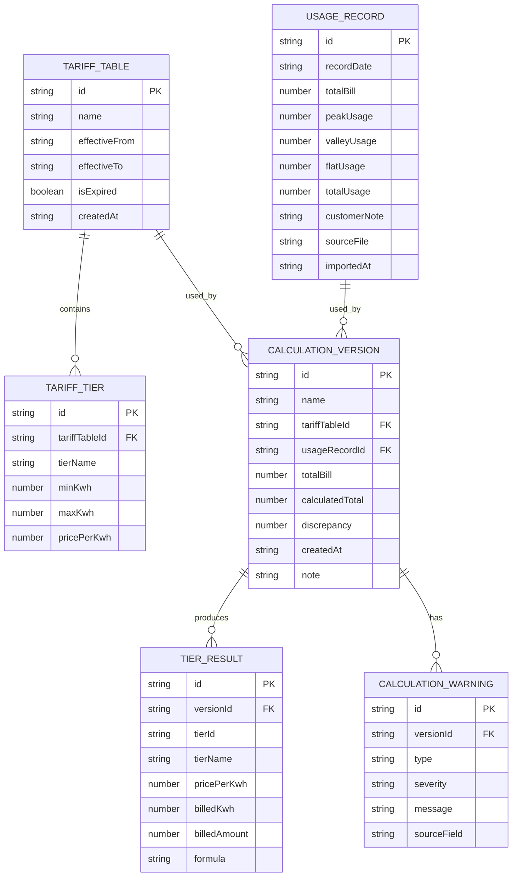

## 1. 架构设计



## 2. 技术描述

- **前端**：React@18 + TypeScript + TailwindCSS@3 + Zustand + React Router DOM
- **构建工具**：Vite@5
- **后端**：Express@4 + TypeScript
- **数据存储**：本地 JSON 文件（模拟持久化），内置样例数据
- **图标库**：lucide-react
- **初始化工具**：vite-init
- **模板选择**：react-express-ts（前后端一体）

## 3. 路由定义

| 路由 | 页面 | 说明 |
|------|------|------|
| `/` | 核算工作台 | 逆向核算主界面，显示计算结果和档位解释 |
| `/import` | 数据导入 | 电价表和用电记录导入管理 |
| `/versions` | 版本追踪 | 历史版本列表和版本对比 |
| `/trace/:versionId` | 数据溯源 | 计算链路追溯和异常点定位 |

## 4. API 定义

### 4.1 类型定义

```typescript
// 电价档位
interface TariffTier {
  tierId: string;
  tierName: string;
  minKwh: number;
  maxKwh: number | null; // null 表示无上界
  pricePerKwh: number;
}

// 电价表
interface TariffTable {
  id: string;
  name: string;
  effectiveFrom: string; // ISO date
  effectiveTo: string;   // ISO date
  tiers: TariffTier[];
  isExpired: boolean;
  createdAt: string;
}

// 原始用电记录
interface UsageRecord {
  id: string;
  recordDate: string;
  totalBill: number;       // 总电费（元）
  peakUsage?: number;      // 峰时用量
  valleyUsage?: number;    // 谷时用量
  flatUsage?: number;      // 平时用量
  totalUsage?: number;     // 总用电量（如有提供）
  customerNote?: string;   // 客户备注
  sourceFile: string;      // 来源文件名
  importedAt: string;
}

// 档位计算结果
interface TierCalculation {
  tierId: string;
  tierName: string;
  pricePerKwh: number;
  billedKwh: number;       // 该档位结算电量
  billedAmount: number;    // 该档位电费
  formula: string;         // 计算公式字符串
}

// 异常信息
interface CalculationWarning {
  type: 'expired_tariff' | 'negative_usage' | 'boundary_tier' | 'mismatch_total';
  severity: 'error' | 'warning' | 'info';
  message: string;
  sourceField: string;     // 关联字段
  sourceValue: any;        // 原始值
}

// 核算版本快照
interface CalculationVersion {
  id: string;
  name: string;
  tariffTableId: string;
  usageRecordId: string;
  totalBill: number;
  calculatedTotal: number;
  discrepancy: number;     // 计算值与实际值差异
  tierResults: TierCalculation[];
  warnings: CalculationWarning[];
  createdAt: string;
  createdBy: string;
  note: string;
}

// 溯源节点
interface TraceNode {
  id: string;
  type: 'result' | 'tier_calc' | 'input' | 'tariff';
  label: string;
  value: any;
  formula?: string;
  sourceRef: string;       // 数据来源引用
  children: TraceNode[];
}
```

### 4.2 接口定义

| 方法 | 路径 | 说明 |
|------|------|------|
| GET | `/api/tariffs` | 获取所有电价表 |
| POST | `/api/tariffs` | 新增电价表 |
| GET | `/api/tariffs/:id` | 获取单个电价表 |
| GET | `/api/usage-records` | 获取所有用电记录 |
| POST | `/api/usage-records` | 新增用电记录 |
| GET | `/api/usage-records/:id` | 获取单条用电记录 |
| POST | `/api/calculate` | 执行逆向核算 |
| GET | `/api/versions` | 获取所有核算版本 |
| GET | `/api/versions/:id` | 获取单个版本详情 |
| GET | `/api/versions/:id/trace` | 获取版本的溯源链路 |
| GET | `/api/versions/compare?ids=a,b` | 对比两个版本 |

## 5. 服务器架构



## 6. 数据模型

### 6.1 ER 图



### 6.2 核心算法说明

**逆向核算算法逻辑**：

1. **输入校验**：检查电价表有效期、用电量正负值
2. **正向累加验证**：
   - 从第一档开始，假设用电量达到该档上限
   - 计算该档电费：(max - min) * price
   - 累加至总电费，直到达到或超过实际总电费
3. **逆向求解**：
   - 确定最后一档（未用满的档位）
   - 计算最后一档用电量：(剩余电费) / 该档电价
   - 生成各档位详细计算结果
4. **异常检测**：
   - 边界点检测：用电量恰好等于档位临界点
   - 负用量检测：原始数据中出现负值
   - 电价表过期：用电日期超出电价表有效期
   - 总量不匹配：计算总用量与提供的总用量不一致
5. **生成溯源链路**：
   - 记录每一步计算的输入和输出
   - 保存计算公式字符串
   - 建立从结果到原始数据的引用链

### 6.3 数据文件结构

```
data/
  ├── tariffs.json          # 电价表数据
  ├── usage-records.json    # 用电记录数据
  └── versions/             # 核算版本快照目录
      ├── v1_20240115.json
      ├── v2_20240116.json
      └── ...
```
