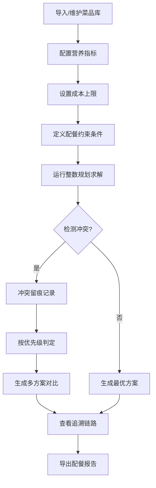

## 1. 产品概述

组合优化配餐器是为学校后勤老师设计的智能配餐系统，基于整数规划算法自动优化菜品组合，解决成本上限滞后、营养指标冲突、过敏约束等复杂问题，实现从菜品库到报告导出的完整可追溯链路。

- 核心目标：让后勤老师自主完成配餐优化，无需专业数学规划知识
- 核心价值：冲突留痕、过程透明、结果可追溯、报告可导出

## 2. 核心功能

### 2.1 用户角色
| 角色 | 注册方式 | 核心权限 |
|------|----------|----------|
| 后勤老师 | 系统预置账号 | 导入菜品、配置约束、运行优化、查看追溯、导出报告 |

### 2.2 功能模块
1. **菜品库管理**：菜品主信息维护、营养指标录入、成本上限配置
2. **配餐优化器**：约束配置、整数规划求解、多方案对比
3. **冲突追溯中心**：冲突留痕记录、优先级判定、解决路径可视化
4. **结果报告导出**：明细查看、追溯链路、报告生成与导出

### 2.3 页面详情
| 页面名称 | 模块名称 | 功能描述 |
|----------|----------|----------|
| 菜品库管理页 | 菜品列表 | 菜品CRUD、批量导入、分类筛选 |
| 菜品库管理页 | 详情面板 | 主信息编辑、营养指标、成本上限 |
| 配餐优化页 | 约束配置 | 预算、营养、过敏、份数等约束条件设置 |
| 配餐优化页 | 求解器面板 | 运行状态、进度显示、算法参数 |
| 配餐优化页 | 结果展示 | 方案卡片、营养达标、成本分析图表 |
| 冲突追溯页 | 冲突列表 | 冲突类型、优先级、处理状态 |
| 冲突追溯页 | 追溯链路 | 整数规划约束、判定逻辑、方案对比 |
| 报告导出页 | 报告预览 | 配餐明细、营养分析、成本统计 |
| 报告导出页 | 导出功能 | PDF/Excel导出、追溯信息附件 |

## 3. 核心流程

**用户主流程描述**：
1. 后勤老师进入菜品库，批量导入菜品样例，维护每道菜品的主信息、营养成分和成本数据
2. 进入配餐优化页面，设置预算上限、营养目标、过敏食材排除、配餐份数等约束
3. 点击运行优化，系统执行整数规划算法，实时显示求解进度
4. 系统自动检测约束冲突（预算超限vs过敏、营养不足等），按优先级留痕并给出判定
5. 查看优化结果，点击任意结果项可追溯到整数规划约束、判定逻辑和备选方案
6. 确认方案后，导出包含完整追溯信息的配餐报告

## 4. 用户界面设计

### 4.1 设计风格
- **主色调**：深青色(#165DFF) - 代表专业、可信
- **辅助色**：橙红色(#FF7D00) - 用于冲突警示；绿色(#00B42A) - 用于达标标识
- **中性色**：深灰(#1D2129)、中灰(#4E5969)、浅灰(#C9CDD4)
- **按钮风格**：圆角8px，悬浮微上浮效果，主按钮带渐变
- **字体**：标题用思源黑体Bold，正文用思源黑体Regular，数字用等宽字体
- **布局风格**：左右分栏布局，左侧导航+内容区卡片式设计，强调数据可视化
- **图标风格**：线性图标，统一24px尺寸，状态变化带动画

### 4.2 页面设计概览
| 页面名称 | 模块名称 | UI元素 |
|----------|----------|--------|
| 菜品库管理页 | 菜品列表 | 表格+卡片双视图、搜索过滤栏、批量操作、导入拖拽区 |
| 配餐优化页 | 约束配置 | 表单分组、滑块控件、多选标签、实时校验提示 |
| 配餐优化页 | 求解面板 | 进度环形图、实时日志滚动、状态徽章 |
| 配餐优化页 | 结果展示 | 方案卡片瀑布流、雷达图对比、成本进度条 |
| 冲突追溯页 | 追溯链路 | 时间线组件、约束节点高亮、方案对比切换器 |
| 报告导出页 | 报告预览 | 分页预览、章节导航、追溯信息折叠面板 |

### 4.3 响应式
- 桌面端优先设计，适配1280px以上分辨率
- 平板端自适应调整分栏比例，导航转为顶部
- 移动端简化视图，核心功能优先展示

### 4.4 交互动效
- 页面加载：元素渐入+轻微上移动画，错落延迟
- 数据更新：数字滚动动画、图表渐入动画
- 冲突提示：脉冲警示动画、高亮闪烁
- 追溯链路：节点连线绘制动画、展开折叠平滑过渡
