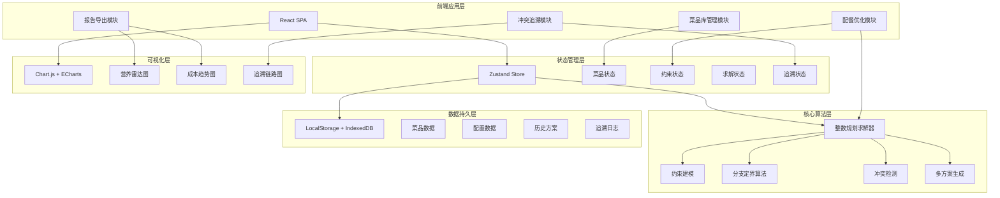
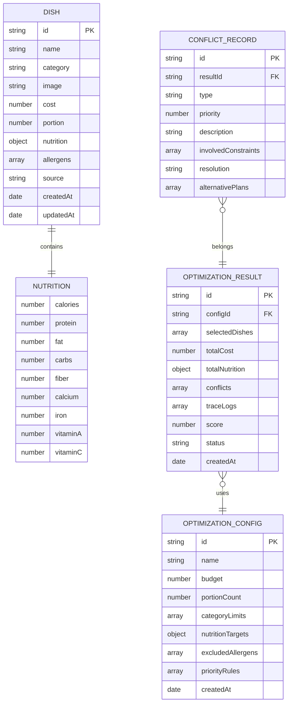
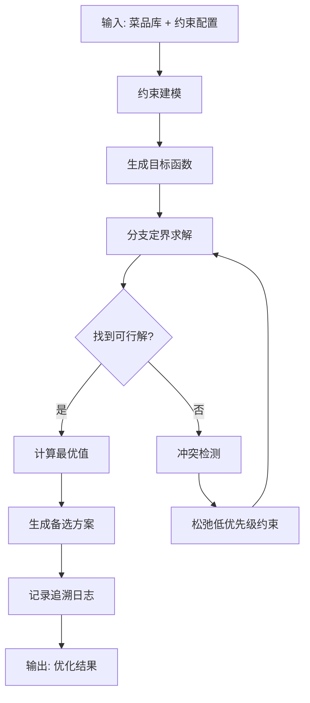

## 1. 架构设计



## 2. 技术说明

- **前端框架**：React@18 + TypeScript@5
- **构建工具**：Vite@5
- **样式方案**：TailwindCSS@3 + SCSS
- **状态管理**：Zustand（轻量级，避免Redux复杂度）
- **路由管理**：React Router@6
- **UI组件库**：Ant Design@5（按需引入）
- **图表可视化**：ECharts@5（营养雷达图、成本分析）
- **整数规划**：自定义实现分支定界算法 + lpsolve.js（备选）
- **文件导出**：SheetJS (Excel) + jsPDF (PDF)
- **数据持久化**：IndexedDB (dexie.js) + LocalStorage
- **代码规范**：ESLint + Prettier

## 3. 路由定义

| 路由路径 | 页面名称 | 说明 |
|----------|----------|------|
| / | 首页/仪表盘 | 快捷入口、统计概览、最近方案 |
| /dishes | 菜品库管理 | 菜品列表、导入导出、详情编辑 |
| /optimizer | 配餐优化 | 约束配置、求解过程、结果展示 |
| /trace | 冲突追溯 | 冲突列表、追溯链路、方案对比 |
| /report | 报告导出 | 报告预览、多格式导出 |

## 4. 数据模型

### 4.1 数据模型定义



### 4.2 TypeScript 类型定义

```typescript
// 菜品相关
interface Nutrition {
  calories: number;
  protein: number;
  fat: number;
  carbs: number;
  fiber: number;
  calcium: number;
  iron: number;
  vitaminA: number;
  vitaminC: number;
}

interface Dish {
  id: string;
  name: string;
  category: '主食' | '荤菜' | '素菜' | '汤品' | '水果' | '奶制品';
  image?: string;
  cost: number;
  portion: number;
  nutrition: Nutrition;
  allergens: string[];
  source: string;
  createdAt: Date;
  updatedAt: Date;
}

// 优化配置
interface NutritionTarget {
  nutrient: keyof Nutrition;
  min?: number;
  max?: number;
  weight: number;
}

interface PriorityRule {
  type: 'budget' | 'allergy' | 'nutrition' | 'category';
  priority: number;
  description: string;
}

interface OptimizationConfig {
  id: string;
  name: string;
  budget: number;
  portionCount: number;
  categoryLimits: { category: string; min?: number; max?: number }[];
  nutritionTargets: NutritionTarget[];
  excludedAllergens: string[];
  priorityRules: PriorityRule[];
  createdAt: Date;
}

// 优化结果
interface Conflict {
  id: string;
  type: 'budget_exceed' | 'allergy_violation' | 'nutrition_deficit' | 'category_violation';
  priority: number;
  description: string;
  involvedConstraints: string[];
  severity: 'high' | 'medium' | 'low';
}

interface TraceLog {
  step: number;
  timestamp: Date;
  type: 'constraint' | 'decision' | 'conflict' | 'resolution';
  description: string;
  details: Record<string, any>;
}

interface AlternativePlan {
  id: string;
  name: string;
  selectedDishes: string[];
  totalCost: number;
  tradeoffs: string[];
  score: number;
}

interface OptimizationResult {
  id: string;
  configId: string;
  selectedDishes: { dishId: string; quantity: number }[];
  totalCost: number;
  totalNutrition: Nutrition;
  conflicts: Conflict[];
  traceLogs: TraceLog[];
  alternativePlans: AlternativePlan[];
  score: number;
  status: 'optimal' | 'suboptimal' | 'infeasible';
  createdAt: Date;
}
```

## 5. 核心算法设计

### 5.1 整数规划求解器架构



### 5.2 冲突优先级判定规则
1. **过敏约束 (优先级1)** - 不可松弛，必须满足
2. **预算上限 (优先级2)** - 可轻微松弛，记录超限
3. **营养下限 (优先级3)** - 关键营养不可松弛，次要可调整
4. **品类数量 (优先级4)** - 可灵活调整

## 6. 项目目录结构

```
src/
├── assets/              # 静态资源
├── components/          # 通用组件
│   ├── DishCard.tsx
│   ├── NutritionRadar.tsx
│   ├── ConflictBadge.tsx
│   ├── TraceTimeline.tsx
│   └── ProgressRing.tsx
├── pages/               # 页面组件
│   ├── Dashboard.tsx
│   ├── DishLibrary/
│   │   ├── DishList.tsx
│   │   ├── DishDetail.tsx
│   │   └── ImportModal.tsx
│   ├── Optimizer/
│   │   ├── ConstraintForm.tsx
│   │   ├── SolverPanel.tsx
│   │   └── ResultDisplay.tsx
│   ├── TraceCenter/
│   │   ├── ConflictList.tsx
│   │   └── TraceViewer.tsx
│   └── Report/
│       ├── ReportPreview.tsx
│       └── ExportPanel.tsx
├── store/               # 状态管理
│   ├── dishStore.ts
│   ├── optimizerStore.ts
│   └── traceStore.ts
├── solver/              # 整数规划求解器
│   ├── types.ts
│   ├── model.ts
│   ├── branchAndBound.ts
│   ├── conflictDetector.ts
│   └── index.ts
├── utils/               # 工具函数
│   ├── export.ts
│   ├── nutrition.ts
│   └── validation.ts
├── hooks/               # 自定义Hooks
├── types/               # 类型定义
├── App.tsx
├── main.tsx
└── routes.tsx
```
