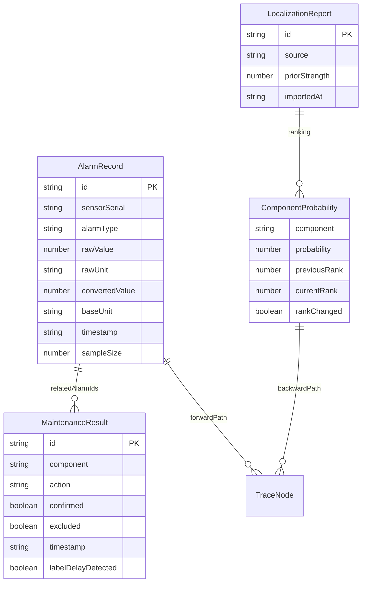

## 1. 架构设计

```mermaid
flowchart TD
    "前端 React" --> "Zustand 状态管理"
    "Zustand 状态管理" --> "贝叶斯更新引擎"
    "Zustand 状态管理" --> "单位换算引擎"
    "Zustand 状态管理" --> "冲突检测器"
    "Zustand 状态管理" --> "边界值检测器"
    "贝叶斯更新引擎" --> "概率排序 + 证据解释"
    "单位换算引擎" --> "冲突检测器"
    "边界值检测器" --> "具体提示（样本过少/先验过强/标签滞后）"
    "冲突检测器" --> "冲突标记（不自动修改）"
    "概率排序 + 证据解释" --> "复检建议生成"
    "复检建议生成" --> "双向追溯索引"
```

## 2. 技术说明

- 前端: React@18 + tailwindcss@3 + vite + TypeScript
- 初始化工具: vite-init
- 后端: 无（纯前端，数据存储于 Zustand + localStorage）
- 数据库: 无（前端 mock 数据 + localStorage 持久化）

## 3. 路由定义

| 路由 | 用途 |
|------|------|
| / | 证据录入页：报警记录、维修结果、定位报告录入 |
| /dashboard | 定位看板页：概率排序、证据解释、复检建议、双向追溯 |

## 4. API定义

无后端API。所有逻辑在前端 Zustand store 中完成。

### 核心数据类型

```typescript
interface AlarmRecord {
  id: string
  sensorSerial: string
  alarmType: string
  rawValue: number
  rawUnit: string
  convertedValue: number
  baseUnit: string
  timestamp: string
  sampleSize: number
}

interface MaintenanceResult {
  id: string
  relatedAlarmIds: string[]
  component: string
  action: string
  confirmed: boolean
  excluded: boolean
  timestamp: string
  labelDelayDetected: boolean
}

interface LocalizationReport {
  id: string
  source: string
  componentRanking: ComponentProbability[]
  priorStrength: number
  evidenceChain: EvidenceItem[]
  importedAt: string
  unitConflicts: UnitConflict[]
  calibrationConflicts: CalibrationConflict[]
}

interface ComponentProbability {
  component: string
  probability: number
  previousRank: number
  currentRank: number
  rankChanged: boolean
}

interface EvidenceItem {
  sourceId: string
  sourceType: 'alarm' | 'maintenance' | 'report'
  description: string
  contributionToRank: string
  confidence: number
}

interface ReinspectionSuggestion {
  component: string
  material: string
  object: string
  reason: string
  priority: 'high' | 'medium' | 'low'
  relatedEvidenceIds: string[]
}

interface TraceLink {
  forwardPath: TraceNode[]
  backwardPath: TraceNode[]
}

interface TraceNode {
  id: string
  type: 'alarm' | 'maintenance' | 'report' | 'result'
  label: string
  sensorSerial?: string
  children: TraceNode[]
}

interface UnitConflict {
  field: string
  existingValue: string
  incomingValue: string
  existingUnit: string
  incomingUnit: string
  resolved: boolean
}

interface CalibrationConflict {
  field: string
  existingCalibration: string
  incomingCalibration: string
  autoModified: boolean
}

interface BoundaryWarning {
  type: 'sample_too_small' | 'prior_too_strong' | 'label_lag'
  component: string
  material: string
  object: string
  detail: string
  severity: 'warning' | 'error'
}
```

## 5. 服务端架构

不适用（纯前端项目）

## 6. 数据模型

### 6.1 数据模型定义



### 6.2 数据定义语言

使用 localStorage 存储，键值结构：
- `bayesian_alarm_records`: AlarmRecord[]
- `bayesian_maintenance_results`: MaintenanceResult[]
- `bayesian_localization_reports`: LocalizationReport[]
- `bayesian_probabilities`: ComponentProbability[]
