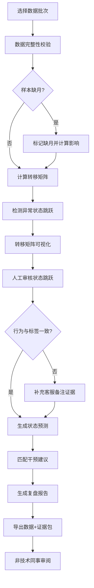

## 1. 产品概述

基于马尔可夫链的会员流失分析工具，解决运营只看最终流失率滞后、增长分析师样本缺月易走偏的问题。通过状态转移矩阵追踪会员全生命周期，确保图表、明细、下载数据同源，保留状态跳跃、样本缺月、活动重叠等关键证据，最终输出非技术人员可读的复盘报告。

- 目标用户：增长分析师、运营经理、客服主管
- 核心价值：提前识别流失风险，留存干预有据可依，复盘结论"说人话"

## 2. 核心功能

### 2.1 用户角色

| 角色 | 注册方式 | 核心权限 |
|------|----------|----------|
| 增长分析师 | 企业账号登录 | 全功能使用、样本调整、干预建议配置 |
| 运营经理 | 企业账号登录 | 查看分析报告、导出数据、审核状态跳跃 |
| 客服主管 | 企业账号登录 | 查看客服备注、补充证据、确认会员状态 |

### 2.2 功能模块

1. **数据概览页**：状态分布、流失趋势、风险预警、数据同源校验标识
2. **转移矩阵页**：状态转移热力图、转移概率明细、异常跳转标记
3. **会员明细页**：单会员状态轨迹、行为与标签不一致告警、客服备注证据
4. **预测干预页**：马尔可夫状态预测、高风险会员列表、干预建议匹配
5. **报告导出页**：复盘报告生成、状态跳跃原因解释、数据下载包

### 2.3 页面详情

| 页面名称 | 模块名称 | 功能描述 |
|----------|----------|----------|
| 数据概览页 | 状态分布卡片 | 活跃/沉默/流失/高危各状态会员数及占比，点击跳转明细 |
| 数据概览页 | 流失趋势图 | 近6个月流失率曲线，标注活动重叠期及版本更新节点 |
| 数据概览页 | 数据同源校验 | 显示当前数据批次号，图表/明细/下载共用同一批次标识 |
| 数据概览页 | 异常告警区 | 样本缺月、状态跳跃、行为标签不一致三类告警 |
| 转移矩阵页 | 转移热力图 | N×N 状态转移概率热力图，异常跳转红色边框标记 |
| 转移矩阵页 | 转移明细表 | 点击单元格显示具体转移会员列表及跳转原因 |
| 转移矩阵页 | 状态跳跃审核 | 人工审核异常状态跳跃，需填写审核意见并留存 |
| 转移矩阵页 | 样本缺月处理 | 标记缺月月份，显示补全策略及对转移概率的影响 |
| 会员明细页 | 状态时间轴 | 单会员状态变更轨迹，标注活动参与记录 |
| 会员明细页 | 行为标签对比 | 行为数据与状态标签结论不一致时高亮告警 |
| 会员明细页 | 客服备注证据 | 嵌入客服沟通记录截图/文本，作为状态补充证据 |
| 会员明细页 | 活动重叠追溯 | 显示重叠活动期内的状态变化，区分版本影响 |
| 预测干预页 | 马尔可夫预测 | 基于当前状态预测未来3个月会员状态分布 |
| 预测干预页 | 高风险会员 | 按流失概率排序，显示可干预节点 |
| 预测干预页 | 干预建议匹配 | 根据状态特征推荐干预策略，沿用转移矩阵数据源 |
| 预测干预页 | 干预效果模拟 | 调整干预参数后预测流失率变化 |
| 报告导出页 | 复盘报告生成 | 自动生成面向非技术人员的分析报告 |
| 报告导出页 | 状态跳跃解释 | 用自然语言解释未通过审核的状态跳跃原因 |
| 报告导出页 | 数据下载包 | 导出CSV/Excel，与图表、明细为同一批次数据 |
| 报告导出页 | 证据链导出 | 导出含客服备注、审核记录、活动标记的完整证据包 |

## 3. 核心流程

用户选择数据批次后，系统校验该批次数据完整性（标记样本缺月），计算马尔可夫转移矩阵并检测异常状态跳跃。分析师可在转移矩阵页审核异常跳转，在会员明细页补充客服备注证据。系统基于同一批数据生成状态预测和干预建议，最终导出包含"人话"解释的复盘报告和完整数据包。

## 4. 用户界面设计

### 4.1 设计风格

- **主色调**：深靛蓝 (#1E3A5F) 代表数据严谨，琥珀色 (#F59E0B) 标记风险预警
- **辅助色**：翠绿 (#10B981) 活跃状态，橙红 (#EF4444) 流失状态，灰蓝 (#64748B) 沉默状态
- **按钮风格**：微立体圆角按钮，hover 有轻微上浮动画，禁用状态半透明
- **字体**：标题用 Noto Serif SC（人文感，适合报告），正文用 Inter（清晰易读）
- **布局**：左侧导航+右侧内容区，卡片式模块，关键数据卡片有描边和阴影层次
- **图标风格**：线性图标，状态节点用几何图形区分（圆形活跃、方形沉默、三角流失）

### 4.2 页面设计概述

| 页面名称 | 模块名称 | UI 元素 |
|----------|----------|---------|
| 数据概览页 | 状态分布卡片 | 渐变色背景卡片，数字用大号字体，底部带环比小趋势图 |
| 数据概览页 | 流失趋势图 | 面积图，活动节点用垂直线+图标标注，hover 显示详情 |
| 转移矩阵页 | 转移热力图 | 格子热力图，数值越大颜色越深，异常格子红色虚线边框 |
| 转移矩阵页 | 状态跳跃审核 | 抽屉式面板，左侧待审核列表，右侧详情+审核意见输入 |
| 会员明细页 | 状态时间轴 | 垂直时间轴，节点用不同颜色图形，活动期用彩色背景条 |
| 会员明细页 | 行为标签对比 | 左右分栏对比，不一致处用黄色背景+感叹号图标 |
| 预测干预页 | 马尔可夫预测 | 多折线图，不同线型代表不同置信区间，置信区间用半透明填充 |
| 报告导出页 | 状态跳跃解释 | 卡片式列表，每条用自然语言开头："这位会员从活跃直接跳到流失，因为..." |
| 报告导出页 | 数据下载区 | 大按钮组，显示数据批次号和更新时间，点击有加载动画 |

### 4.3 响应式

- 桌面端优先（1280px+），三栏布局
- 平板端（768-1279px）：两栏布局，导航折叠为图标
- 移动端（<768px）：单栏流式布局，底部 Tab 导航，图表可横向滚动

### 4.4 交互细节

- 页面加载：卡片依次淡入，延迟 80ms 错位
- 热力图单元格 hover：放大 1.02 倍，显示转移人数和概率
- 状态节点点击：涟漪扩散动画，展开详情面板
- 报告生成：进度条动画，每完成一个模块显示对勾
- 证据链导出：文件打包动画，显示"正在整理证据 1/5..."
