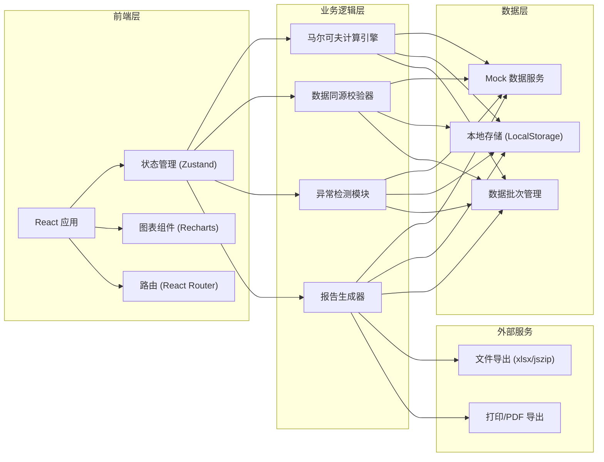
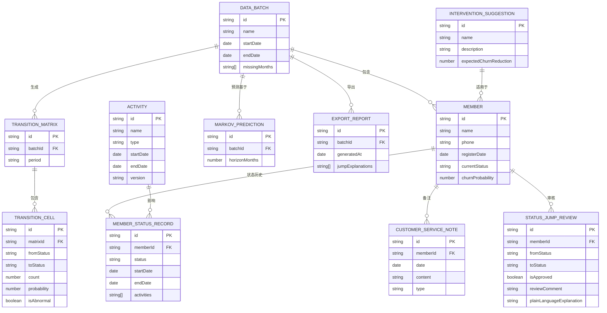

## 1. 架构设计



## 2. 技术描述

- **前端框架**: React@18 + TypeScript@5 + Vite@5
- **样式方案**: TailwindCSS@3 + CSS Variables 主题系统
- **状态管理**: Zustand（轻量级，支持数据批次全局共享）
- **路由**: React Router v6
- **图表库**: Recharts（支持热力图、折线图、面积图）
- **图标**: Lucide React（线性图标，符合设计风格）
- **文件导出**: xlsx + jszip + file-saver
- **动画**: Framer Motion（页面过渡、微交互）
- **后端**: 纯前端 Mock 数据，无后端依赖
- **数据持久化**: LocalStorage 存储审核记录和报告草稿

## 3. 路由定义

| 路由 | 页面 | 功能 |
|------|------|------|
| / | 数据概览页 | 状态分布、流失趋势、异常告警、数据批次选择 |
| /matrix | 转移矩阵页 | 转移热力图、状态跳跃审核、样本缺月处理 |
| /members | 会员明细页 | 会员列表、状态轨迹、行为标签对比、客服备注 |
| /members/:id | 会员详情页 | 单会员全量信息、活动重叠追溯 |
| /predict | 预测干预页 | 马尔可夫预测、高风险会员、干预建议匹配 |
| /report | 报告导出页 | 复盘报告、状态跳跃解释、数据下载 |

## 4. 核心数据结构

### 4.1 TypeScript 类型定义

```typescript
// 会员状态枚举
export enum MemberStatus {
  ACTIVE = 'active',      // 活跃
  AT_RISK = 'at_risk',    // 高危
  SILENT = 'silent',       // 沉默
  CHURNED = 'churned',     // 流失
  NEW = 'new',            // 新会员
  REACTIVATED = 'reactivated' // 回流
}

// 数据批次
export interface DataBatch {
  id: string;
  name: string;
  startDate: string;
  endDate: string;
  createdAt: string;
  missingMonths: string[];      // 样本缺月列表
  memberCount: number;
  isCurrent: boolean;
}

// 转移矩阵单元
export interface TransitionCell {
  fromStatus: MemberStatus;
  toStatus: MemberStatus;
  count: number;
  probability: number;
  isAbnormal: boolean;          // 是否异常跳跃
  abnormalReason?: string;
  memberIds: string[];
}

// 转移矩阵
export interface TransitionMatrix {
  batchId: string;
  period: string;
  cells: TransitionCell[];
  statusOrder: MemberStatus[];
}

// 会员状态记录
export interface MemberStatusRecord {
  id: string;
  memberId: string;
  status: MemberStatus;
  startDate: string;
  endDate: string;
  source: 'auto' | 'manual' | 'customer_service';
  remark?: string;
  activities: string[];         // 参与的活动ID
}

// 会员信息
export interface Member {
  id: string;
  name: string;
  phone: string;
  registerDate: string;
  totalOrders: number;
  totalAmount: number;
  lastActiveDate: string;
  currentStatus: MemberStatus;
  statusHistory: MemberStatusRecord[];
  behaviorTags: string[];
  systemTags: string[];
  tagConflict: boolean;         // 行为标签与系统标签是否冲突
  customerServiceNotes: CustomerServiceNote[];
  churnProbability: number;     // 流失概率
  predictedStatus3m: MemberStatus;
}

// 客服备注
export interface CustomerServiceNote {
  id: string;
  memberId: string;
  date: string;
  operator: string;
  content: string;
  type: 'complaint' | 'consult' | 'feedback' | 'other';
  attachmentUrl?: string;       // 截图附件
  relatedStatus?: MemberStatus; // 关联的状态变更
}

// 活动记录
export interface Activity {
  id: string;
  name: string;
  type: 'promotion' | 'version_update' | 'event' | 'campaign';
  startDate: string;
  endDate: string;
  overlapWith?: string[];       // 重叠的活动ID
  version?: string;             // 版本号（如果是版本更新）
}

// 状态跳跃审核记录
export interface StatusJumpReview {
  id: string;
  memberId: string;
  fromStatus: MemberStatus;
  toStatus: MemberStatus;
  jumpDate: string;
  isApproved: boolean | null;   // null=待审核
  reviewer?: string;
  reviewDate?: string;
  reviewComment?: string;
  evidence: string[];           // 证据ID列表
  plainLanguageExplanation?: string; // 人话解释
}

// 马尔可夫预测结果
export interface MarkovPrediction {
  batchId: string;
  predictionDate: string;
  horizonMonths: number;
  initialDistribution: Record<MemberStatus, number>;
  transitionMatrix: number[][];
  predictions: Array<{
    month: string;
    distribution: Record<MemberStatus, number>;
    confidenceInterval: { lower: number; upper: number };
  }>;
}

// 干预建议
export interface InterventionSuggestion {
  id: string;
  name: string;
  description: string;
  targetStatuses: MemberStatus[];
  expectedChurnReduction: number; // 预计降低流失率
  cost: 'low' | 'medium' | 'high';
  applicableMemberIds: string[];
}

// 导出报告
export interface ExportReport {
  id: string;
  batchId: string;
  generatedAt: string;
  generatedBy: string;
  title: string;
  summary: string;
  sections: ReportSection[];
  jumpExplanations: string[];    // 状态跳跃人话解释列表
}

export interface ReportSection {
  title: string;
  content: string;
  type: 'text' | 'chart' | 'table';
  data?: any;
}
```

### 4.2 Mock 数据设计

- 2000+ 条模拟会员数据，覆盖6个月时间范围
- 预设 5% 的状态跳跃异常样本
- 预设 2 个样本缺月
- 预设 3 个活动重叠期
- 预设 15% 的行为标签与系统标签不一致样本

## 5. 核心算法模块

### 5.1 马尔可夫转移矩阵计算

```typescript
// 1. 统计各状态间的转移次数
// 2. 计算转移概率 P(i->j) = count(i->j) / count(i)
// 3. 处理样本缺月：线性插值补全缺失月份的转移
// 4. 异常检测：跨2个及以上状态的跳转标记为异常
```

### 5.2 状态预测算法

```typescript
// 初始状态向量 V0
// 转移矩阵 P
// 预测 n 个月后的状态: Vn = V0 * P^n
// 置信区间计算：基于历史转移概率的方差
```

### 5.3 数据同源校验

```typescript
// 所有页面读取同一 batchId 的数据
// 图表、明细、下载前校验 batchId 一致性
// 切换批次时清空所有页面缓存
```

### 5.4 人话解释生成

```typescript
// 基于状态跳跃的特征组合生成自然语言解释
// 模板: "这位会员从{from}直接跳到{to}，因为{原因}，建议{建议}"
// 原因来源：行为数据、客服备注、活动记录、版本更新
```

## 6. 数据模型 ER 图


