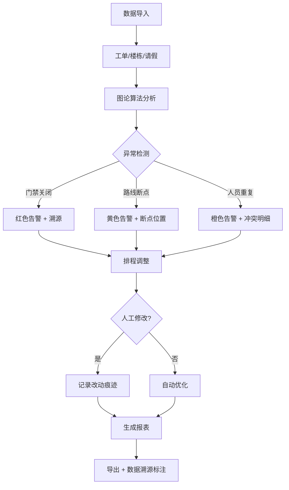

## 1. 产品概述

图论巡检换班器是一款面向物业工程主管的智能巡检排班管理系统，通过图论算法分析巡检路线断点、门禁状态和人员排班冲突，实现巡检工作的透明化、可追溯化管理。

- 解决问题：避免人工复核时口径不一致，确保工单、楼栋、请假三类数据的对应关系清晰可见
- 目标用户：物业工程主管、巡检调度人员
- 核心价值：异常点可追溯、换班影响可视化、复核有据可依

## 2. 核心功能

### 2.1 用户角色

| 角色 | 注册方式 | 核心权限 |
|------|----------|----------|
| 工程主管 | 系统分配 | 完整功能：工单管理、排程调整、报表导出、异常分析 |
| 巡检员 | 系统分配 | 查看个人排班、上报异常、确认工单 |

### 2.2 功能模块

1. **巡检看板**：路线图可视化、异常告警汇总、今日排班概览
2. **工单管理**：工单列表、状态追踪、来源追溯
3. **楼栋巡检图**：GIS楼栋布局、巡检路线绘制、门禁状态标记
4. **排程中心**：人员排班、请假管理、换班约束配置
5. **异常分析**：路线断点检测、门禁关闭告警、人员重复巡检
6. **报表导出**：多维度报表、改动痕迹留存、数据溯源标注

### 2.3 页面详情

| 页面名称 | 模块名称 | 功能描述 |
|----------|----------|----------|
| 巡检看板 | 异常告警面板 | 门禁关闭/路线断点/人员重复三类异常分开展示，红色醒目标记 |
| 巡检看板 | 路线图可视化 | SVG楼栋拓扑图，实时标记巡检进度和断点位置 |
| 巡检看板 | 今日概览 | 待办工单、在岗人员、异常数量统计 |
| 工单管理 | 工单列表 | 支持筛选、排序，每条工单显示来源（系统派单/人工插单） |
| 工单管理 | 工单详情 | 关联楼栋信息、巡检员、时间、处理记录全链路 |
| 楼栋巡检图 | 拓扑图交互 | 点击楼栋显示关联工单、门禁记录、巡检历史 |
| 楼栋巡检图 | 路线分析 | 图论算法计算最优路线，高亮显示断点位置及原因 |
| 排程中心 | 排班日历 | 周视图展示人员排班，支持拖拽调整 |
| 排程中心 | 换班约束 | 可配置约束规则，人工修改时记录改动痕迹 |
| 排程中心 | 请假管理 | 请假申请、审批、自动调班触发逻辑 |
| 异常分析 | 分类详情 | 三类异常分别统计，每条异常可追溯数据来源 |
| 异常分析 | 影响分析 | 显示换班/插单对整体排程的影响范围 |
| 报表导出 | 报表生成 | 工单/排程/异常三类报表，保留数据对应关系 |
| 报表导出 | 改动记录 | 报表中标注人工修改的内容及修改人、时间 |

## 3. 核心流程

1. 数据整合：将工单列表、门禁记录、排班数据统一导入
2. 图论分析：构建楼栋拓扑图，计算巡检路线连通性
3. 异常检测：分类识别三类异常，分别标记和溯源
4. 排程调整：支持人工修改，记录所有改动痕迹
5. 报表导出：保留数据对应关系，便于后续复核

## 4. 用户界面设计

### 4.1 设计风格

- **主色调**：深蓝 (#1e3a5f) - 专业、稳重
- **告警色**：
  - 门禁关闭：深红 (#dc2626) - 最高优先级
  - 路线断点：深橙 (#ea580c) - 中高优先级
  - 人员重复：深黄 (#ca8a04) - 中优先级
- **成功色**：墨绿 (#166534) - 正常状态
- **按钮风格**：直角矩形、细线边框、hover时轻微上浮
- **字体**：思源黑体 (Source Han Sans) - 清晰易读
- **布局风格**：卡片式模块化布局，左侧导航 + 主内容区
- **图标风格**：线性简约图标，告警使用实心图标增强视觉冲击

### 4.2 页面设计概述

| 页面名称 | 模块名称 | UI 元素 |
|----------|----------|---------|
| 巡检看板 | 异常告警面板 | 三色卡片分列、数字加粗、闪烁动画提示、点击展开详情 |
| 巡检看板 | 路线拓扑图 | SVG交互图、节点hover高亮、断点红色虚线连接 |
| 工单管理 | 工单列表 | 斑马纹表格、来源标签（系统/人工）、状态色标 |
| 楼栋巡检图 | 拓扑图 | 节点大小表示重要性、连线粗细表示巡检频次 |
| 排程中心 | 排班日历 | 色块区分人员、拖拽调整时半透明预览、修改后虚线标记 |
| 报表导出 | 报表预览 | 数据分组展示、改动处下划线标记、溯源脚注 |

### 4.3 响应式

- Desktop-first 设计，主内容区最小宽度 1200px
- 侧边栏可折叠，适配不同屏幕尺寸
- 表格区域支持横向滚动
- 移动端简化为列表视图，保留核心告警信息

### 4.4 动画交互

- 异常告警数字脉冲动画（每2秒一次）
- 拓扑图节点悬停放大效果
- 排班拖拽时的幽灵预览
- 页面切换时的淡入过渡
- 数据更新时的高亮闪烁
