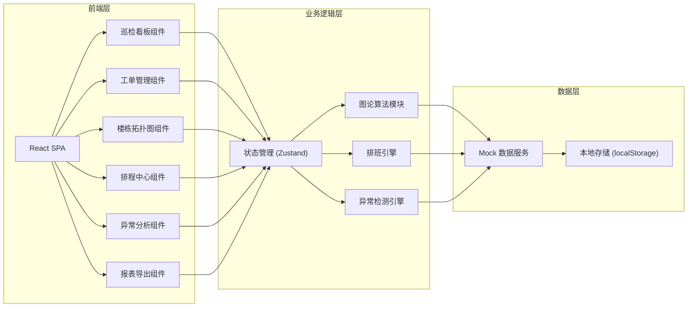
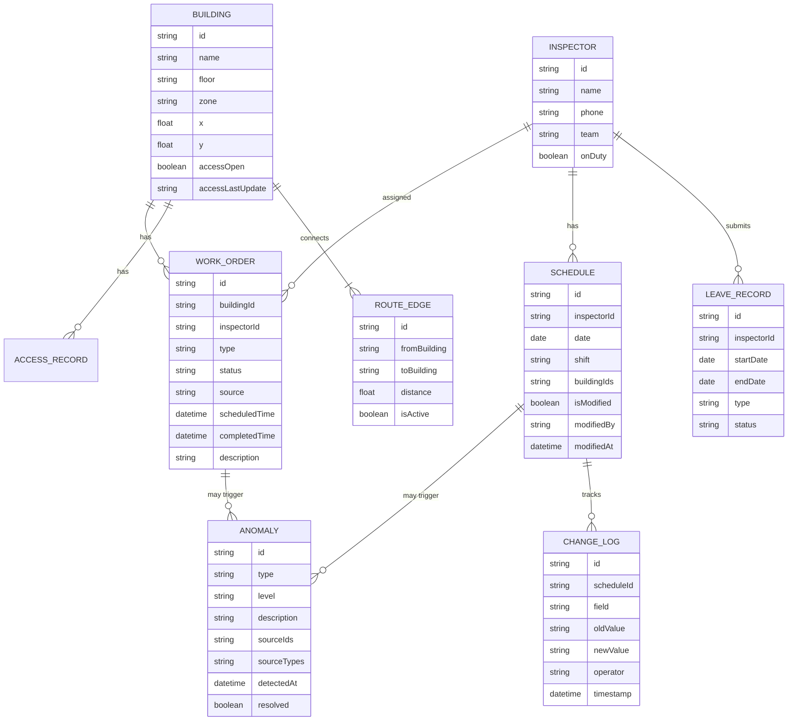

## 1. 架构设计



## 2. 技术描述

- **前端框架**: React@18 + TypeScript
- **构建工具**: Vite@5
- **样式方案**: TailwindCSS@3
- **状态管理**: Zustand@4 (轻量级，适合中小型应用)
- **图论算法**: 自定义实现 + D3.js 可视化
- **路由**: React Router@6
- **图表/可视化**: D3.js@7 (拓扑图) + Recharts@2 (统计图表)
- **日期处理**: date-fns@2
- **导出功能**: xlsx (Excel导出) + jsPDF (PDF导出)
- **后端**: 无后端，使用 Mock 数据 + localStorage 持久化

## 3. 路由定义

| 路由 | 页面 | 主要功能 |
|------|------|----------|
| / | 巡检看板 | 异常汇总、拓扑图预览、今日概览 |
| /work-orders | 工单管理 | 工单列表、筛选、详情查看 |
| /building-map | 楼栋巡检图 | 拓扑图交互、路线分析、门禁状态 |
| /schedule | 排程中心 | 排班日历、请假管理、约束配置 |
| /anomalies | 异常分析 | 三类异常详情、影响分析、溯源 |
| /reports | 报表导出 | 报表生成、预览、导出、改动记录 |

## 4. 数据模型

### 4.1 数据模型定义



### 4.2 Mock 数据结构示例

```typescript
// 楼栋数据
interface Building {
  id: string;
  name: string;
  floor: string;
  zone: 'A' | 'B' | 'C' | 'D';
  x: number;
  y: number;
  accessOpen: boolean;
  accessLastUpdate: string;
}

// 工单数据
interface WorkOrder {
  id: string;
  buildingId: string;
  inspectorId: string;
  type: 'routine' | 'repair' | 'inspection';
  status: 'pending' | 'in_progress' | 'completed' | 'cancelled';
  source: 'system' | 'manual';
  scheduledTime: string;
  completedTime?: string;
  description: string;
}

// 异常数据
interface Anomaly {
  id: string;
  type: 'access_closed' | 'route_break' | 'duplicate_inspection';
  level: 'high' | 'medium' | 'low';
  description: string;
  sourceIds: string[];
  sourceTypes: string[];
  detectedAt: string;
  resolved: boolean;
}
```

## 5. 核心模块设计

### 5.1 图论算法模块

```typescript
// 图论核心算法
interface RouteGraph {
  nodes: Building[];
  edges: RouteEdge[];
}

class RouteAnalyzer {
  // 检测路线断点
  detectBreakpoints(graph: RouteGraph): Breakpoint[];
  
  // 计算最优巡检路线
  findOptimalRoute(startId: string, buildings: string[]): string[];
  
  // 计算楼栋连通性
  checkConnectivity(buildingIds: string[]): boolean;
  
  // 检测重复巡检区域
  detectDuplicateCoverage(schedules: Schedule[]): DuplicateInfo[];
}
```

### 5.2 异常检测引擎

```typescript
class AnomalyDetector {
  // 门禁关闭检测
  detectAccessClosed(buildings: Building[]): Anomaly[];
  
  // 路线断点检测
  detectRouteBreaks(graph: RouteGraph): Anomaly[];
  
  // 人员重复检测
  detectDuplicateInspection(schedules: Schedule[]): Anomaly[];
  
  // 综合检测
  detectAll(context: DetectionContext): Anomaly[];
}
```

### 5.3 改动追踪系统

```typescript
class ChangeTracker {
  // 记录修改
  logChange(entityType: string, entityId: string, field: string, oldValue: any, newValue: any, operator: string): void;
  
  // 获取实体修改历史
  getChangeHistory(entityType: string, entityId: string): ChangeLog[];
  
  // 报表导出时标注改动
  annotateReportWithChanges(reportData: any): any;
}
```

## 6. 关键技术实现要点

1. **拓扑图可视化**: 使用 D3.js force-directed graph 或自定义 SVG 布局
2. **拖拽排班**: 使用 react-dnd 实现排班日历的拖拽调整
3. **数据溯源**: 每条数据记录 sourceIds 和 sourceTypes，支持点击追溯
4. **改动痕迹**: 所有人工修改通过 ChangeLog 记录，报表中用样式标记
5. **本地持久化**: 使用 localStorage 存储用户配置和修改记录
6. **响应式布局**: TailwindCSS 响应式断点，左侧导航可折叠
