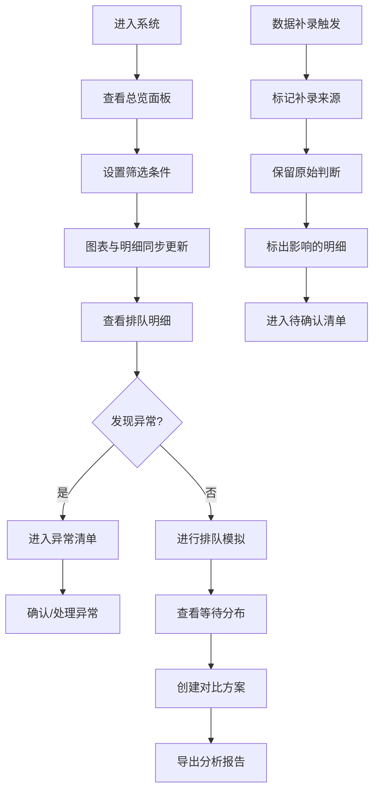

## 1. 产品概述

政务大厅"随机过程排队窗口"系统，解决日常排队业务中的口径不一致、数据补录覆盖、异常识别遗漏等核心问题。系统面向政务大厅管理员，提供排队模拟、等待分布分析、方案对比、异常追踪等核心功能。

- **核心问题**：预约爽约、服务时长异常、窗口临停等异常情况识别不及时；筛选条件变化时图表与明细不同步；数据补录覆盖原有判断
- **目标价值**：建立统一数据口径，确保分析一致性；保护原始判断不被补录覆盖；异常情况显性化管理

## 2. 核心特性

### 2.1 用户角色
| 角色 | 登录方式 | 核心权限 |
|------|----------|----------|
| 大厅管理员 | 账号密码 | 完整功能权限，包括数据查看、筛选分析、模拟对比、异常处理 |
| 窗口操作员 | 账号密码 | 仅查看本窗口排队数据，无法进行模拟和方案对比 |

### 2.2 功能模块
1. **总览面板**：实时排队概况、关键指标、异常预警
2. **排队明细**：到访记录、办理记录、数据补录追踪
3. **排队模拟**：基于历史数据的排队过程模拟
4. **等待分布**：等待时长分布分析图表
5. **方案对比**：多方案参数对比分析
6. **异常清单**：待确认、异常、已处理三类清单

### 2.3 页面详情
| 页面名称 | 模块名称 | 功能描述 |
|----------|----------|----------|
| 总览面板 | 实时概览 | 展示当前排队人数、平均等待时长、窗口利用率等核心指标 |
| 总览面板 | 异常预警 | 实时展示爽约、时长异常、窗口临停等预警信息 |
| 排队明细 | 筛选器 | 多维度筛选（时间、窗口、业务类型），筛选变化时全页面同步 |
| 排队明细 | 到访记录 | 展示到访时间、预约状态、补录标记，保留原始判断 |
| 排队明细 | 办理记录 | 展示办理时长、窗口信息、异常标记，支持补录追踪 |
| 排队明细 | 补录影响 | 标记预约号补录影响的所有相关明细 |
| 排队模拟 | 模拟参数 | 设置到达率、服务时长、窗口数量等参数 |
| 排队模拟 | 过程回放 | 动画展示排队过程，支持暂停/加速 |
| 等待分布 | 分布图表 | 等待时长概率分布图、累积分布图 |
| 等待分布 | 统计指标 | 均值、中位数、分位数、超时概率 |
| 方案对比 | 参数配置 | 最多支持4个方案同时对比 |
| 方案对比 | 差异分析 | 自动标注方案间的关键指标差异 |
| 异常清单 | 待确认 | 需要人工确认的异常记录 |
| 异常清单 | 异常 | 已确认的异常记录，不可混入正常明细 |
| 异常清单 | 已处理 | 已完成处理的历史异常 |

## 3. 核心流程

## 4. 用户界面设计

### 4.1 设计风格
- **主色调**：政务蓝 (#165DFF) 作为主色，搭配深灰 (#1D2129) 作为中性色
- **辅助色**：警示红 (#F53F3F) 用于异常，警告橙 (#FF7D00) 用于待确认，成功绿 (#00B42A) 用于正常
- **按钮风格**：扁平化设计，圆角 6px，点击反馈明显
- **字体**：标题使用 "Noto Serif SC" 彰显正式感，正文使用 "Noto Sans SC" 保证可读性
- **布局风格**：三栏布局（左侧导航 + 中间主内容 + 右侧详情/筛选），卡片式模块划分
- **图标风格**：线性图标，统一 16px/20px 规格，颜色与功能语义对应

### 4.2 页面设计概述
| 页面名称 | 模块名称 | UI 元素 |
|----------|----------|---------|
| 总览面板 | 实时概览 | 数据卡片网格、微趋势图、状态指示器、渐变背景 |
| 总览面板 | 异常预警 | 横向滚动通知条、闪烁红点、优先级标签 |
| 排队明细 | 筛选器 | 下拉选择器、日期范围、快捷筛选标签、重置按钮 |
| 排队明细 | 数据表格 | 固定表头、斑马纹、行高亮、补录标记角标、异常行背景色 |
| 排队模拟 | 模拟控制面板 | 滑块控件、数字输入、播放控制条、进度指示 |
| 排队模拟 | 可视化区域 | SVG 排队动画、窗口状态灯、人数计数器 |
| 等待分布 | 图表区域 | ECharts 直方图、箱线图、可交互数据提示 |
| 方案对比 | 对比面板 | 多列卡片布局、差异高亮箭头、推荐标记 |
| 异常清单 | 分类标签 | Tab 切换、计数角标、筛选搜索、批量操作 |

### 4.3 响应式
- **桌面优先**：最小支持 1366px 宽度，最优 1920px
- **平板适配**：右侧面板可收起，表格支持横向滚动
- **触控优化**：按钮最小 44px 触控区域，滑动手势支持

### 4.4 动效设计
- 页面加载：卡片依次淡入，间隔 80ms
- 筛选变化：图表数据平滑过渡 600ms
- 异常预警：呼吸灯效果，周期 2s
- 补录标记：脉冲动画提示受影响行
- 排队模拟：平滑的位置过渡动画
