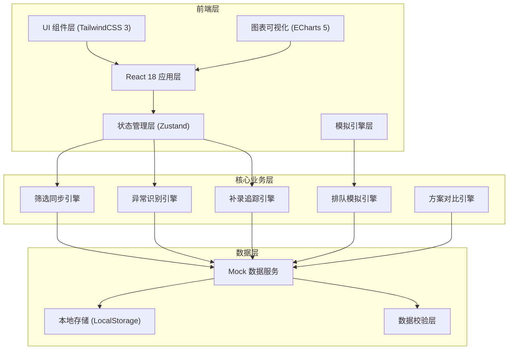
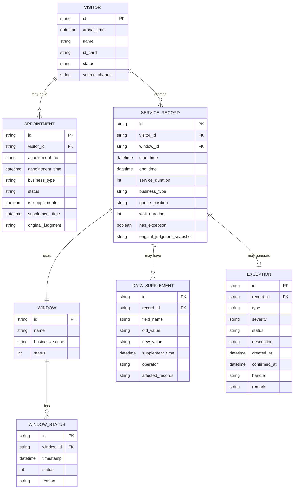

## 1. 架构设计



## 2. 技术描述

- **前端框架**：React@18.2.0 + TypeScript@5.0
- **构建工具**：Vite@5.0
- **样式方案**：TailwindCSS@3.4 + PostCSS
- **状态管理**：Zustand@4.5（轻量级，支持订阅选择器，避免不必要重渲染）
- **图表库**：ECharts@5.5（支持直方图、箱线图、动态数据更新）
- **图标库**：Lucide React（线性图标，与设计风格一致）
- **路由**：React Router DOM@6.22
- **日期处理**：date-fns@3.3
- **数据持久化**：LocalStorage（存储用户筛选偏好和方案配置）
- **Mock 数据**：MSW@2.2（浏览器端 Mock，模拟真实接口延迟）

## 3. 路由定义

| 路由 | 页面用途 | 权限要求 |
|------|----------|----------|
| `/dashboard` | 总览面板 - 实时概览和异常预警 | 管理员/操作员 |
| `/queue-detail` | 排队明细 - 到访/办理记录、补录追踪 | 管理员/操作员 |
| `/simulation` | 排队模拟 - 参数配置和过程回放 | 仅管理员 |
| `/distribution` | 等待分布 - 统计分析图表 | 仅管理员 |
| `/comparison` | 方案对比 - 多方案参数对比 | 仅管理员 |
| `/exceptions` | 异常清单 - 待确认/异常/已处理 | 管理员/操作员 |

## 4. 数据模型

### 4.1 核心实体关系



### 4.2 状态管理 Store 设计

```typescript
// 筛选器状态
interface FilterState {
  dateRange: [Date, Date];
  windowIds: string[];
  businessTypes: string[];
  status: string[];
  keyword: string;
}

// 核心数据状态
interface QueueState {
  visitors: Visitor[];
  serviceRecords: ServiceRecord[];
  appointments: Appointment[];
  windows: Window[];
  exceptions: Exception[];
  supplements: DataSupplement[];
}

// 筛选同步机制
interface FilterSyncEngine {
  subscribe(callback: (filtered: QueueState) => void): () => void;
  getFilteredData(): QueueState;
  updateFilter(newFilter: Partial<FilterState>): void;
}

// 异常类型定义
type ExceptionType = 'missed_appointment' | 'abnormal_duration' | 'window_pause';
type ExceptionStatus = 'pending' | 'confirmed' | 'resolved';

// 模拟配置
interface SimulationConfig {
  arrivalRate: number;      // 每分钟到达人数
  avgServiceTime: number;   // 平均服务时长(分钟)
  serviceTimeStd: number;   // 服务时长标准差
  windowCount: number;      // 窗口数量
  simulationDuration: number; // 模拟时长(分钟)
  noShowRate: number;       // 爽约率
}

// 对比方案
interface ComparisonPlan {
  id: string;
  name: string;
  config: SimulationConfig;
  result: SimulationResult;
}

interface SimulationResult {
  avgWaitTime: number;
  maxWaitTime: number;
  avgQueueLength: number;
  maxQueueLength: number;
  windowUtilization: number;
  timeoutRate: number;
  waitDistribution: number[];
}
```

### 4.3 关键常量定义

```typescript
// 服务时长异常判定阈值
const ABNORMAL_DURATION_THRESHOLD = {
  MIN: 1,      // 小于1分钟为异常短
  MAX: 60,     // 大于60分钟为异常长
  STD_MULTIPLE: 3, // 超过3倍标准差判定为异常
};

// 爽约判定规则
const NO_SHOW_THRESHOLD = {
  GRACE_PERIOD: 15, // 预约时间后15分钟未到算爽约
};

// 数据补录追踪字段
const SUPPLEMENT_TRACKED_FIELDS = [
  'appointment_no',
  'service_duration',
  'end_time',
  'window_id',
] as const;
```

### 4.4 核心引擎接口

```typescript
// 筛选同步引擎
interface IFilterSyncEngine {
  getFilteredRecords(): ServiceRecord[];
  onFilterChange(callback: () => void): Unsubscribe;
}

// 异常识别引擎
interface IExceptionEngine {
  detectMissedAppointment(record: ServiceRecord): Exception | null;
  detectAbnormalDuration(record: ServiceRecord): Exception | null;
  detectWindowPause(window: Window): Exception | null;
  processAllExceptions(): Exception[];
}

// 补录追踪引擎
interface ISupplementEngine {
  recordSupplement(
    recordId: string,
    field: string,
    oldValue: any,
    newValue: any,
    operator: string
  ): DataSupplement;
  getAffectedRecords(supplementId: string): string[];
  preserveOriginalJudgment(recordId: string): void;
}

// 排队模拟引擎
interface ISimulationEngine {
  run(config: SimulationConfig): SimulationResult;
  getTimeline(): SimulationEvent[];
  reset(): void;
}

// 方案对比引擎
interface IComparisonEngine {
  addPlan(plan: ComparisonPlan): void;
  removePlan(planId: string): void;
  compare(): ComparisonResult;
  getRecommendation(): ComparisonPlan | null;
}
```

## 5. 目录结构

```
src/
├── assets/              # 静态资源
│   └── styles/         # 全局样式
├── components/         # 可复用组件
│   ├── layout/        # 布局组件
│   ├── ui/            # 基础UI组件
│   ├── charts/        # 图表组件
│   └── features/      # 业务组件
├── pages/             # 页面组件
│   ├── Dashboard/
│   ├── QueueDetail/
│   ├── Simulation/
│   ├── Distribution/
│   ├── Comparison/
│   └── Exceptions/
├── store/             # 状态管理
│   ├── useFilterStore.ts
│   ├── useQueueStore.ts
│   ├── useSimulationStore.ts
│   └── useComparisonStore.ts
├── engines/           # 核心业务引擎
│   ├── FilterSyncEngine.ts
│   ├── ExceptionEngine.ts
│   ├── SupplementEngine.ts
│   ├── SimulationEngine.ts
│   └── ComparisonEngine.ts
├── types/             # TypeScript 类型定义
├── utils/             # 工具函数
├── mock/              # Mock 数据和服务
└── routes/            # 路由配置
```
