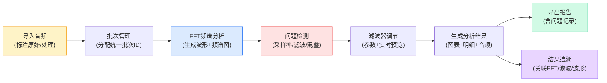

## 1. 产品概述

傅里叶噪声拆解是面向音乐科技助教的音频分析工具，用于处理学生录音中的电流声和环境噪声问题，通过频域滤波前后的可视化对比，帮助助教准确评估降噪效果。

- **核心价值**：将音频片段、频谱参数、听感备注统一管理，确保图表、明细和下载文件来自同一批数据，实现分析结果的可追溯性
- **目标用户**：音乐科技助教、音频处理教师、声学研究人员
- **解决痛点**：多来源材料管理混乱、问题分析无记录、滤波效果无法对比追溯

## 2. 核心功能

### 2.1 功能模块

1. **分析工作台**：音频上传、原始/处理结果分类管理、批次数据统一
2. **频谱分析面板**：FFT频谱图、波形图、滤波前后对比视图
3. **滤波器控制**：频域滤波参数调节、实时预览、滤波频段标注
4. **问题检测模块**：采样率错误检测、过度滤波预警、频段混叠识别
5. **报告导出系统**：含问题明细的完整分析报告、音频文件导出
6. **结果追溯面板**：从结果记录跳转至FFT分析、滤波预览、波形对比
7. **使用说明**：音频准备指南、问题复现方法、导出文件解读

### 2.2 页面详情

| 页面名称 | 模块名称 | 功能描述 |
|----------|----------|----------|
| 分析工作台 | 音频导入区 | 支持拖拽上传、多文件导入、自动识别原始/处理标记 |
| 分析工作台 | 批次管理器 | 统一批次ID、关联图表/明细/下载文件、来源备注记录 |
| 频谱分析面板 | FFT频谱图 | 实时傅里叶变换、频率轴对数/线性切换、峰值标注 |
| 频谱分析面板 | 波形对比区 | 上下双栏对比原始与滤波后波形、时间轴同步缩放 |
| 频谱分析面板 | 参数明细卡 | 采样率、位深、FFT尺寸、窗函数类型等关键参数 |
| 滤波器控制 | 频段选择器 | 拖拽选择滤波频段、低通/高通/带通/陷波模式 |
| 滤波器控制 | 滤波预览 | 实时试听滤波效果、A/B对比切换 |
| 问题检测模块 | 异常识别器 | 采样率不匹配、过度滤波平坦区、频段混叠自动检测 |
| 报告导出系统 | 报告生成器 | 含问题清单、参数记录、频谱图的PDF/JSON报告 |
| 结果追溯面板 | 历史记录列表 | 按批次展示分析结果、一键跳转各分析视图 |
| 使用说明 | 快速指南 | 音频准备、采样率错复现、导出文件解读 |

## 3. 核心流程

**主要用户流程**：
1. 助教上传学生录音，标记为"原始材料"，填写来源和听感备注
2. 系统自动分配批次ID，执行FFT分析并检测采样率等问题
3. 助教调节滤波参数，实时预览效果，对比波形变化
4. 确认处理结果后，系统将原始音频、滤波参数、频谱图、问题记录统一关联
5. 导出包含所有明细的分析报告和处理后音频
6. 后续可通过追溯面板从任意结果跳转到对应的分析视图

## 4. 用户界面设计

### 4.1 设计风格
- **设计方向**：科技精密仪器风格，深色主题配光谱渐变
- **主色调**：深灰蓝 `#0f172a`，光谱渐变 `#06b6d4 → #8b5cf6 → #ec4899`
- **辅助色**：警告橙 `#f59e0b`，错误红 `#ef4444`，成功绿 `#10b981`
- **字体**：显示字体 `Space Grotesk`（精密科技感），正文 `JetBrains Mono`（数据可读性）
- **视觉元素**：网格背景、频谱色彩映射、细边卡片、发光数据点
- **按钮风格**：极简描边按钮，悬停时光谱渐变填充，微秒级过渡动画

### 4.2 页面设计概要

| 页面名称 | 模块名称 | UI元素 |
|----------|----------|--------|
| 分析工作台 | 整体布局 | 三栏布局：左侧批次列表 + 中间频谱区 + 右侧参数面板 |
| 频谱分析面板 | FFT频谱图 | Canvas绘制，频谱色阶映射，悬停显示频率/幅值，网格参考线 |
| 频谱分析面板 | 波形对比 | 上下同步滚动，时间标尺，选区放大，差异高亮 |
| 滤波器控制 | 频段选择 | 拖拽式手柄，频段半透明覆盖，参数实时显示 |
| 问题检测模块 | 异常卡片 | 彩色边框标识问题等级，展开查看详细说明和复现方法 |
| 结果追溯面板 | 时间线 | 垂直时间线记录分析历史，点击展开关联视图链接 |
| 使用说明 | 卡片式指南 | 三步快速上手，每步含示意图和操作要点 |

### 4.3 响应式
- **桌面优先**：1440px+ 完整三栏布局，精细控制
- **平板适配**：1024px 两栏布局，参数面板改为底部抽屉
- **移动优化**：768px 单栏滚动，触控优化的滑块和按钮

