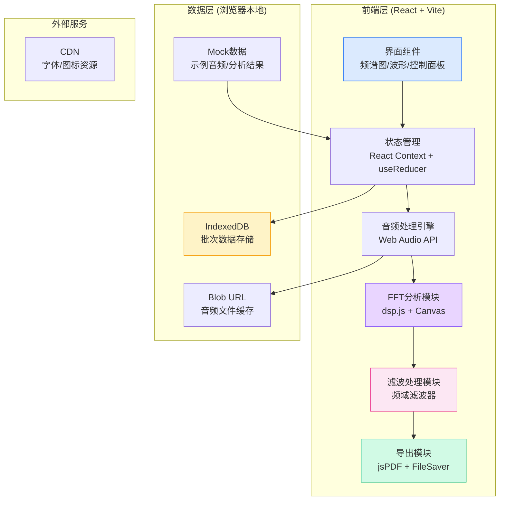
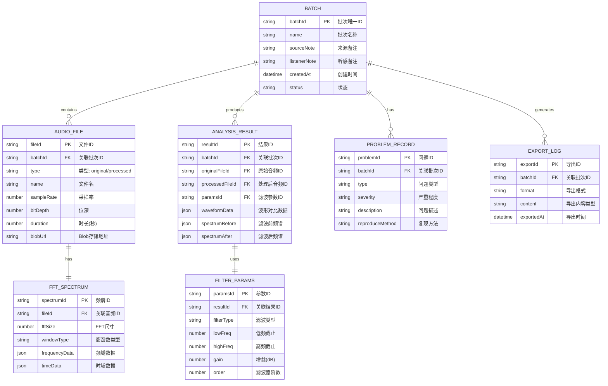

## 1. 架构设计



## 2. 技术描述

- **前端框架**：React@18 + TypeScript + Vite@5
- **样式方案**：TailwindCSS@3 + CSS变量（主题系统）
- **音频处理**：Web Audio API + dsp.js（FFT/滤波算法）
- **可视化**：Canvas API（频谱图/波形绘制）
- **数据存储**：IndexedDB（本地持久化）+ React Context（状态管理）
- **文件导出**：jsPDF（PDF报告）+ FileSaver.js（文件下载）
- **图标**：Lucide React
- **后端**：无（纯前端应用，所有处理在浏览器端完成）
- **数据库**：无（使用IndexedDB本地存储）

## 3. 路由定义

| 路由 | 页面/组件 | 功能说明 |
|------|----------|----------|
| `/` | 分析工作台 | 主应用界面，包含所有功能模块 |
| `/guide` | 使用说明 | 快速指南、问题复现方法 |

**说明**：采用单页应用架构，主要功能通过Tab和面板切换实现，不使用多页面路由。

## 4. 数据模型

### 4.1 数据模型定义



### 4.2 TypeScript 类型定义

```typescript
// 批次信息
interface Batch {
  batchId: string;
  name: string;
  sourceNote: string;
  listenerNote: string;
  createdAt: number;
  status: 'pending' | 'analyzing' | 'completed' | 'has_issues';
}

// 音频文件
interface AudioFile {
  fileId: string;
  batchId: string;
  type: 'original' | 'processed';
  name: string;
  sampleRate: number;
  bitDepth: number;
  duration: number;
  blobUrl: string;
  channelData: Float32Array[];
}

// FFT频谱数据
interface FFTSpectrum {
  spectrumId: string;
  fileId: string;
  fftSize: number;
  windowType: 'hann' | 'hamming' | 'blackman';
  frequencyData: Float32Array;
  timeData: Float32Array;
  binFrequencies: number[];
}

// 滤波参数
interface FilterParams {
  paramsId: string;
  resultId: string;
  filterType: 'lowpass' | 'highpass' | 'bandpass' | 'notch';
  lowFreq: number;
  highFreq: number;
  gain: number;
  order: number;
}

// 分析结果
interface AnalysisResult {
  resultId: string;
  batchId: string;
  originalFileId: string;
  processedFileId: string;
  paramsId: string;
  spectrumBefore: FFTSpectrum;
  spectrumAfter: FFTSpectrum;
  waveformDiff: number[];
  createdAt: number;
}

// 问题记录
interface ProblemRecord {
  problemId: string;
  batchId: string;
  type: 'sample_rate_mismatch' | 'over_filtering' | 'frequency_aliasing' | 'high_noise_floor';
  severity: 'info' | 'warning' | 'error';
  description: string;
  reproduceMethod: string;
  detectedAt: number;
}

// 导出记录
interface ExportLog {
  exportId: string;
  batchId: string;
  format: 'pdf' | 'json' | 'wav';
  content: 'report' | 'audio' | 'full';
  exportedAt: number;
}

// 应用状态
interface AppState {
  batches: Batch[];
  activeBatchId: string | null;
  audioFiles: Record<string, AudioFile>;
  analysisResults: Record<string, AnalysisResult>;
  problems: Record<string, ProblemRecord[]>;
  exportLogs: ExportLog[];
}
```

## 5. 核心模块结构

```
src/
├── components/
│   ├── workspace/          # 工作台主布局
│   ├── audio/              # 音频上传/播放组件
│   ├── spectrum/           # FFT频谱图组件
│   ├── waveform/           # 波形对比组件
│   ├── filter/             # 滤波器控制组件
│   ├── problems/           # 问题检测组件
│   ├── export/             # 报告导出组件
│   ├── trace/              # 结果追溯组件
│   └── guide/              # 使用说明组件
├── hooks/
│   ├── useAudioContext.ts  # Web Audio API封装
│   ├── useFFT.ts           # FFT分析Hook
│   ├── useFilter.ts        # 滤波处理Hook
│   └── useBatchStore.ts    # 批次数据管理
├── utils/
│   ├── dsp/                # 数字信号处理算法
│   ├── fft.ts              # FFT实现
│   ├── filters.ts          # 滤波器实现
│   ├── problemDetector.ts  # 问题检测逻辑
│   ├── exporter.ts         # 导出工具
│   └── indexedDB.ts        # 本地存储封装
├── types/
│   └── index.ts            # 类型定义
├── store/
│   └── AppContext.tsx      # 全局状态
├── mock/
│   └── sampleData.ts       # Mock示例数据
├── App.tsx
├── main.tsx
└── index.css
```

