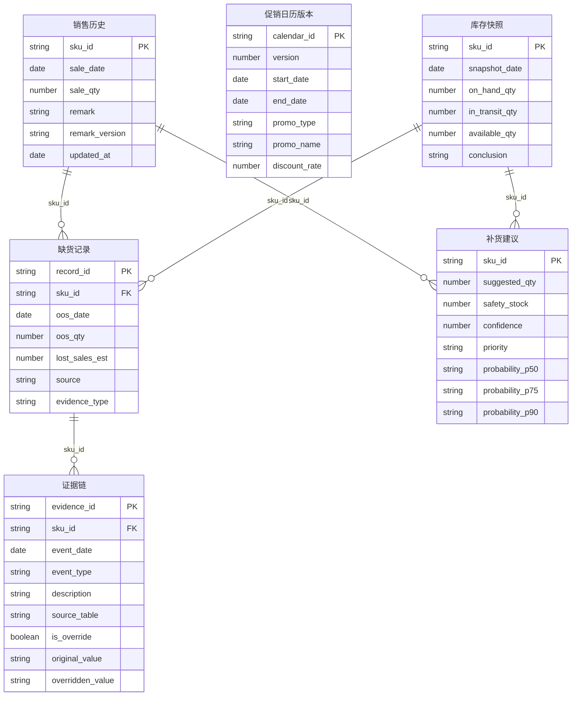

## 1. 架构设计

```mermaid
flowchart TB
    subgraph "前端层"
        A["React SPA 应用"]
        A1["数据导入台"]
        A2["概览分析台"]
        A3["详情溯源台"]
    end
    subgraph "数据处理层"
        B["CSV/Excel 解析引擎"]
        B1["版本差异对比器"]
        B2["口径冲突检测器"]
        B3["一致性校验器"]
    end
    subgraph "分析计算层"
        C["概率预测引擎"]
        C1["安全库存计算器"]
        C2["补货建议生成器"]
        C3["证据链聚合器"]
    end
    subgraph "数据层"
        D["内存数据仓库"]
        D1["销售历史表"]
        D2["促销日历版本表"]
        D3["库存快照表"]
        D4["缺货记录表"]
        D5["证据链表"]
    end
    A1 --> B
    B --> B1
    B --> B2
    B1 --> D
    B2 --> D
    A2 --> C
    C --> C1
    C --> C2
    C2 --> C3
    C3 --> D5
    A3 --> C3
    A3 --> B3
    B3 --> "导出文件"
```

## 2. 技术说明

- 前端：React@18 + TailwindCSS@3 + Vite
- 初始化工具：Vite init
- 后端：无（纯前端应用，所有数据处理在浏览器端完成）
- 数据库：无（使用内存数据仓库 + localStorage 持久化，内置样例数据集）
- 图表库：Recharts（概率预测曲线、安全库存水位图）、自定义 Canvas 绘制（热力图）
- 数据解析：Papaparse（CSV）、SheetJS/xlsx（Excel）
- 路由：React Router v6
- 状态管理：Zustand

## 3. 路由定义

| 路由 | 用途 |
|------|------|
| / | 重定向至 /import |
| /import | 数据导入台：上传数据源、检测版本差异和口径冲突 |
| /overview | 概览分析台：概率分布图、安全库存水位、补货建议表 |
| /detail/:skuId | 详情溯源台：单品概率预测、安全库存计算、证据链时间线 |

## 4. 数据模型

### 4.1 数据模型定义



### 4.2 数据定义

```sql
-- 销售历史
CREATE TABLE sales_history (
    sku_id        TEXT NOT NULL,
    sale_date     DATE NOT NULL,
    sale_qty      REAL NOT NULL,
    remark        TEXT,
    remark_version TEXT DEFAULT 'v1',
    updated_at    DATETIME DEFAULT CURRENT_TIMESTAMP,
    PRIMARY KEY (sku_id, sale_date)
);

-- 促销日历版本
CREATE TABLE promo_calendar (
    calendar_id  TEXT PRIMARY KEY,
    version      INTEGER NOT NULL,
    start_date   DATE NOT NULL,
    end_date     DATE NOT NULL,
    promo_type   TEXT NOT NULL,
    promo_name   TEXT NOT NULL,
    discount_rate REAL
);

-- 库存快照
CREATE TABLE inventory_snapshot (
    sku_id         TEXT NOT NULL,
    snapshot_date  DATE NOT NULL,
    on_hand_qty    REAL NOT NULL,
    in_transit_qty REAL DEFAULT 0,
    available_qty  REAL NOT NULL,
    conclusion     TEXT,
    PRIMARY KEY (sku_id, snapshot_date)
);

-- 缺货记录
CREATE TABLE out_of_stock (
    record_id      TEXT PRIMARY KEY,
    sku_id         TEXT NOT NULL,
    oos_date       DATE NOT NULL,
    oos_qty        REAL,
    lost_sales_est REAL,
    source         TEXT,
    evidence_type  TEXT DEFAULT 'shortage'
);

-- 补货建议
CREATE TABLE replenishment_suggestion (
    sku_id         TEXT PRIMARY KEY,
    suggested_qty  REAL NOT NULL,
    safety_stock   REAL NOT NULL,
    confidence     REAL NOT NULL,
    priority       TEXT NOT NULL,
    probability_p50 REAL,
    probability_p75 REAL,
    probability_p90 REAL
);

-- 证据链
CREATE TABLE evidence_chain (
    evidence_id     TEXT PRIMARY KEY,
    sku_id          TEXT NOT NULL,
    event_date      DATE NOT NULL,
    event_type      TEXT NOT NULL,
    description     TEXT,
    source_table    TEXT,
    is_override     BOOLEAN DEFAULT FALSE,
    original_value  TEXT,
    overridden_value TEXT
);
```
