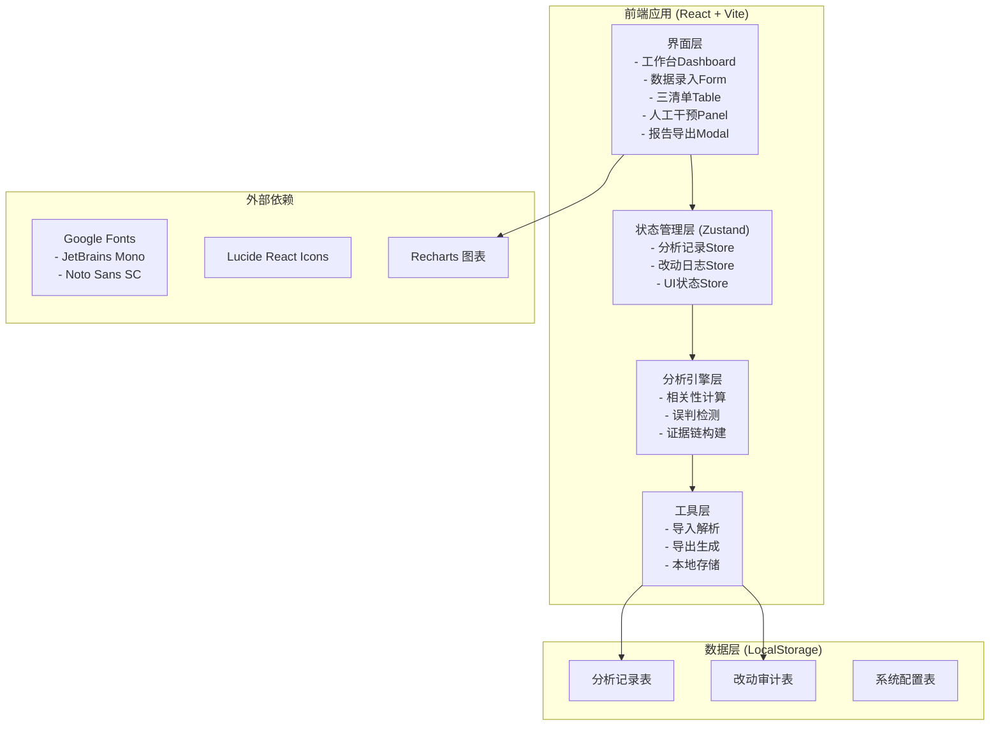
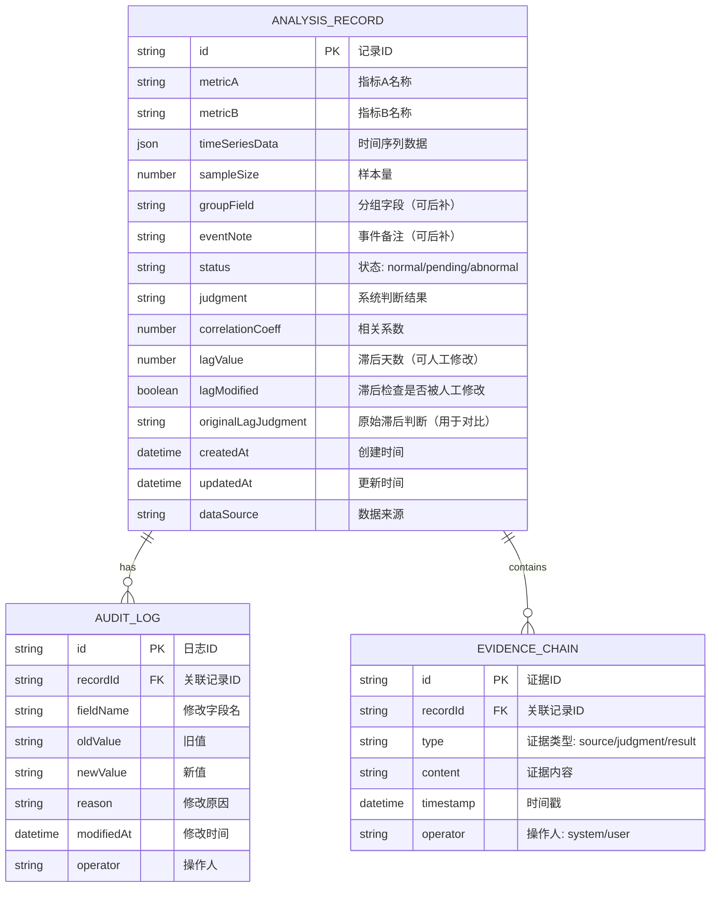

## 1. 架构设计



## 2. 技术描述

- **前端框架**：React@18 + TypeScript
- **构建工具**：Vite@5
- **样式方案**：TailwindCSS@3 + CSS Variables
- **状态管理**：Zustand（轻量级，适合本地工具）
- **图表库**：Recharts（展示相关性散点图和时间序列）
- **图标库**：Lucide React
- **数据持久化**：LocalStorage + 版本管理
- **导出格式**：CSV + JSON + Markdown

## 3. 路由定义

| 路由 | 页面名称 | 主要用途 |
|------|----------|----------|
| `/` | 工作台 | 数据概览、快捷操作入口 |
| `/data-entry` | 数据录入 | 指标录入、分组补录、备注补录 |
| `/analysis` | 分析结果 | 三清单展示、证据链查看 |
| `/intervention` | 人工干预 | 滞后检查修改、改动追溯 |
| `/export` | 报告导出 | 导出配置、预览、下载 |

## 4. 数据模型

### 4.1 数据模型定义



### 4.2 核心类型定义

```typescript
type RecordStatus = 'normal' | 'pending' | 'abnormal';
type PendingReason = 'lag_relation' | 'common_trend' | 'third_variable';
type AbnormalReason = 'too_few_samples' | 'missing_data' | 'outlier_dominance' | 'calculation_error';

interface TimeSeriesPoint {
  date: string;
  valueA: number;
  valueB: number;
}

interface EvidenceItem {
  id: string;
  type: 'source' | 'judgment' | 'result';
  content: string;
  timestamp: string;
  operator: 'system' | 'user';
}

interface AnalysisRecord {
  id: string;
  metricA: string;
  metricB: string;
  timeSeriesData: TimeSeriesPoint[];
  sampleSize: number;
  groupField?: string;
  eventNote?: string;
  status: RecordStatus;
  judgment: string;
  correlationCoeff: number;
  pValue: number;
  lagValue: number;
  lagModified: boolean;
  originalLagJudgment?: string;
  pendingReason?: PendingReason;
  abnormalReason?: AbnormalReason;
  evidenceChain: EvidenceItem[];
  createdAt: string;
  updatedAt: string;
  dataSource: string;
  groupFieldAddedAt?: string;
  eventNoteAddedAt?: string;
}

interface AuditLogEntry {
  id: string;
  recordId: string;
  fieldName: string;
  oldValue: string;
  newValue: string;
  reason: string;
  modifiedAt: string;
  operator: string;
  impactScope: string[];
}
```

### 4.3 误判检测算法配置

```typescript
interface DetectionConfig {
  minSampleSize: number;           // 最小样本量，默认30
  significantCorrelation: number;  // 显著相关系数阈值，默认0.7
  maxLagDays: number;              // 最大滞后检测天数，默认30
  commonTrendThreshold: number;    // 共同趋势阈值，默认0.8
  outlierThreshold: number;        // 异常值阈值，默认2.5倍标准差
}

const DEFAULT_CONFIG: DetectionConfig = {
  minSampleSize: 30,
  significantCorrelation: 0.7,
  maxLagDays: 30,
  commonTrendThreshold: 0.8,
  outlierThreshold: 2.5,
};
```

## 5. 核心算法逻辑

### 5.1 相关性计算
- 使用Pearson相关系数计算线性相关性
- 计算p值判断统计显著性
- 样本量 < 30 直接进入异常清单

### 5.2 误判检测规则
1. **样本太少**：样本量 < 配置的minSampleSize → 异常清单
2. **数据缺失**：时间序列缺失率 > 20% → 异常清单
3. **滞后关系**：交叉相关性最大值出现在滞后期 ≠ 0 → 待确认清单
4. **共同趋势**：两个指标都与时间变量高度相关 → 待确认清单
5. **异常主导**：单个异常值对相关性影响过大 → 异常清单
6. **正常通过**：以上检测均通过 → 正常明细清单

### 5.3 增量更新规则
- 补充分组字段时：仅更新groupField和groupFieldAddedAt，保留原始judgment和status
- 补充事件备注时：仅更新eventNote和eventNoteAddedAt，保留原始judgment和status
- 任何补充操作都会在evidenceChain中追加新证据，不覆盖历史证据

### 5.4 人工修改影响追溯
- 当lagValue被人工修改时：
  1. 设置lagModified = true
  2. 保存originalLagJudgment
  3. 写入audit_log记录改动
  4. 重新计算相关性判断
  5. 在分组对比和导出报告中用特殊标记（*）标注已修改项
  6. 展示"修改前/修改后"对比视图

## 6. 初始数据

应用启动时自动加载两条样例记录：

```typescript
const DEMO_RECORDS: AnalysisRecord[] = [
  {
    id: 'DEMO-001',
    metricA: '广告投放额',
    metricB: '订单转化量',
    sampleSize: 1250,
    status: 'normal',
    judgment: '相关性显著（r=0.82, p<0.001），无明显误判迹象',
    correlationCoeff: 0.82,
    pValue: 0.001,
    lagValue: 0,
    lagModified: false,
    // ... 其他字段
  },
  {
    id: 'DEMO-002',
    metricA: '活动曝光',
    metricB: '用户注册',
    sampleSize: 8,
    status: 'abnormal',
    abnormalReason: 'too_few_samples',
    judgment: '样本太少（n=8 < 30），无法得出可靠的相关性结论',
    correlationCoeff: 0.45,
    pValue: 0.23,
    lagValue: 0,
    lagModified: false,
    // ... 其他字段
  },
];
```
