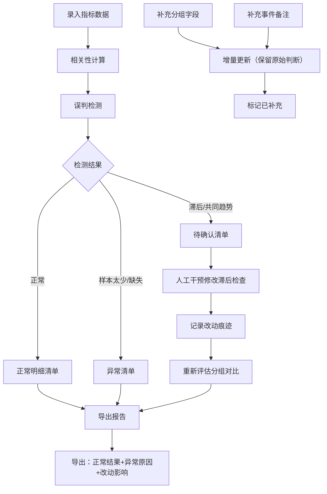

## 1. 产品概述

"相关性误判提醒台"是一款面向数据分析新人的专业工具，用于批量检测相关性分析中的常见误判（将相关性等同于因果关系），通过结构化的证据链管理帮助新人建立严谨的分析思维。

- **核心问题**：数据分析新人看到两个指标一起涨就下因果结论，复盘时经常被业务挑战
- **目标用户**：数据分析新人及其导师
- **核心价值**：将数据来源、分析判断和结果结论串联起来，形成可追溯的分析证据链

## 2. 核心 Features

### 2.1 用户角色

| 角色 | 注册方式 | 核心权限 |
|------|----------|----------|
| 数据分析新人 | 无需注册，本地工具 | 录入数据、执行分析、查看结果、导出报告 |
| 数据分析导师 | 无需注册，本地工具 | 审核判断、人工干预、验证分支逻辑 |

### 2.2 功能模块

1. **数据录入台**：指标数据录入、分组字段补录、事件备注补录
2. **相关性分析引擎**：批量计算、误判检测、证据链构建
3. **三清单管理**：正常明细清单、待确认清单、异常清单
4. **人工干预中心**：滞后检查修改、改动追溯、影响分析
5. **报告导出**：正常结果导出、异常原因导出、改动痕迹导出

### 2.3 页面详情

| 页面名称 | 模块名称 | 功能描述 |
|---------|----------|----------|
| 首页工作台 | 数据概览卡片 | 展示总记录数、各清单统计、最近更新时间 |
| 首页工作台 | 快捷操作区 | 批量导入、新增记录、导出报告、加载样例 |
| 数据录入页 | 指标数据录入 | 录入指标A、指标B、时间序列、样本量 |
| 数据录入页 | 分组字段补录 | 后续补充分组维度（不覆盖已有判断） |
| 数据录入页 | 事件备注补录 | 后续补充业务事件备注（不覆盖已有判断） |
| 分析结果页 | 正常明细清单 | 展示通过校验的相关性分析结果 |
| 分析结果页 | 待确认清单 | 展示滞后关系、共同趋势等需要人工确认的记录 |
| 分析结果页 | 异常清单 | 展示样本太少、数据缺失等无法计算的记录 |
| 人工干预页 | 滞后检查修改 | 人工调整滞后检测参数 |
| 人工干预页 | 改动追溯 | 展示所有人工修改记录及其影响范围 |
| 报告导出页 | 导出配置 | 选择导出内容、格式、是否包含改动痕迹 |

## 3. 核心流程

### 3.1 主业务流程

用户录入指标数据 → 系统自动执行相关性计算和误判检测 → 根据检测结果自动分发到三个清单 → 用户补充分组字段和备注（保留原始判断） → 导师人工审核待确认项 → 生成并导出完整报告

### 3.2 流程图

## 4. 用户界面设计

### 4.1 设计风格

- **主色调**：深邃蓝（#1e3a5f）代表专业严谨，搭配警示橙（#f59e0b）和危险红（#ef4444）标记不同清单
- **辅助色**：成功绿（#10b981）标记正常、确认蓝（#3b82f6）标记待确认
- **按钮风格**：直角微圆角（4px），轻微投影，hover时边框高亮
- **字体**：标题使用"JetBrains Mono"等宽字体体现数据感，正文使用"Noto Sans SC"
- **布局风格**：三栏卡片式布局，左侧导航、中间主内容、右侧证据链面板
- **视觉元素**：使用细边框、网格背景、数据水印增强数据分析工具的专业感
- **图标风格**：线性图标，统一2px描边，强调严谨专业

### 4.2 页面设计概览

| 页面名称 | 模块名称 | UI元素 |
|---------|----------|--------|
| 工作台 | 概览卡片 | 4张统计卡片，使用不同边框色区分清单类型，数字跳动动画 |
| 数据录入 | 表单区 | 分段式表单，指标区、分组区、备注区物理分隔，各区域有独立保存按钮 |
| 分析结果 | 三清单 | Tab切换，每个清单使用不同的边框色和背景色，卡片可展开查看证据链 |
| 人工干预 | 修改面板 | 左右对比布局，左侧原始值、右侧修改值，中间箭头指示改动方向 |
| 报告导出 | 导出预览 | 实时预览导出内容，可勾选包含项，生成进度条动画 |

### 4.3 响应式

- **桌面优先**：1440px以上最佳体验，三栏布局
- **平板适配**：1024px切换为两栏，右侧证据链改为底部抽屉
- **移动端**：768px以下单栏堆叠，清单改为列表模式

## 5. 内置样例数据

| 记录ID | 类型 | 指标A | 指标B | 样本量 | 检测结果 | 说明 |
|--------|------|-------|-------|--------|----------|------|
| DEMO-001 | 正常 | 广告投放额 | 订单转化量 | 1250 | 相关性显著，无明显误判 | 样例正常记录，验证正常分支 |
| DEMO-002 | 异常 | 活动曝光 | 用户注册 | 8 | 样本太少（<30），无法得出可靠结论 | 样例异常记录，验证样本太少分支 |
