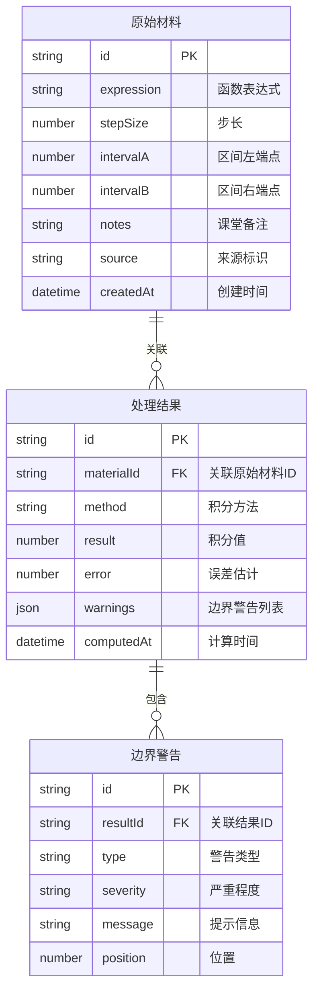

## 1. 架构设计

```mermaid
flowchart TB
    subgraph "前端层"
        "React UI" --> "Zustand Store"
        "Zustand Store" --> "积分计算引擎"
        "Zustand Store" --> "边界检测模块"
        "积分计算引擎" --> "结果数据"
        "边界检测模块" --> "警告数据"
        "结果数据" --> "可视化模块"
        "警告数据" --> "可视化模块"
        "可视化模块" --> "截图导出"
        "警告数据" --> "报告导出"
        "结果数据" --> "报告导出"
    end
    subgraph "数据层"
        "LocalStorage" --> "原始材料(函数/步长/备注)"
        "LocalStorage" --> "处理结果(积分值/误差/警告)"
    end
    "Zustand Store" --> "LocalStorage"
```

## 2. 技术说明

- 前端：React@18 + TypeScript + Tailwind CSS@3 + Vite
- 初始化工具：vite-init（react-ts模板）
- 后端：无（纯前端计算）
- 数据库：无（LocalStorage持久化，内存计算）
- 图表：recharts（曲线图+区域填充）
- 截图导出：html2canvas
- 数学解析：mathjs

## 3. 路由定义

| 路由 | 用途 |
|------|------|
| / | 工作台主页面，包含所有功能模块 |

## 4. API定义

无后端API，全部前端计算。

## 5. 服务端架构图

不适用

## 6. 数据模型

### 6.1 数据模型定义



### 6.2 数据定义语言

使用Zustand Store + LocalStorage，数据结构以TypeScript类型定义：

```typescript
interface RawMaterial {
  id: string;
  expression: string;
  stepSize: number;
  intervalA: number;
  intervalB: number;
  notes: string;
  source: 'manual' | 'import';
  createdAt: number;
}

interface ProcessedResult {
  id: string;
  materialId: string;
  method: 'trapezoidal' | 'simpson';
  result: number;
  errorEstimate: number;
  warnings: BoundaryWarning[];
  computedAt: number;
}

interface BoundaryWarning {
  id: string;
  type: 'singularity' | 'reversed_interval' | 'oversized_step';
  severity: 'warning' | 'error';
  message: string;
  position?: number;
}
```
