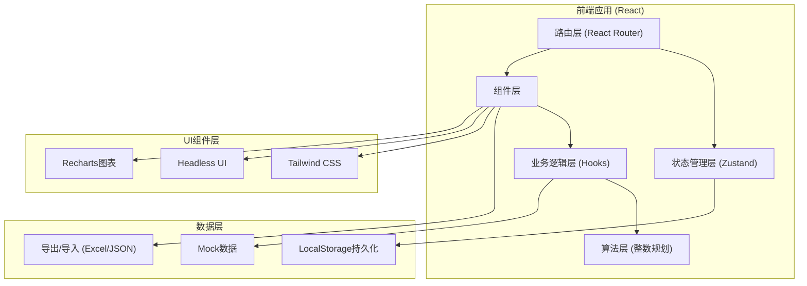
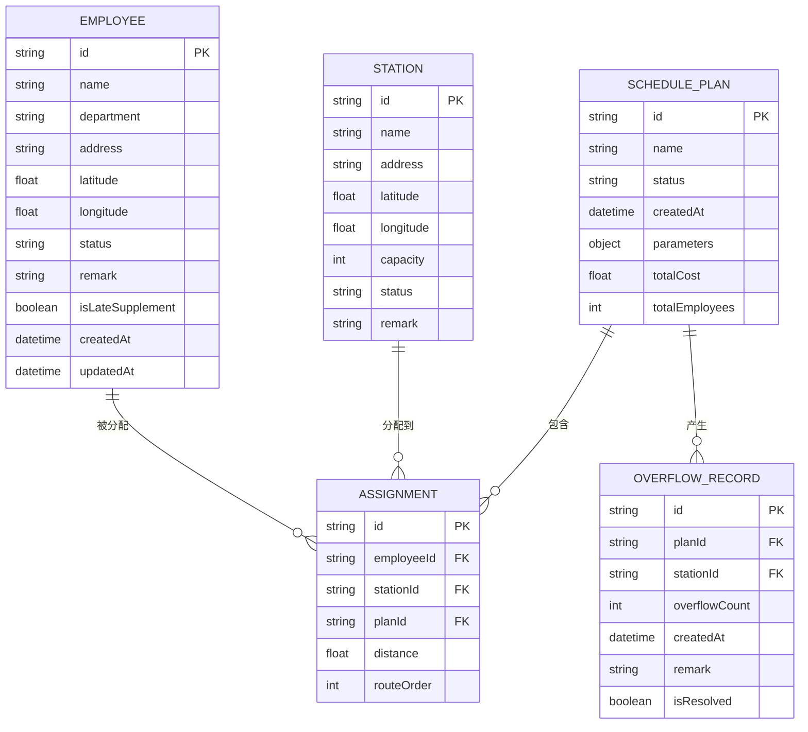

## 1. 架构设计



## 2. 技术描述

- 前端：React@18 + TypeScript + Vite
- 状态管理：Zustand
- UI框架：Tailwind CSS@3 + Headless UI
- 图表：Recharts
- 数据持久化：LocalStorage
- Excel导入导出：xlsx库
- 构建工具：Vite@5

## 3. 路由定义

| 路由 | 页面名称 | 目的 |
|------|---------|------|
| / | 首页/仪表盘 | 整体概览、快速操作入口 |
| /employees | 员工住址管理 | 员工信息导入、编辑、查询 |
| /stations | 站点候选管理 | 候选站点维护、容量设置 |
| /scheduling | 整数规划排程 | 算法配置、运行、方案对比 |
| /reports | 调度报告中心 | 容量超限告警、历史记录、报告导出 |

## 4. 数据模型

### 4.1 数据模型定义



### 4.2 核心数据结构定义

```typescript
// 员工住址
interface Employee {
  id: string;
  name: string;
  department: string;
  address: string;
  latitude: number;
  longitude: number;
  status: 'active' | 'inactive' | 'missing_data';
  remark: string;
  isLateSupplement: boolean;
  createdAt: string;
  updatedAt: string;
}

// 站点候选
interface Station {
  id: string;
  name: string;
  address: string;
  latitude: number;
  longitude: number;
  capacity: number;
  status: 'candidate' | 'selected' | 'closed';
  remark: string;
}

// 排程方案
interface SchedulePlan {
  id: string;
  name: string;
  status: 'draft' | 'running' | 'completed' | 'failed';
  createdAt: string;
  parameters: {
    maxWalkingDistance: number;
    minStationEmployees: number;
    costPerStation: number;
  };
  totalCost: number;
  totalEmployees: number;
  assignments: Assignment[];
}

// 分配记录
interface Assignment {
  id: string;
  employeeId: string;
  stationId: string;
  planId: string;
  distance: number;
  routeOrder: number;
}

// 容量超限记录
interface OverflowRecord {
  id: string;
  planId: string;
  stationId: string;
  overflowCount: number;
  createdAt: string;
  remark: string;
  isResolved: boolean;
}
```

## 5. 整数规划算法设计

### 5.1 目标函数

最小化总成本 = 站点开通成本 + 员工步行距离成本

```
min Σ(c_j * y_j) + ΣΣ(d_ij * x_ij)
```

### 5.2 约束条件

1. 每位员工必须分配到一个站点: `Σx_ij = 1`
2. 站点容量限制: `Σx_ij ≤ C_j * y_j`
3. 最小员工数限制: `Σx_ij ≥ m_j * y_j`
4. 决策变量: `x_ij ∈ {0,1}, y_j ∈ {0,1}`

### 5.3 启发式算法实现

- 基于贪心算法的初始解
- K-means聚类预分组
- 局部搜索优化

