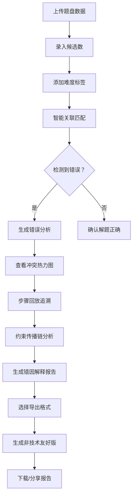

## 1. 产品概述

数独步骤纠错器是一款面向数学兴趣班师生的专业数独解题分析工具，专注于检测和解释数独解题过程中的候选冲突、步骤跳跃和唯一解破坏等问题。通过智能关联题盘、候选数和难度标签，提供可视化的约束传播追踪、步骤回放和"人话"版错因解释，帮助师生高效定位问题、理解错误根源。

---

## 2. 核心功能

### 2.1 用户角色

| 角色 | 核心权限 |
|------|----------|
| 数学兴趣班老师 | 完整功能：数据上传、错误分析、报告生成、历史追溯 |
| 学生用户 | 基础功能：查看分析结果、步骤回放、错因解释 |

### 2.2 功能模块

1. **数据导入与关联页**：题盘上传、候选数录入、难度标签、智能关联匹配
2. **错误分析面板**：冲突检测、约束传播可视化、步骤跳跃识别、唯一解验证
3. **步骤回放中心**：逐步骤回放、当前状态高亮、前后对比、候选数演变
4. **错因解释报告**："人话"解释、触发材料溯源、卡点定位、补救建议
5. **报告导出与分享**：PDF/JSON导出、非技术友好版本、数据一致性保证

### 2.3 页面详情

| 页面名称 | 模块名称 | 功能描述 |
|-----------|-------------|---------------------|
| 数据导入与关联页 | 题盘上传区 | 支持手动输入9×9数独、图片识别、文本粘贴 |
| 数据导入与关联页 | 候选数录入区 | 多格候选数批量录入、自动生成初始候选 |
| 数据导入与关联页 | 智能关联面板 | 通过题盘特征、候选数分布、难度标签自动匹配关联数据 |
| 错误分析面板 | 冲突热力图 | 9×9网格颜色编码显示冲突严重程度 |
| 错误分析面板 | 约束传播链图 | 有向图展示约束传播路径，可点击追溯 |
| 错误分析面板 | 错误类型卡片 | 候选冲突/步骤跳跃/唯一解破坏分类展示 |
| 步骤回放中心 | 时间轴控制 | 滑块+按钮控制步骤前进/后退/跳转 |
| 步骤回放中心 | 状态对比面板 | 左右分屏显示前后状态差异 |
| 错因解释报告 | 触发溯源卡片 | 显示哪份材料、哪个格子触发错误 |
| 错因解释报告 | 卡点定位模块 | 精确标注卡住的格子和原因 |
| 错因解释报告 | 补救建议区 | 列出下一步应填写的数字和理由 |
| 错因解释报告 | "人话"解释区 | 用通俗语言解释技术术语和错误逻辑 |
| 报告导出页 | 导出选项卡 | 选择导出格式、内容范围、语言风格 |
| 报告导出页 | 预览区 | 实时预览报告效果，可切换技术/非技术版本 |

---

## 3. 核心流程

### 3.1 主流程描述

数学兴趣班老师上传题盘和候选数数据，系统自动进行智能关联匹配。随后执行错误检测算法，识别候选冲突、步骤跳跃和唯一解破坏。老师通过步骤回放功能逐帧查看解题过程，结合约束传播链图理解错误发生的完整路径。最后生成包含"人话"解释的纠错报告，可导出分享给非技术同事或学生。

### 3.2 主流程图

---

## 4. 用户界面设计

### 4.1 设计风格

**设计基调：学术严谨 × 现代可视化**
- **主色**：深蓝 #1a365d（专业、可信）
- **辅助色**：
  - 琥珀橙 #ed8936（警告、冲突标记）
  - 翡翠绿 #38a169（正确、通过）
  - 玫瑰红 #e53e3e（严重错误）
  - 天蓝 #3182ce（信息、链接）
- **按钮风格**：微圆角（6px）、轻微阴影、hover时上浮2px
- **字体**：
  - 标题：Noto Serif SC（衬线，学术感）
  - 正文：Noto Sans SC（无衬线，易读）
  - 数字：JetBrains Mono（等宽，数独数字）
- **布局风格**：卡片式模块化布局，左侧导航+主内容区+右侧详情面板
- **图标风格**：线性图标（Lucide），保持简洁专业

### 4.2 页面设计概览

| 页面名称 | 模块名称 | UI 元素细节 |
|-----------|-------------|-------------|
| 错误分析面板 | 冲突热力图 | 9×9网格，单元格背景色随冲突程度渐变，数字居中显示，hover显示详细候选数 |
| 错误分析面板 | 约束传播链图 | SVG有向图，节点可拖拽，点击高亮关联路径，连线显示传播方向 |
| 步骤回放中心 | 时间轴控制 | 底部通栏，蓝色进度条，圆形滑块，带数字标记的关键步骤节点 |
| 错因解释报告 | "人话"解释区 | 浅蓝背景卡片，左侧💡图标，正文大号字体，关键术语下划线标注 |
| 报告导出页 | 预览区 | 毛玻璃效果边框，可左右切换技术版/通俗版，底部显示下载按钮 |

### 4.3 响应式

- **桌面端优先**：1440px以上为设计基准
- **平板适配**：1024px时右侧面板收起为可展开抽屉
- **手机适配**：768px以下改为垂直堆叠布局，时间轴改为底部固定

### 4.4 微交互与动画

- 页面加载：模块按顺序淡入（staggered 100ms delay）
- 数独格子：hover时轻微放大（1.05倍），选中时蓝色边框脉冲动画
- 错误标记：新检测到的错误有3次闪烁提示
- 步骤切换：网格内容交叉淡入淡出（300ms）
- 报告生成：进度条带流光效果

