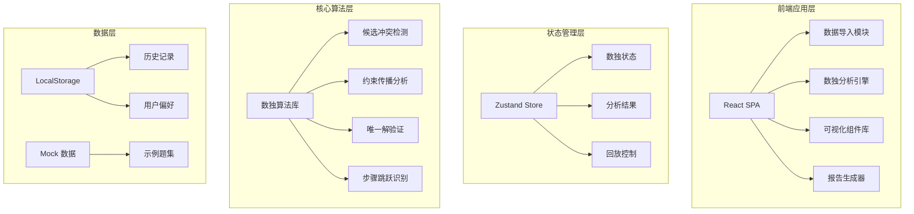
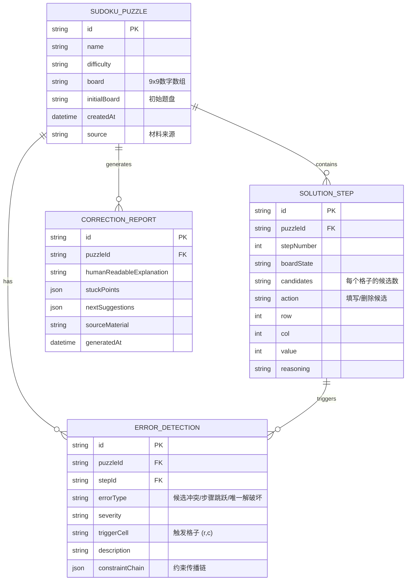

## 1. 架构设计



---

## 2. 技术描述

- **前端框架**：React@18 + TypeScript@5
- **构建工具**：Vite@5
- **样式方案**：Tailwind CSS@3
- **状态管理**：Zustand@4
- **图标库**：Lucide React@0.344
- **图表可视化**：Recharts@2
- **关系图**：React Flow@11（约束传播链图）
- **PDF导出**：jspdf@2 + html2canvas@1

---

## 3. 路由定义

| 路由 | 页面 | 核心功能 |
|-------|---------|----------|
| / | 首页/数据导入 | 题盘上传、候选数录入、智能关联 |
| /analyze | 错误分析面板 | 冲突热力图、约束传播链、错误列表 |
| /replay | 步骤回放中心 | 时间轴控制、状态对比、逐帧回放 |
| /report | 错因解释报告 | 触发溯源、卡点定位、补救建议、人话解释 |
| /export | 报告导出页 | 格式选择、预览、下载分享 |

---

## 4. 数据模型

### 4.1 数据模型定义



### 4.2 TypeScript 类型定义

```typescript
// 数独题盘
interface SudokuPuzzle {
  id: string;
  name: string;
  difficulty: 'easy' | 'medium' | 'hard' | 'expert';
  board: (number | null)[][];
  initialBoard: (number | null)[][];
  candidates: Set<number>[][];
  source: string;
  createdAt: Date;
}

// 解题步骤
interface SolutionStep {
  id: string;
  puzzleId: string;
  stepNumber: number;
  board: (number | null)[][];
  candidates: Set<number>[][];
  action: 'fill' | 'remove_candidate' | 'undo';
  row: number;
  col: number;
  value?: number;
  removedCandidate?: number;
  reasoning: string;
}

// 错误检测结果
interface ErrorDetection {
  id: string;
  puzzleId: string;
  stepId: string;
  errorType: 'candidate_conflict' | 'step_jump' | 'unique_solution_violation';
  severity: 'low' | 'medium' | 'high' | 'critical';
  triggerCell: { row: number; col: number };
  affectedCells: { row: number; col: number }[];
  constraintChain: ConstraintNode[];
  description: string;
}

// 约束传播节点
interface ConstraintNode {
  id: string;
  cell: { row: number; col: number };
  candidate: number;
  type: 'source' | 'propagation' | 'conflict';
  reason: string;
  parentIds: string[];
}

// 纠错报告
interface CorrectionReport {
  id: string;
  puzzleId: string;
  sourceMaterial: string;
  errors: ErrorDetection[];
  stuckPoint: {
    cell: { row: number; col: number };
    reason: string;
  };
  nextSuggestions: {
    cell: { row: number; col: number };
    value: number;
    reasoning: string;
  }[];
  humanReadableExplanation: {
    summary: string;
    whatWentWrong: string;
    whyItMatters: string;
    howToFix: string;
  };
  generatedAt: Date;
}
```

---

## 5. 核心算法模块

### 5.1 候选冲突检测算法
- **输入**：当前题盘状态 + 候选数矩阵
- **输出**：冲突单元格列表 + 约束传播链
- **逻辑**：对每个单元格的候选数，检查同行/列/宫格是否存在唯一候选数冲突，构建约束传播有向图

### 5.2 步骤跳跃识别
- **输入**：步骤序列（上一步 → 当前步）
- **输出**：跳跃判定 + 遗漏的中间步骤
- **逻辑**：对比两步之间的候选数变化，验证变化是否可通过基础数独技巧（唯一余数、摒除）一步完成

### 5.3 唯一解验证
- **输入**：题盘状态
- **输出**：解的数量（0/1/多个）+ 反例（如果多解）
- **逻辑**：回溯法 + 启发式剪枝，限制搜索深度避免性能问题

### 5.4 "人话"解释生成器
- **输入**：技术错误描述 + 约束链
- **输出**：四段落通俗解释（概述/问题/影响/修复）
- **逻辑**：模板匹配 + 术语替换 + 逻辑链简化

---

## 6. 组件结构

```
src/
├── components/
│   ├── SudokuGrid/          # 数独网格组件
│   │   ├── SudokuCell.tsx   # 单元格（支持候选数显示）
│   │   └── HeatmapOverlay.tsx
│   ├── ConstraintGraph/     # 约束传播链图
│   │   └── FlowChart.tsx
│   ├── Timeline/            # 步骤回放时间轴
│   │   └── PlaybackControls.tsx
│   ├── ReportCard/          # 报告卡片组件
│   │   ├── HumanReadableCard.tsx
│   │   └── SuggestionCard.tsx
│   └── common/              # 通用组件
├── stores/
│   ├── usePuzzleStore.ts    # 题盘状态管理
│   ├── useAnalysisStore.ts  # 分析结果管理
│   └── useReplayStore.ts    # 回放控制
├── engine/
│   ├── sudokuCore.ts        # 基础数独逻辑
│   ├── conflictDetector.ts  # 冲突检测
│   ├── stepValidator.ts     # 步骤验证
│   └── explanationGenerator.ts # 人话解释生成
├── pages/
│   ├── ImportPage.tsx
│   ├── AnalyzePage.tsx
│   ├── ReplayPage.tsx
│   ├── ReportPage.tsx
│   └── ExportPage.tsx
└── App.tsx
```

---

## 7. Mock 数据说明

预置 3 套示例数据用于演示：
1. **入门级示例**：简单候选冲突，适合教学演示
2. **中级示例**：步骤跳跃问题，展示约束传播链
3. **高级示例**：唯一解破坏，多解场景分析

每套数据包含：完整题盘、5-10个解题步骤、预计算的错误分析、生成的报告。

