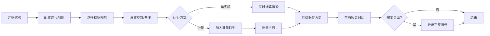

## 1. 产品概述

分形迭代课堂板是专为数学教师设计的分形几何实验工具，解决迭代过程追踪难、对比繁、导出乱的问题。系统自动保存所有实验历史，支持批量计算，提供完整的结果溯源和问题诊断。

- 核心目标：让数学教师专注于分形教学而非工具操作
- 目标用户：高中/大学数学教师、科研人员、分形爱好者
- 核心价值：完整的过程留痕、智能的错误诊断、便捷的溯源复核

## 2. 核心功能

### 2.1 用户角色

| 角色 | 注册方式 | 核心权限 |
|------|---------|---------|
| 教师用户 | 无需注册，本地使用 | 创建实验、批量计算、导出结果、查看历史 |

### 2.2 功能模块

1. **实验工作台**：分形参数配置、实时预览、迭代控制
2. **批量计算中心**：多组实验数据批量导入、并行计算、进度追踪
3. **历史档案库**：实验历史列表、版本对比、维度说明展示
4. **结果导出**：完整报告导出、图片归档、失败原因记录
5. **样例库**：预置典型案例（迭代爆炸、规则非法、颜色重叠）

### 2.3 页面详情

| 页面名称 | 模块名称 | 功能描述 |
|---------|---------|---------|
| 实验工作台 | 参数配置区 | 迭代规则编辑、初始图形选择、颜色方案设置、课堂备注 |
| 实验工作台 | 实时预览区 | Canvas分形渲染、迭代步数控制、缩放平移、错误提示醒目展示 |
| 实验工作台 | 信息面板 | 当前维度计算、规则溯源链接、备注显示 |
| 批量计算中心 | 数据导入区 | 批量参数导入（JSON/CSV）、实验列表管理 |
| 批量计算中心 | 执行面板 | 一键执行、实时进度、状态标识 |
| 批量计算中心 | 结果概览 | 成功/失败统计、失败原因分类 |
| 历史档案库 | 历史列表 | 时间线展示、搜索筛选、批量选择 |
| 历史档案库 | 对比视图 | 多版本并排对比、参数差异高亮 |
| 导出中心 | 导出配置 | 格式选择（PDF/JSON/图片包）、内容勾选 |
| 导出中心 | 溯源详情 | 迭代规则、初始图形、导出图片关联展示 |

## 3. 核心流程

用户从配置单个实验开始，可直接运行或加入批量队列。系统实时计算并渲染，自动保存每次迭代。完成后可查看历史对比，或批量导出包含成功结果和失败原因的完整报告。

## 4. 界面设计

### 4.1 设计风格
- **主色调**：深海军蓝 #0A2463（学术严谨）
- **强调色**：警示红 #E63946（迭代爆炸/规则非法醒目提示）、成功绿 #2A9D8F、警告橙 #F4A261
- **中性色**：象牙白 #F8F9FA、深灰 #212529
- **按钮风格**：微圆角（4px）、悬停微浮起、点击凹陷
- **字体**：标题用 Noto Serif SC（学术感），正文用 JetBrains Mono（代码/数字清晰）
- **布局风格**：三栏式卡片布局，左侧配置、中间预览、右侧信息
- **图标风格**：线性简约图标，配合数学符号（∞, Σ, ∂）

### 4.2 页面设计概览

| 页面名称 | 模块名称 | UI 元素 |
|---------|---------|---------|
| 实验工作台 | 参数配置区 | 代码编辑器风格的规则输入、图形选择器、颜色拾取器、备注文本框 |
| 实验工作台 | 实时预览区 | 大尺寸Canvas、错误弹窗（红底白字）、迭代步数滑块、缩放控件 |
| 实验工作台 | 信息面板 | 维度数值卡片、溯源链接（蓝色下划线）、备注展示框 |
| 批量计算中心 | 数据导入区 | 拖拽上传区、参数表格、添加/删除行按钮 |
| 批量计算中心 | 执行面板 | 大尺寸执行按钮、进度条（带状态色）、状态标签 |
| 批量计算中心 | 结果概览 | 统计卡片、失败原因列表（带图标） |
| 历史档案库 | 历史列表 | 时间线布局、缩略图卡片、筛选标签 |
| 历史档案库 | 对比视图 | 并排画布、参数差异高亮（黄色背景） |
| 导出中心 | 导出配置 | 复选框组、格式选择、导出预览 |
| 导出中心 | 溯源详情 | 关联卡片组、跳转链接、关系线 |

### 4.3 响应式
- 桌面端（>1200px）：三栏完整布局
- 平板端（768-1200px）：两栏布局，信息面板折叠为抽屉
- 移动端（<768px）：单栏堆叠，预览区置顶

### 4.4 特殊交互设计
- **错误醒目提示**：迭代爆炸时整个预览区边框变红，闪烁3次，中央显示红色警告框
- **规则非法**：输入框红框，实时语法错误提示
- **颜色重叠**：预览区右上角橙色警告标识
- **溯源链接**：点击参数值直接跳转到对应历史实验
- **历史对比**：参数变化时维度说明实时更新动画
