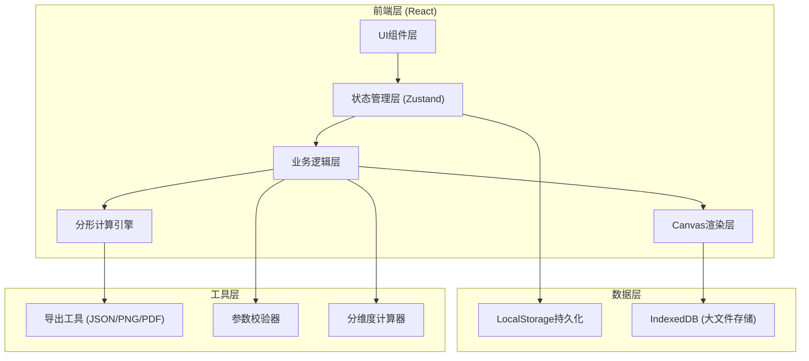
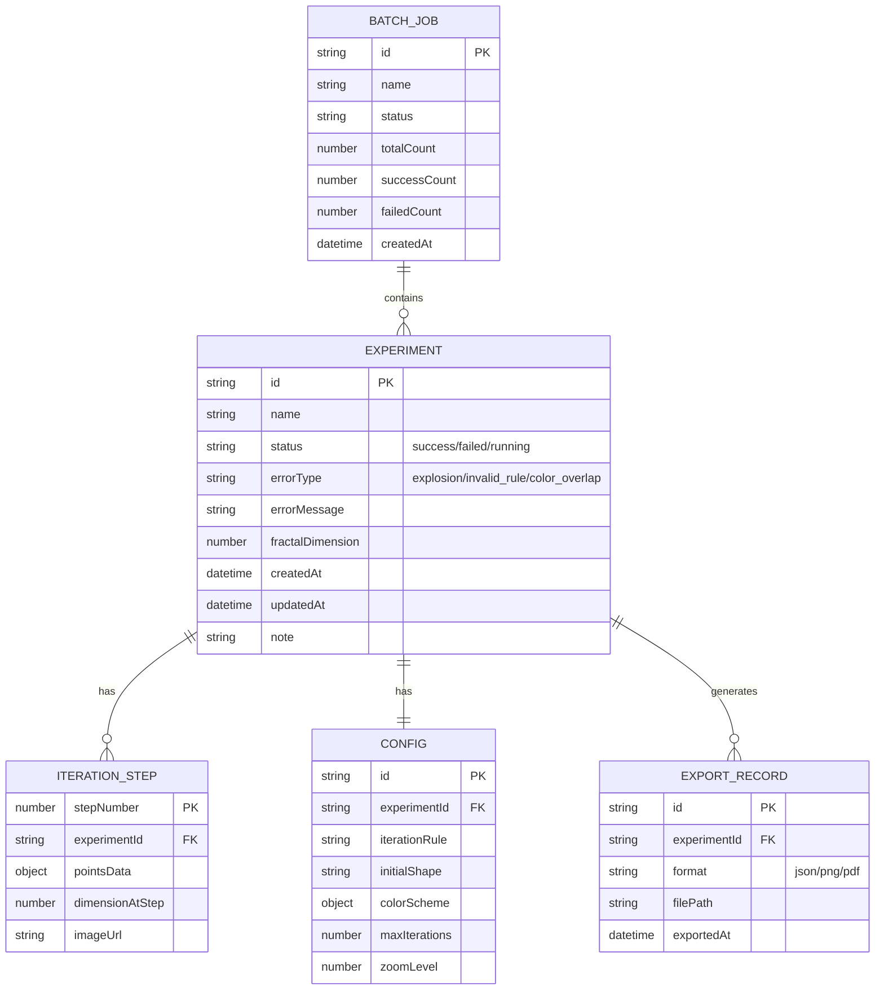

## 1. 架构设计



## 2. 技术选型

- **前端框架**: React@18 + TypeScript
- **构建工具**: Vite@5
- **样式方案**: TailwindCSS@3
- **状态管理**: Zustand (轻量、支持中间件持久化)
- **Canvas渲染**: 原生 HTML5 Canvas API
- **导出工具**: html2canvas (截图), jspdf (PDF生成)
- **数据持久化**: LocalStorage + IndexedDB
- **图标**: Lucide React

## 3. 路由定义

| 路由 | 页面 | 功能 |
|------|------|------|
| / | 实验工作台 | 单实验配置、实时预览、运行控制 |
| /batch | 批量计算中心 | 批量导入、队列管理、结果概览 |
| /history | 历史档案库 | 历史列表、多版本对比、搜索筛选 |
| /export | 导出中心 | 报告配置、溯源详情、导出执行 |
| /samples | 样例库 | 预置案例展示、一键加载 |

## 4. 数据模型

### 4.1 数据模型定义



### 4.2 TypeScript 类型定义

```typescript
interface ExperimentConfig {
  id: string;
  iterationRule: string;
  initialShape: 'triangle' | 'square' | 'line' | 'custom';
  colorScheme: {
    stroke: string;
    fill: string;
    background: string;
  };
  maxIterations: number;
  zoomLevel: number;
  note: string;
}

interface IterationResult {
  step: number;
  points: Array<{ x: number; y: number }>;
  dimension: number;
  imageData?: string;
}

interface Experiment {
  id: string;
  name: string;
  config: ExperimentConfig;
  status: 'idle' | 'running' | 'success' | 'failed';
  errorType?: 'explosion' | 'invalid_rule' | 'color_overlap' | 'other';
  errorMessage?: string;
  results: IterationResult[];
  fractalDimension?: number;
  createdAt: Date;
  updatedAt: Date;
}

interface BatchJob {
  id: string;
  name: string;
  experiments: Experiment[];
  status: 'pending' | 'running' | 'completed';
  progress: number;
}
```

## 5. 核心模块设计

### 5.1 分形计算引擎

```typescript
// 核心计算类
class FractalEngine {
  validateRule(rule: string): ValidationResult;
  checkExplosion(points: Point[]): boolean;
  checkColorOverlap(colors: ColorScheme): boolean;
  iterate(config: ExperimentConfig, onStep: (result: IterationResult) => void): Promise<ExperimentResult>;
  calculateDimension(points: Point[]): number;
}
```

### 5.2 状态管理 Store

```typescript
interface FractalStore {
  currentExperiment: Experiment | null;
  history: Experiment[];
  batchJobs: BatchJob[];
  
  // Actions
  createExperiment: (config: Partial<ExperimentConfig>) => Experiment;
  runExperiment: (id: string) => Promise<void>;
  addToBatch: (experimentId: string) => void;
  runBatch: (jobId: string) => Promise<void>;
  compareExperiments: (ids: string[]) => ComparisonResult;
  exportExperiment: (id: string, format: ExportFormat) => Promise<string>;
}
```

### 5.3 持久化中间件

```typescript
// Zustand persist middleware 配置
// - 实验元数据 -> localStorage
// - Canvas截图 -> IndexedDB
// - 批量导出记录 -> localStorage
```
