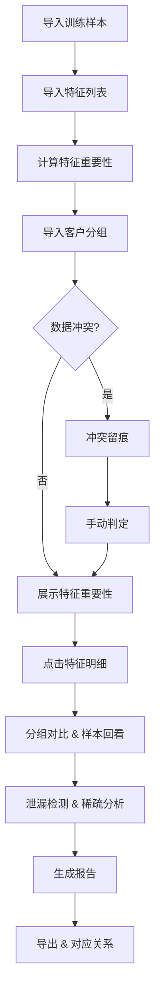

## 1. 产品概述

随机森林特征审计工具——面向风控数据科学家与业务复核人员，解决特征重要性解释反复、训练样本/特征列表/客户分组三方数据冲突难以追踪、特征泄漏与分组稀疏难以可视化的问题。用户可自主导入样例数据、查看特征重要性图表、点入明细、导出报告，实现一次导入、全程可追溯的审计闭环。

- 核心目标：让同事自助完成随机森林特征审计，无需数据科学家重复解释
- 目标用户：风控团队数据科学家、模型复核人员、业务审计人员

## 2. 核心功能

### 2.1 用户角色

| 角色 | 使用方式 | 核心权限 |
|------|----------|----------|
| 数据科学家 | 导入数据、配置参数、深度分析 | 全部功能 |
| 复核人员 | 查看结果、导出报告、点击明细 | 只读+导出 |

### 2.2 功能模块

1. **审计工作台**：数据导入区（训练样本/特征列表/客户分组）、版本时间线、冲突告警栏
2. **特征重要性面板**：特征重要性排序图、分组对比视图、样本回看联动
3. **风险诊断面板**：特征泄漏检测、分组稀疏分析、冲突留痕记录
4. **报告导出面板**：报告生成与下载、对应关系详情、版本追溯

### 2.3 页面详情

| 页面名称 | 模块名称 | 功能描述 |
|----------|----------|----------|
| 审计工作台 | 数据导入区 | 支持CSV/Excel导入训练样本、特征列表、客户分组，自动解析列头与数据类型 |
| 审计工作台 | 版本时间线 | 展示三组数据的导入时序，标记晚到版本与混用版本，可点击查看差异 |
| 审计工作台 | 冲突告警栏 | 实时检测三方数据冲突（特征名不匹配、分组键缺失、样本ID不一致），留痕后可手动判定 |
| 特征重要性面板 | 重要性排序图 | 水平条形图展示特征重要性排序，支持点击单特征查看详情 |
| 特征重要性面板 | 分组对比视图 | 按客户分组对比特征重要性差异，高亮组间显著变化 |
| 特征重要性面板 | 样本回看联动 | 点击特征后展示该特征在训练样本中的分布，支持按分组筛选 |
| 风险诊断面板 | 特征泄漏检测 | 基于特征与目标变量的关联度、时间先后等信息标记潜在泄漏特征 |
| 风险诊断面板 | 分组稀疏分析 | 检测各分组下的样本量与特征覆盖率，标记稀疏分组 |
| 风险诊断面板 | 冲突留痕记录 | 记录所有数据冲突的发现时间、涉及数据源、处理方式，支持版本时序回溯 |
| 报告导出面板 | 报告生成 | 一键生成包含特征重要性、风险诊断、冲突留痕的审计报告（JSON/HTML） |
| 报告导出面板 | 对应关系详情 | 展示训练样本、特征列表、报告导出的版本对应关系，方便复核 |
| 报告导出面板 | 版本追溯 | 按时间线回溯历次审计结果，对比差异 |

## 3. 核心流程

用户导入训练样本和特征列表 → 系统自动解析并计算特征重要性 → 用户导入客户分组（可能晚到）→ 系统检测冲突并留痕 → 用户查看特征重要性图 → 点击单特征查看样本分布与分组对比 → 系统标记泄漏风险与稀疏分组 → 用户判定冲突 → 生成报告并导出 → 复核人员查看对应关系详情

## 4. 用户界面设计

### 4.1 设计风格

- 主色调：深灰（#1a1a2e）背景 + 琥珀色（#f59e0b）强调色，辅以青色（#06b6d4）标记风险项
- 按钮风格：圆角矩形，hover时微浮起+阴影
- 字体：DM Sans（正文）+ JetBrains Mono（数据/代码），标题14-16px，数据12px
- 布局风格：左侧固定导航 + 右侧内容区，卡片式分区
- 图标风格：线性图标（lucide-react），与数据密集型界面匹配

### 4.2 页面设计概述

| 页面名称 | 模块名称 | UI元素 |
|----------|----------|--------|
| 审计工作台 | 数据导入区 | 三列卡片，拖拽上传，解析状态指示器，版本标签 |
| 审计工作台 | 版本时间线 | 水平时间轴，节点标记数据源类型，晚到版本用虚线框 |
| 审计工作台 | 冲突告警栏 | 顶部横幅，冲突条目列表，每条含来源、时间、状态标签 |
| 特征重要性面板 | 重要性排序图 | 水平条形图，hover高亮，点击展开详情抽屉 |
| 特征重要性面板 | 分组对比视图 | 分组色块对比，差异用箭头与数值标注 |
| 特征重要性面板 | 样本回看联动 | 右侧抽屉式面板，直方图+分组筛选器 |
| 风险诊断面板 | 特征泄漏检测 | 红色标签卡片，泄漏特征列表，关联时间线 |
| 风险诊断面板 | 分组稀疏分析 | 热力矩阵，低覆盖率格子高亮 |
| 风险诊断面板 | 冲突留痕记录 | 时间排序表格，含版本号、操作人、判定结果 |
| 报告导出面板 | 报告生成 | 预览卡片+导出按钮，格式选择下拉 |
| 报告导出面板 | 对应关系详情 | 三列对照表，版本号对齐，差异高亮 |
| 报告导出面板 | 版本追溯 | 垂直时间线，可展开历次报告摘要 |

### 4.3 响应式设计

- 桌面优先设计，最小宽度1280px
- 图表区域支持缩放
- 抽屉面板支持折叠/展开

### 4.4 3D场景指导

不适用
