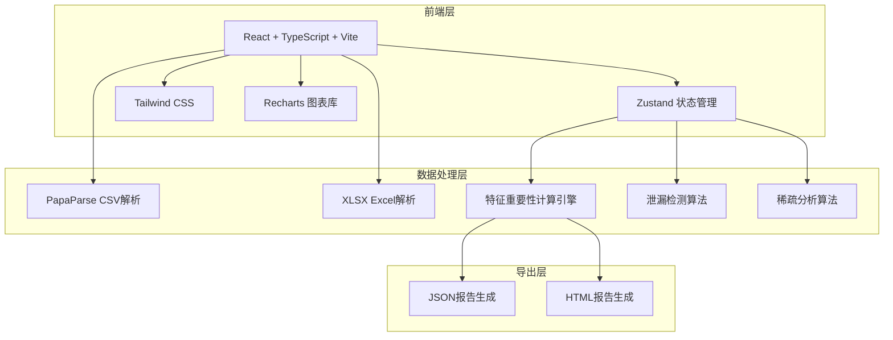
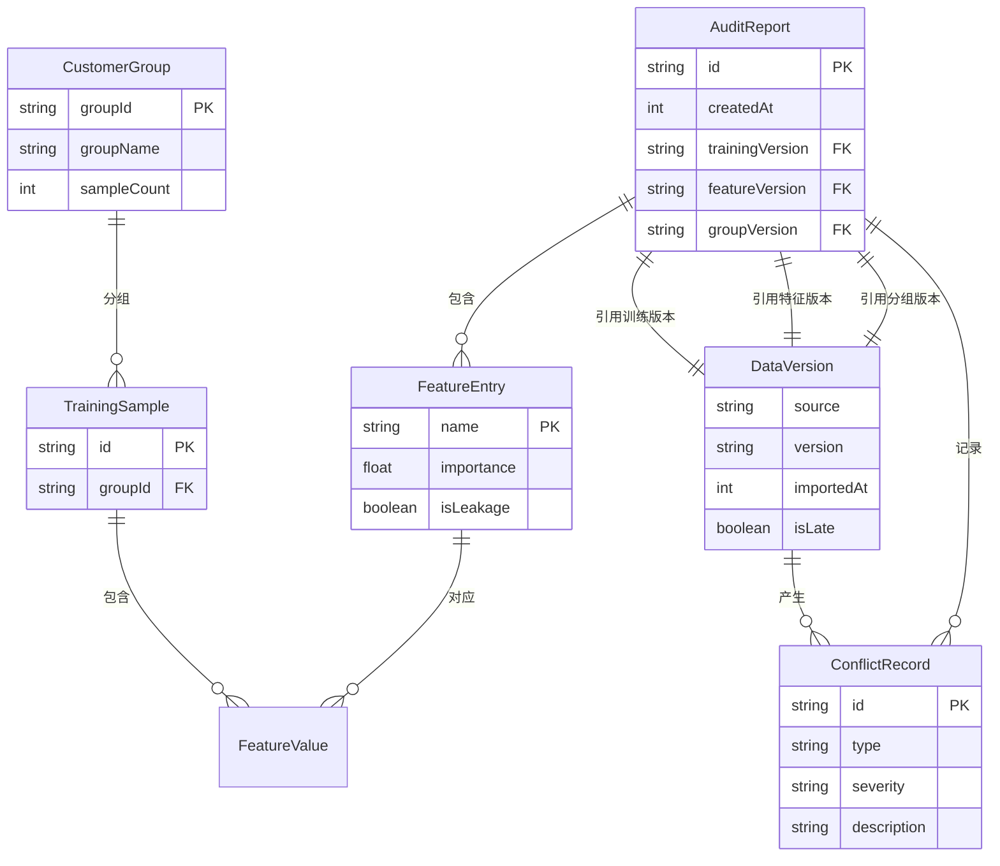

## 1. 架构设计



纯前端架构，无需后端服务。所有数据导入、计算、分析、导出均在浏览器端完成，确保数据不离开用户设备。

## 2. 技术说明

- 前端：React@18 + TypeScript + Tailwind CSS@3 + Vite
- 初始化工具：vite-init
- 后端：无
- 数据库：无（使用浏览器内存+Zustand持久化）
- 图表库：Recharts（特征重要性条形图、分组对比图、分布直方图）
- CSV解析：papaparse
- Excel解析：xlsx
- 状态管理：Zustand（含persist中间件，支持localStorage持久化）
- 图标：lucide-react

## 3. 路由定义

| 路由 | 用途 |
|------|------|
| / | 审计工作台：数据导入、版本时间线、冲突告警 |
| /importance | 特征重要性面板：排序图、分组对比、样本回看 |
| /diagnosis | 风险诊断面板：泄漏检测、稀疏分析、冲突留痕 |
| /report | 报告导出面板：报告生成、对应关系、版本追溯 |

## 4. API定义

无后端API。所有数据通过前端文件导入，计算在浏览器端完成。

### 4.1 核心数据结构

```typescript
interface TrainingSample {
  id: string
  features: Record<string, number | string>
  target?: number | string
  groupId?: string
}

interface FeatureEntry {
  name: string
  importance: number
  category?: string
  isLeakage: boolean
  leakageReason?: string
  sparsityByGroup: Record<string, number>
}

interface CustomerGroup {
  groupId: string
  groupName: string
  sampleCount: number
  featureCoverage: Record<string, number>
}

interface DataVersion {
  source: "training" | "feature" | "group"
  version: string
  importedAt: number
  isLate: boolean
  conflicts: ConflictRecord[]
}

interface ConflictRecord {
  id: string
  type: "feature_mismatch" | "group_key_missing" | "sample_id_inconsistent" | "version_mix"
  severity: "high" | "medium" | "low"
  description: string
  detectedAt: number
  resolvedAt?: number
  resolution?: string
  relatedSources: DataVersion[]
}

interface AuditReport {
  id: string
  createdAt: number
  trainingVersion: string
  featureVersion: string
  groupVersion: string
  featureImportance: FeatureEntry[]
  leakageFeatures: FeatureEntry[]
  sparseGroups: CustomerGroup[]
  conflicts: ConflictRecord[]
}
```

## 5. 服务端架构图

不适用（纯前端项目）

## 6. 数据模型

### 6.1 数据模型定义



### 6.2 数据定义语言

不适用（无数据库，使用TypeScript类型定义和Zustand store管理内存数据）
