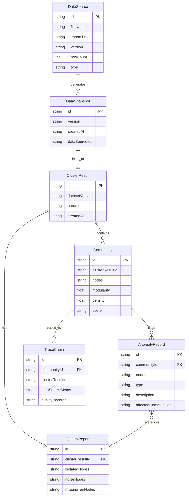

## 1. 架构设计

```mermaid
graph TD
    "Frontend[前端 React + TypeScript]" --> "Store[Zustand 状态管理]"
    "Store" --> "ClusteringEngine[谱聚类引擎]"
    "Store" --> "QualityDetector[数据质量检测]"
    "Store" --> "Visualization[D3.js 可视化]"
    "Store" --> "TraceService[溯源服务]"
    "Store" --> "ExportService[导出服务]"
    "ClusteringEngine" --> "Laplacian[拉普拉斯矩阵计算]"
    "ClusteringEngine" --> "EigenDecomp[特征分解]"
    "ClusteringEngine" --> "KMeans[K-Means 嵌入聚类]"
    "QualityDetector" --> "IsolatedCheck[孤立节点检测]"
    "QualityDetector" --> "NoiseCheck[活动噪声检测]"
    "QualityDetector" --> "MissingTagCheck[标签缺失检测]"
```

纯前端架构，所有计算在浏览器端完成，无需后端服务。

## 2. 技术说明

- 前端：React@18 + TypeScript + Tailwind CSS@3 + Vite
- 初始化工具：vite-init
- 后端：无（纯前端，所有数据在浏览器本地处理）
- 数据库：无（使用浏览器内存 + Zustand 持久化，可选 localStorage）
- 图可视化：D3.js@7
- 数学计算：ml-matrix（矩阵运算，特征分解）
- 状态管理：Zustand
- 图标：lucide-react

## 3. 路由定义

| 路由 | 用途 |
|------|------|
| / | 重定向到 /import |
| /import | 数据导入页：上传互动边、用户标签、活动记录 |
| /cluster | 聚类分析页：参数设置、执行聚类、社群评分、异常节点 |
| /graph | 可视化图页面：力导向图、节点明细、质量标注叠层 |
| /trace | 结果溯源页：溯源链条、导出结果 |

## 4. API 定义

无后端 API。所有数据通过前端本地处理：

### 4.1 数据导入接口（前端内部）

```typescript
interface InteractionEdge {
  source: string
  target: string
  weight: number
  timestamp: string
}

interface UserTag {
  userId: string
  tags: string[]
}

interface ActivityRecord {
  userId: string
  activityType: string
  timestamp: string
}

interface DataSourceMeta {
  id: string
  fileName: string
  importTime: string
  version: string
  rowCount: number
  type: 'interaction' | 'tag' | 'activity'
}
```

### 4.2 聚类结果接口

```typescript
interface ClusterResult {
  id: string
  params: ClusterParams
  communities: Community[]
  qualityReport: QualityReport
  createdAt: string
  datasetVersion: string
}

interface ClusterParams {
  k: number
  similarityThreshold: number
  weightDecay: number
}

interface Community {
  id: string
  nodes: string[]
  modularity: number
  density: number
  score: 'A' | 'B' | 'C' | 'D'
  anomalies: AnomalyRecord[]
}

interface AnomalyRecord {
  nodeId: string
  type: 'isolated' | 'noise' | 'missing_tag'
  description: string
  affectedCommunities: string[]
}

interface QualityReport {
  isolatedNodes: string[]
  noiseNodes: string[]
  missingTagNodes: string[]
  totalNodes: number
  totalEdges: number
}
```

### 4.3 溯源接口

```typescript
interface TraceChain {
  resultId: string
  communityId: string
  clusterParams: ClusterParams
  clusterResultId: string
  dataSourceMetas: DataSourceMeta[]
  qualityRecords: AnomalyRecord[]
}
```

## 5. 服务器架构图

不适用（纯前端项目）

## 6. 数据模型

### 6.1 数据模型定义



### 6.2 数据定义语言

不适用（纯前端，数据存储在 Zustand store 和 localStorage 中）
