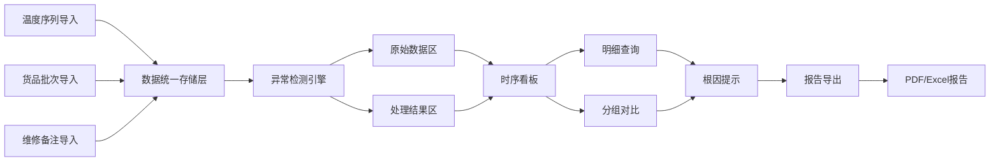

## 1. 产品概述

异常检测温控看板是面向冷链数据分析师和运营团队的专业分析工具，解决仓库温度异常跳点时难以区分传感器故障与货物实际受影响的核心痛点。系统围绕时序异常检测主线，提供统一数据源的图表展示、明细查询、分组对比和报告导出能力。

- **核心问题**：温度跳点归因难、多源数据整合难、异常报告不完整
- **目标用户**：冷链数据分析师、仓库运营人员、质量管理人员
- **产品价值**：加速异常根因定位、确保数据一致性、提升报告可信度

## 2. 核心 Features

### 2.1 用户角色

| 角色 | 登录方式 | 核心权限 |
|------|----------|----------|
| 数据分析师 | 内部账号登录 | 数据导入、异常检测、分析对比、报告导出 |
| 运营人员 | 内部账号登录 | 数据浏览、异常查看、报告查阅 |
| 管理员 | 内部账号登录 | 用户管理、系统配置、数据维护 |

### 2.2 Feature Module

1. **数据导入中心**：温度序列导入、货品批次导入、维修备注导入、数据源追溯
2. **时序异常看板**：温度趋势图、异常点标注、传感器状态、数据完整性指示
3. **明细查询页面**：原始数据与处理结果对比、异常详情、时间轴回放
4. **分组对比分析**：多传感器对比、多批次对比、正常vs异常区间对比
5. **根因提示引擎**：异常类型识别、传感器故障判断、数据质量问题提示
6. **报告导出中心**：一键生成PDF/Excel报告、包含全部异常标注、支持分享转发

### 2.3 页面详情

| 页面名称 | 模块名称 | 功能描述 |
|----------|----------|----------|
| 数据导入中心 | 文件上传区 | 拖拽上传CSV/Excel，支持温度、批次、备注三类文件 |
| 数据导入中心 | 数据源管理 | 显示导入批次、上传人、时间戳、原始文件清单 |
| 数据导入中心 | 数据预览 | 导入前数据采样预览、字段映射、异常值提示 |
| 时序异常看板 | 主控图表区 | 交互式温度时序图，支持缩放、悬停查看详情 |
| 时序异常看板 | 异常标记层 | 跳红点、离线区间、缺采段、漂移标注 |
| 时序异常看板 | 状态概览卡 | 在线传感器数、异常点数、数据完整率、今日告警 |
| 时序异常看板 | 回放控制器 | 按时间轴播放温度变化过程，异常点暂停高亮 |
| 明细查询页面 | 原始数据区 | 展示未处理的原始采样数据，标记可疑点 |
| 明细查询页面 | 处理结果区 | 插值补全、漂移修正后的干净数据，标注处理动作 |
| 明细查询页面 | 异常详情卡 | 异常时间、温度值、偏离度、可能原因、关联批次 |
| 分组对比页面 | 对比配置区 | 选择对比维度：传感器/批次/时间段 |
| 分组对比页面 | 多图联动区 | 同步缩放的多线图，差异高亮显示 |
| 分组对比页面 | 统计摘要区 | 均值、方差、极值、异常频次等对比指标 |
| 根因提示页面 | 诊断结果区 | 异常分类：传感器故障/货物异常/数据质量 |
| 根因提示页面 | 证据链展示 | 支撑诊断的关联数据：维修记录、相邻传感器、批次信息 |
| 报告导出中心 | 报告预览区 | 生成前预览报告内容和结构 |
| 报告导出中心 | 导出配置 | 选择格式（PDF/Excel）、包含模块、时间范围 |
| 报告导出中心 | 导出历史 | 历史报告列表，支持重新下载和分享 |

## 3. 核心流程

### 3.1 异常分析主流程

数据分析师导入多源数据 → 系统自动执行异常检测 → 时序看板展示异常分布 → 分析师通过回放定位问题时段 → 分组对比验证根因 → 查看根因提示确认结论 → 导出包含完整证据链的检测报告 → 转发给相关同事

### 3.2 数据流示意图

## 4. 用户界面设计

### 4.1 设计风格

**工业科技风 + 数据专业感**
- **主色调**：深空蓝 `#0F172A` 作为背景，冰蓝 `#38BDF8` 作为主色
- **警示色**：温度异常用橙红渐变 `#F97316 → #EF4444`，传感器离线用灰紫 `#6366F1`
- **中性色**：石板灰系列，确保数据可读性
- **字体**：标题使用 JetBrains Mono（等宽科技感），正文使用 Inter（清晰易读）
- **布局**：侧边导航 + 主内容区的仪表盘布局，卡片式模块化
- **交互**：悬停微光效果、图表平滑过渡、异常点脉冲动画
- **图标**：线性图标配合发光效果，保持技术感

### 4.2 页面设计概览

| 页面名称 | 模块名称 | UI 元素 |
|----------|----------|---------|
| 时序异常看板 | 主控图表区 | 深色背景折线图、异常点发光标记、时间轴滑块、缩放控制 |
| 时序异常看板 | 状态概览卡 | 渐变背景数值卡、状态指示灯、趋势箭头、微图表 |
| 数据导入中心 | 文件上传区 | 虚线边框拖放区、文件类型图标、上传进度条、校验结果标识 |
| 明细查询页面 | 双栏对比 | 左右分栏原始vs处理，同步滚动，差异行高亮 |
| 分组对比页面 | 多图联动 | 可拖拽图表布局、同步十字光标、差异填充区域 |
| 报告导出中心 | 报告预览 | 模拟A4纸效果、章节折叠、水印、页眉页脚预览 |

### 4.3 响应式设计

- **Desktop-first**：优先保证1920px大屏数据展示效果，侧边导航固定宽度260px
- **平板适配**：侧边栏可折叠为图标模式，图表区域自适应
- **交互优化**：所有图表支持触摸滑动缩放，表格支持横向滚动
- **断点**：1280px（桌面）、768px（平板）、375px（移动）

## 5. 数据一致性保障机制

### 5.1 统一数据源原则

- 所有模块（图表、明细、下载）必须绑定同一 `data_batch_id`
- 切换数据批次时，所有页面自动刷新至对应批次数据
- 数据处理过程全程记录 `processing_log`，可追溯每一步变换

### 5.2 异常完整性记录

- 缺采样：标记缺失区间，报告中明确标注缺失时长和影响范围
- 时钟漂移：记录修正前后时间戳对比，保留原始值备查
- 传感器离线：记录离线时段，在报告中注明数据断档
- 所有页面提醒的异常，必须同步写入导出报告
