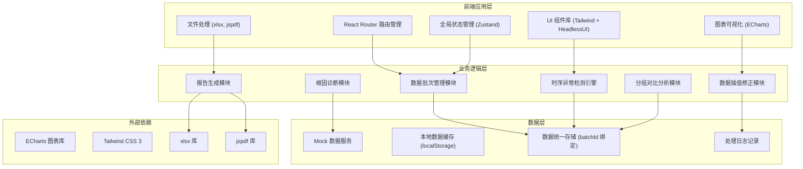
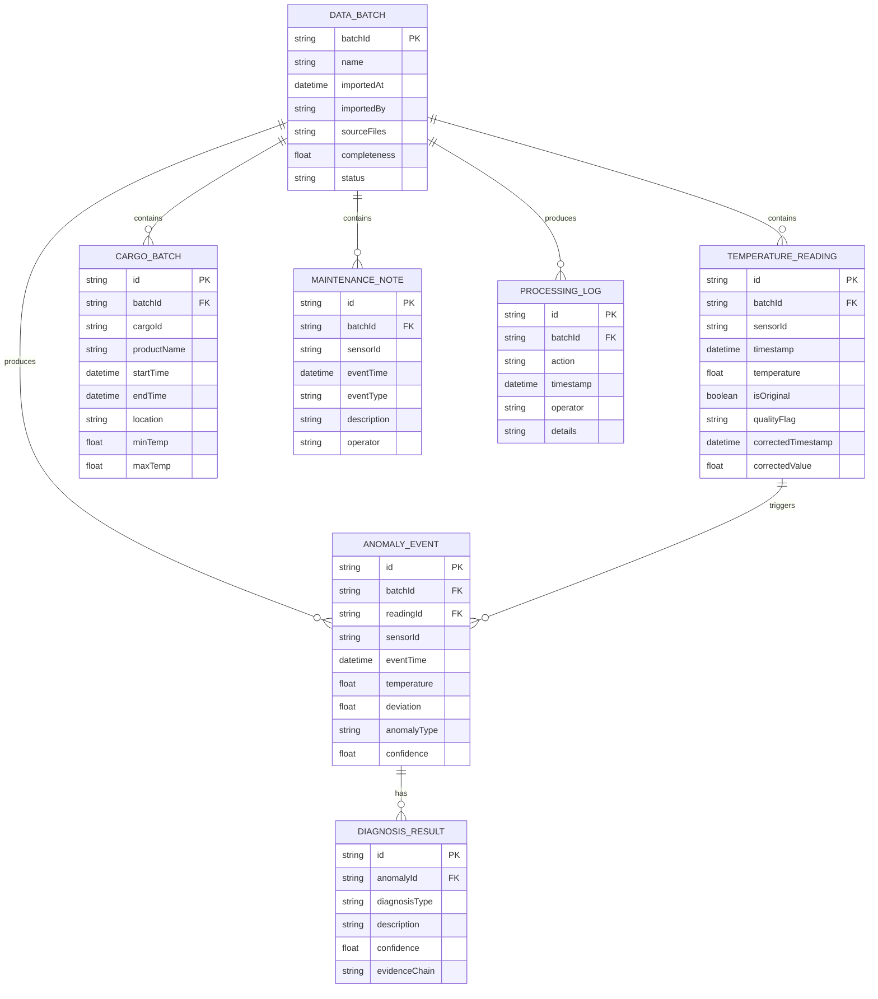

## 1. 架构设计



## 2. 技术描述

- **前端框架**：React@18.2.0 + TypeScript
- **构建工具**：Vite@5.0.0
- **样式方案**：TailwindCSS@3.4.0
- **状态管理**：Zustand@4.4.0
- **图表库**：ECharts@5.4.3
- **路由**：React Router@6.20.0
- **UI组件**：HeadlessUI@1.7.17 + Heroicons
- **文件处理**：xlsx@0.18.5（Excel导入导出）、jspdf@2.5.1（PDF导出）
- **后端**：无后端，使用 Mock 数据 + localStorage 持久化
- **数据**：内置完整的冷链温控模拟数据集，支持导入自定义数据

## 3. 路由定义

| 路由 | 页面名称 | 核心功能 |
|------|----------|----------|
| `/` | 时序异常看板 | 主控时序图、状态概览、回放控制 |
| `/import` | 数据导入中心 | 文件上传、数据源管理、数据预览 |
| `/detail` | 明细查询 | 原始vs处理数据对比、异常详情 |
| `/compare` | 分组对比 | 多传感器/批次/时段对比分析 |
| `/diagnosis` | 根因诊断 | 异常分类、证据链展示 |
| `/export` | 报告导出 | 报告预览、格式选择、导出历史 |

## 4. 数据模型

### 4.1 核心数据结构



### 4.2 异常类型定义

```typescript
// 数据质量问题类型
type DataQualityIssue = 
  | 'missing_sample'      // 缺采样
  | 'clock_drift'         // 时钟漂移
  | 'sensor_offline'      // 传感器离线
  | 'outlier'             // 异常跳点
  | 'value_out_of_range'; // 超出量程

// 根因诊断类型
type DiagnosisType = 
  | 'sensor_fault'        // 传感器故障
  | 'cargo_anomaly'       // 货物异常
  | 'data_quality_issue'  // 数据质量问题
  | 'environment_change'  // 环境变化
  | 'unknown';            // 待确认

// 异常事件接口
interface AnomalyEvent {
  id: string;
  batchId: string;
  sensorId: string;
  eventTime: Date;
  temperature: number;
  threshold: number;
  deviation: number;
  anomalyType: DataQualityIssue;
  severity: 'low' | 'medium' | 'high' | 'critical';
  diagnosis?: DiagnosisType;
  confidence: number;
  relatedBatch?: string;
  relatedMaintenance?: string;
  notes?: string;
}
```

## 5. 核心模块设计

### 5.1 异常检测引擎

```typescript
// 基于统计方法的时序异常检测
class AnomalyDetector {
  // 3σ 原则检测跳点
  detectOutliers(series: TemperatureReading[]): AnomalyEvent[];
  
  // 检测数据缺失区间
  detectMissingSamples(series: TemperatureReading[]): AnomalyEvent[];
  
  // 检测时钟漂移（时间间隔异常）
  detectClockDrift(series: TemperatureReading[]): AnomalyEvent[];
  
  // 检测传感器离线（长时间无数据）
  detectOffline(series: TemperatureReading[]): AnomalyEvent[];
  
  // 综合检测入口
  detectAll(batchId: string): AnomalyEvent[];
}
```

### 5.2 数据一致性保障机制

```typescript
// 全局数据批次管理
class DataBatchManager {
  private currentBatchId: string | null;
  
  // 切换数据批次时触发全局更新
  setCurrentBatch(batchId: string): void;
  
  // 校验数据来源一致性
  validateDataConsistency(batchId: string): boolean;
  
  // 获取绑定当前批次的所有数据
  getBatchData(batchId: string): BatchData;
  
  // 记录数据处理操作日志
  logProcessing(action: string, details: any): void;
}
```

### 5.3 报告生成模块

```typescript
class ReportGenerator {
  // 生成包含所有异常的完整报告
  generateReport(batchId: string, options: ReportOptions): ReportData;
  
  // 导出为 Excel（包含原始数据、处理结果、异常明细）
  exportToExcel(report: ReportData): Blob;
  
  // 导出为 PDF（包含图表、结论、证据链）
  exportToPDF(report: ReportData): Blob;
  
  // 确保报告包含所有页面提示的异常
  ensureAnomalyCompleteness(report: ReportData): ReportData;
}
```

## 6. 状态管理设计

```typescript
// Zustand Store 设计
interface AppState {
  // 数据批次状态
  currentBatchId: string | null;
  batches: DataBatch[];
  temperatureData: TemperatureReading[];
  cargoBatches: CargoBatch[];
  maintenanceNotes: MaintenanceNote[];
  
  // 异常检测结果
  anomalies: AnomalyEvent[];
  diagnoses: DiagnosisResult[];
  processingLogs: ProcessingLog[];
  
  // 视图状态
  selectedTimeRange: [Date, Date];
  selectedSensors: string[];
  playbackState: PlaybackState;
  
  // Actions
  setCurrentBatch: (batchId: string) => void;
  importData: (files: File[]) => Promise<void>;
  runDetection: () => void;
  selectTimeRange: (range: [Date, Date]) => void;
  togglePlayback: () => void;
  exportReport: (format: 'pdf' | 'excel') => Promise<void>;
}
```

## 7. 性能优化策略

1. **虚拟滚动**：明细数据表格使用虚拟滚动，支持10万+条数据流畅浏览
2. **增量渲染**：图表数据采用增量加载，初始渲染后按需加载详情
3. **Web Worker**：异常检测算法在 Web Worker 中运行，避免阻塞主线程
4. **数据缓存**：已处理的数据批次结果缓存到 localStorage，重复访问无需重新计算
5. **防抖节流**：图表缩放、时间轴滑动等高频操作使用防抖优化
