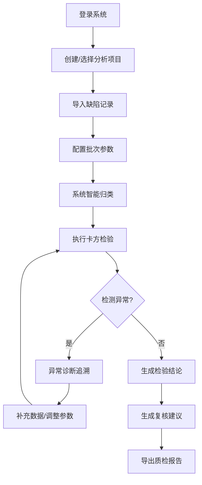

## 1. 产品概述

卡方分布质检面板是面向质量工程师的专业分析工具，用于基于缺陷记录进行卡方检验质量分析。系统支持缺陷记录导入、批次关联、智能归类、异常检测、复核建议生成及报告导出，确保日常处理与事后复盘口径一致。

- 核心价值：解决质量工程师重复计算、结果混乱、异常追溯困难的痛点
- 目标用户：质量工程师、质检主管、生产管理人员

## 2. 核心功能

### 2.1 用户角色
| 角色 | 注册方式 | 核心权限 |
|------|----------|----------|
| 质量工程师 | 系统登录 | 导入缺陷记录、执行卡方检验、查看分析结果、导出报告 |
| 质检主管 | 系统登录 | 复核分析结果、查看历史记录、管理班组信息 |

### 2.2 功能模块
1. **质检面板主页**：项目概览、快捷操作入口、历史分析记录
2. **卡方检验工作台**：缺陷记录导入、批次配置、参数设置、实时计算
3. **智能归类中心**：自动关联缺陷记录、产品批次、抽检数量
4. **异常诊断面板**：样本过少、类别合并、批次混入的检测与追溯
5. **报告导出中心**：复核建议生成、多格式导出、班组信息一致性校验

### 2.3 页面详情
| 页面名称 | 模块名称 | 功能描述 |
|----------|----------|----------|
| 质检面板主页 | 项目概览卡片 | 显示当前项目状态、最近分析、待处理事项 |
| 质检面板主页 | 快捷操作区 | 新建分析、导入记录、查看历史的快速入口 |
| 卡方检验工作台 | 数据导入模块 | 支持CSV/Excel导入缺陷记录，数据预览与校验 |
| 卡方检验工作台 | 参数配置区 | 设置产品批次、抽检数量、显著性水平等参数 |
| 卡方检验工作台 | 实时计算面板 | 展示卡方值、自由度、p值、检验结论 |
| 智能归类中心 | 自动关联引擎 | 基于线索自动归类到对应项目 |
| 异常诊断面板 | 异常检测列表 | 列出所有检测到的异常情况 |
| 异常诊断面板 | 追溯详情视图 | 显示触发材料、卡住位置、下一步建议 |
| 报告导出中心 | 报告生成器 | 生成包含复核建议的完整质检报告 |
| 报告导出中心 | 一致性校验 | 确保导出文件与页面/终端摘要口径一致 |

## 3. 核心流程

### 3.1 主要用户流程
质量工程师登录系统 → 创建新分析项目 → 导入缺陷记录 → 配置批次与抽检参数 → 系统自动归类 → 执行卡方检验 → 查看异常诊断 → 生成复核建议 → 导出质检报告

### 3.2 流程图示

## 4. 用户界面设计

### 4.1 设计风格
- **主色调**：专业深蓝 (#1e3a5f)，代表专业与可信赖
- **辅助色**：警示橙 (#f59e0b) 用于异常提示，成功绿 (#10b981) 用于合格标识
- **按钮风格**：圆角矩形，微立体效果，悬停时轻微上浮
- **字体**：标题使用思源黑体 Bold，正文使用思源宋体 Regular
- **布局风格**：卡片式布局，顶部导航 + 左侧菜单 + 主内容区
- **图标风格**：线性图标，保持简洁专业

### 4.2 页面设计概览
| 页面名称 | 模块名称 | UI 元素 |
|----------|----------|----------|
| 质检面板主页 | 项目概览卡片 | 深色卡片背景、统计数字大字展示、趋势小图表 |
| 卡方检验工作台 | 数据表格 | 斑马纹表格、可排序列、行高亮效果 |
| 异常诊断面板 | 异常卡片 | 渐变色边框、图标动画、展开/收起动效 |
| 报告导出中心 | 预览区域 | 模拟纸张效果、分页预览、打印样式 |

### 4.3 响应式设计
- 桌面端优先设计（1280px+）
- 平板端（768-1279px）：左侧菜单可折叠
- 移动端（<768px）：底部导航栏，卡片单列布局

### 4.4 交互动效
- 页面加载：元素渐入 + 轻微位移动画
- 按钮悬停：背景色过渡 + 阴影增强
- 数据更新：数字滚动动画
- 异常提示：脉冲动画吸引注意力
