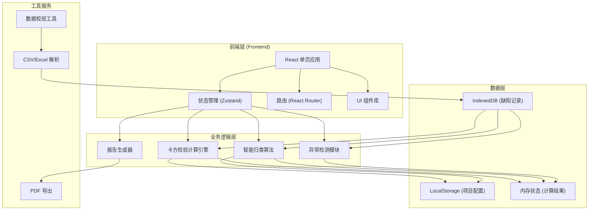
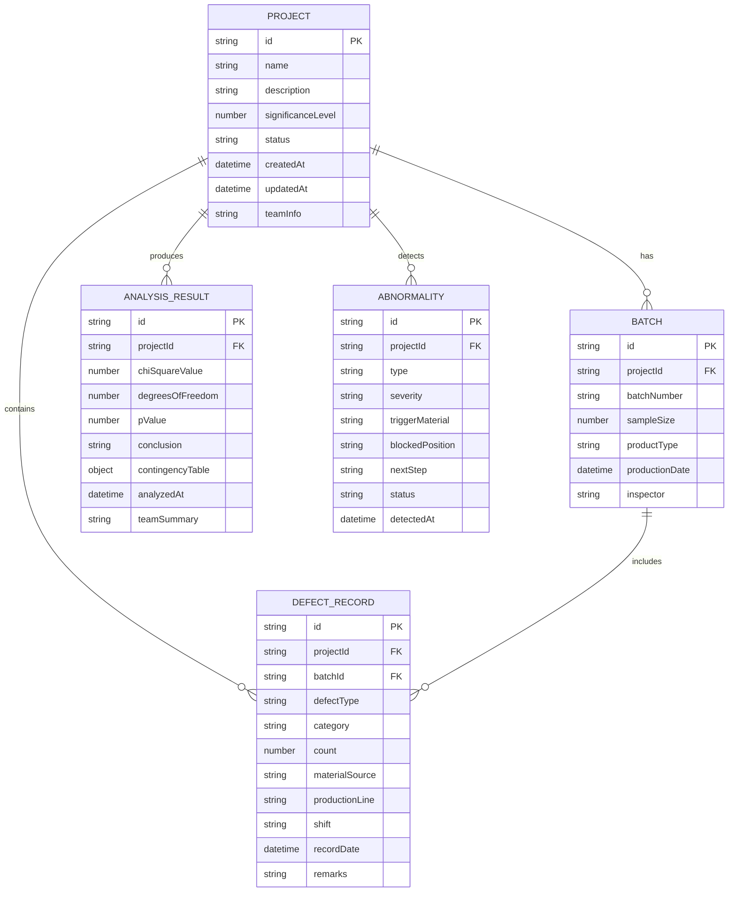

## 1. 架构设计



## 2. 技术描述

- **前端框架**: React@18 + TypeScript@5
- **构建工具**: Vite@5
- **样式方案**: TailwindCSS@3 + PostCSS
- **状态管理**: Zustand (轻量级，适合数据分析场景)
- **路由管理**: React Router@6
- **图表库**: Recharts (用于卡方分布可视化)
- **数据处理**: PapaParse (CSV解析) + SheetJS (Excel支持)
- **PDF导出**: jsPDF + html2canvas
- **本地存储**: LocalStorage + IndexedDB (Dexie.js封装)
- **数学计算**: jStat (统计计算库) + 自定义卡方检验实现

## 3. 路由定义

| 路由路径 | 页面名称 | 主要功能 |
|----------|----------|----------|
| / | 质检面板主页 | 项目概览、快捷操作、历史记录 |
| /workbench | 卡方检验工作台 | 数据导入、参数配置、实时计算 |
| /classification | 智能归类中心 | 自动关联、项目管理、线索匹配 |
| /diagnosis | 异常诊断面板 | 异常列表、追溯详情、改进建议 |
| /report | 报告导出中心 | 报告预览、复核建议、多格式导出 |

## 4. 数据模型

### 4.1 数据模型定义



### 4.2 核心类型定义

```typescript
// 项目
interface Project {
  id: string;
  name: string;
  description: string;
  significanceLevel: number; // 显著性水平 (0.01, 0.05, 0.10)
  status: 'draft' | 'analyzing' | 'completed' | 'archived';
  createdAt: Date;
  updatedAt: Date;
  teamInfo: TeamInfo;
}

// 班组信息
interface TeamInfo {
  teamName: string;
  shift: string;
  supervisor: string;
  members: string[];
}

// 缺陷记录
interface DefectRecord {
  id: string;
  projectId: string;
  batchId: string;
  defectType: string;
  category: string;
  count: number;
  materialSource: string;
  productionLine: string;
  shift: string;
  recordDate: Date;
  remarks?: string;
}

// 产品批次
interface Batch {
  id: string;
  projectId: string;
  batchNumber: string;
  sampleSize: number;
  productType: string;
  productionDate: Date;
  inspector: string;
}

// 卡方检验结果
interface ChiSquareResult {
  id: string;
  projectId: string;
  chiSquareValue: number;
  degreesOfFreedom: number;
  pValue: number;
  criticalValue: number;
  conclusion: 'accept' | 'reject';
  conclusionText: string;
  contingencyTable: number[][];
  expectedTable: number[][];
  residuals: number[][];
  analyzedAt: Date;
  teamSummary: string;
}

// 异常信息
interface Abnormality {
  id: string;
  projectId: string;
  type: 'insufficient_sample' | 'category_merged' | 'batch_mixed';
  severity: 'low' | 'medium' | 'high';
  triggerMaterial: string;
  blockedPosition: string;
  nextStep: string;
  status: 'pending' | 'resolved';
  detectedAt: Date;
  resolvedAt?: Date;
}

// 复核建议
interface ReviewAdvice {
  projectId: string;
  overallAssessment: string;
  keyFindings: string[];
  recommendations: string[];
  followUpActions: string[];
  generatedAt: Date;
}
```

## 5. 核心算法模块

### 5.1 卡方检验计算引擎
- 列联表构建与验证
- 期望频数计算
- 卡方统计量计算
- 自由度计算
- p值计算 (使用卡方分布CDF)
- 结论判定与解释生成

### 5.2 智能归类算法
- 基于缺陷类型、批次号、日期的相似度匹配
- 项目自动关联逻辑
- 重复检测与去重机制
- 幂等性保证 (同一批数据多次运行结果一致)

### 5.3 异常检测模块
- 样本量过少检测 (期望频数 < 5 的格子占比)
- 类别自动合并建议
- 批次混入检测 (批次号异常模式)
- 追溯信息生成与下一步建议

### 5.4 一致性校验引擎
- 页面显示数据与导出数据校验
- 班组信息多端同步验证
- 计算结果哈希校验
